---
## Author
author:
  name: Добрынин Никита Артёмович
  email: 1032251933@rudn.ru
  affiliation:
    - name: Российский университет дружбы народов
      country: Российская Федерация
      postal-code: 117198
      city: Москва
      address: ул. Миклухо-Маклая, д. 6

## Title
title: "Отчёт по прохождению внешнего курса"
subtitle: "Введение"

---

# Цель работы
Ознакомиться с общей информацией о linux и научиться его устанавливать.

# Задание
Пройти первый раздел внешнего курса.

# Выполнение лабораторной работы

Как называется этот курс? Введение в линукс(рис. [-@fig-001])

{#fig-001 width=60%}

Вопрос о том как проходить этот курс (рис. [-@fig-002])

{#fig-002 width=60%}

Выбрать ОС которыми обчно пользуюсь (рис. [-@fig-003])

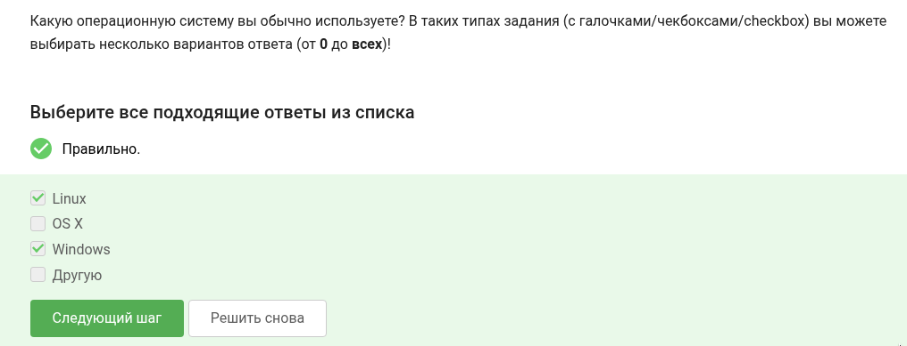{#fig-003 width=60%}

Что такое ВМ? (рис. [-@fig-004])

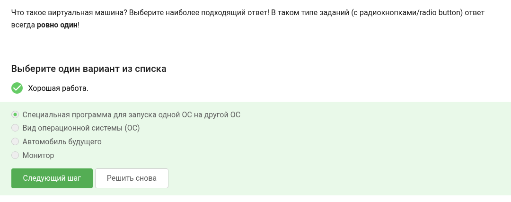{#fig-004 width=60%}

Смолли ли запустить Линукс? (рис. [-@fig-005])

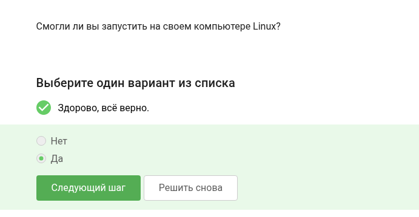{#fig-005 width=60%}

Необходимо сделать документ в программе LibreOffice и написать строку "Hello, Linux!" (рис. [-@fig-006])

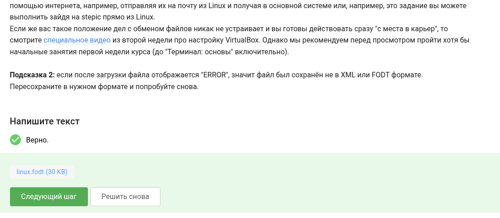{#fig-006 width=60%}

Какое расширение имеют установочные пакеты в Ubuntu (рис. [-@fig-007])

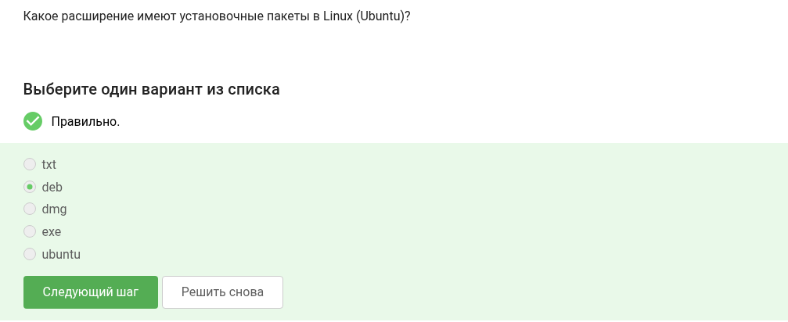{#fig-007 width=60%}

Нужно запустить программу VLC и написать первую по счету фамилию из всех авторов проекта (рис. [-@fig-008])

{#fig-008 width=60%}

Для чего используется update manager (рис. [-@fig-009])

{#fig-009 width=60%}

Синонимы командной строки (рис. [-@fig-0010])

{#fig-0010 width=60%}

Какая команда напечатает в какой директории вы находитесь (рис. [-@fig-0011])

{#fig-0011 width=60%}

Нужно выбрать все варианты команды данной в задании (рис. [-@fig-0012])

{#fig-0012 width=60%}

Какая команда покажет содержимое каталога downloads из другого каталога (рис. [-@fig-0013])

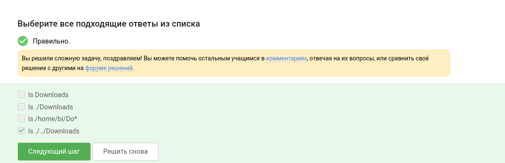{#fig-0013 width=60%}

Какая команда используется для удаления директорий (рис. [-@fig-0014])

{#fig-0014 width=60%}

Что произойдет если через терминал запустить firefox, и написать команду exit (рис. [-@fig-0015])

{#fig-0015 width=60%}

Чему эквивалентен запуск программы с & (рис. [-@fig-0016])

{#fig-0016 width=60%}

Необходимо сделать файл исполняемым и запустить его (рис. [-@fig-0017])

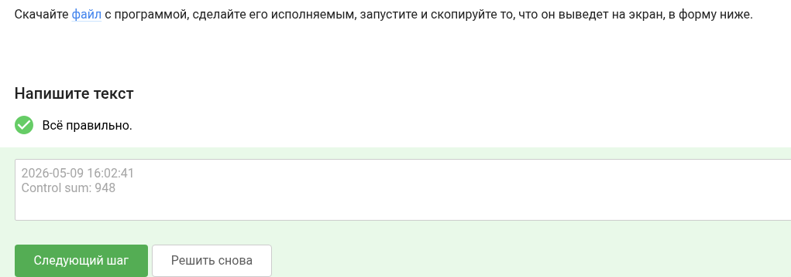{#fig-0017 width=60%}

Куда по умолчанию выводится поток ошибок программы запущенной в терминале (рис. [-@fig-0018])

{#fig-0018 width=60%}

Какая из команд создаст файл и запишет в него поток ошибок запущенной программы (рис. [-@fig-0019])

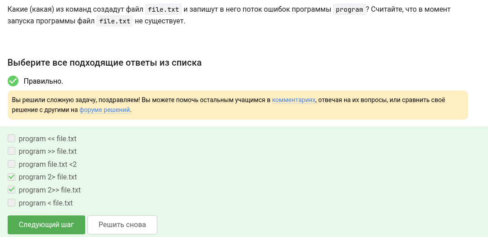{#fig-0019 width=60%}

Куда деваются сообщения об ошибках от программ которые обьеденены в конвейер (рис. [-@fig-0020])

{#fig-0020 width=60%}

В каком файле на диске окажется картинка скачанная с ресурса командой указанной нв рисунке (рис. [-@fig-0021])

{#fig-0021 width=60%}

Какую опцию нужно указать к wget чтобы она не выводила ошибок на экран (рис. [-@fig-0022])

{#fig-0022 width=60%}

Какие файлы буду скачаны с сайта командой wget -r -l 1 -A jpg в котором есть ссылки на картинки в формате .jpg .png и ссылки на другие ресурсы сайта (рис. [-@fig-0023])

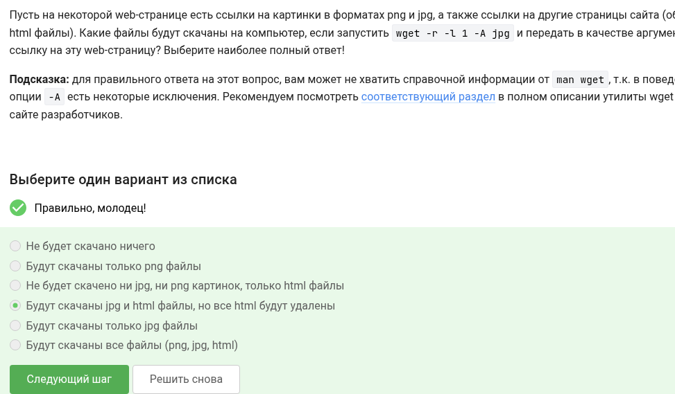{#fig-0023 width=60%}

 Какие команды создадут архив из директории(рис. [-@fig-0024])

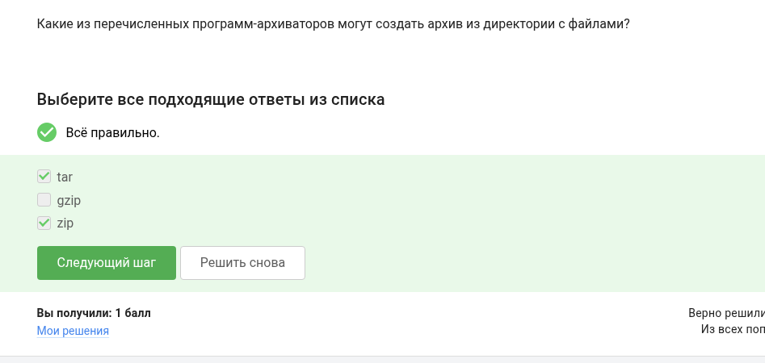{#fig-0024 width=60%}

Чем отличется zip и gzip (рис. [-@fig-0025])

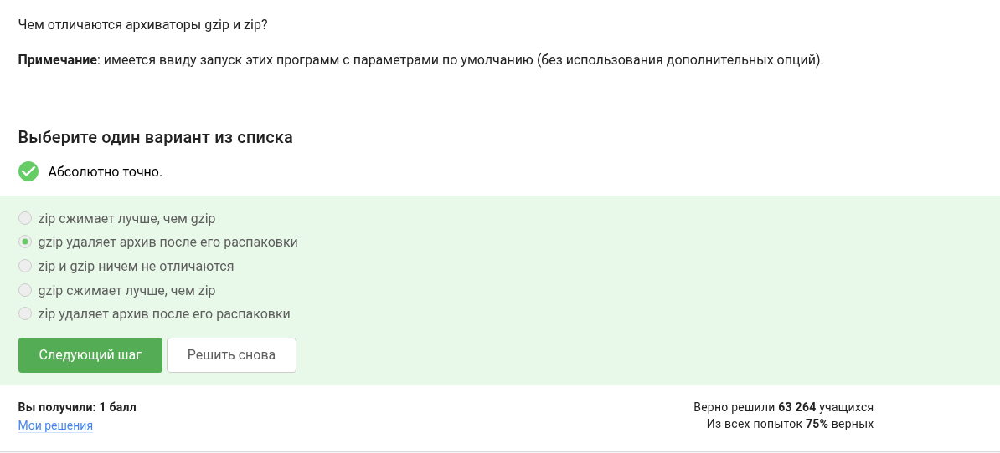{#fig-0025 width=60%}

Какой набор опций указать tar чтобы запаковать файлы в .tar.bz2 (рис. [-@fig-0026])

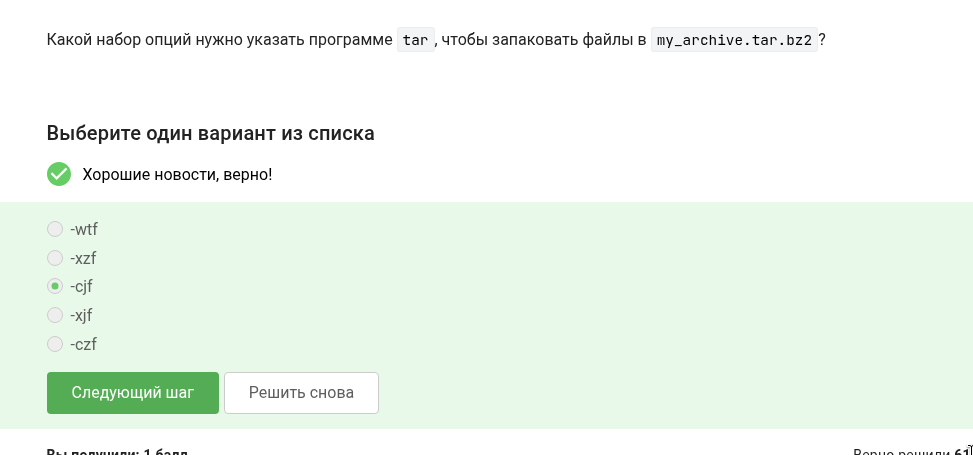{#fig-0026 width=60%}

Какая маска команды find не найдет файл Alexey.jpeg(рис. [-@fig-0027])

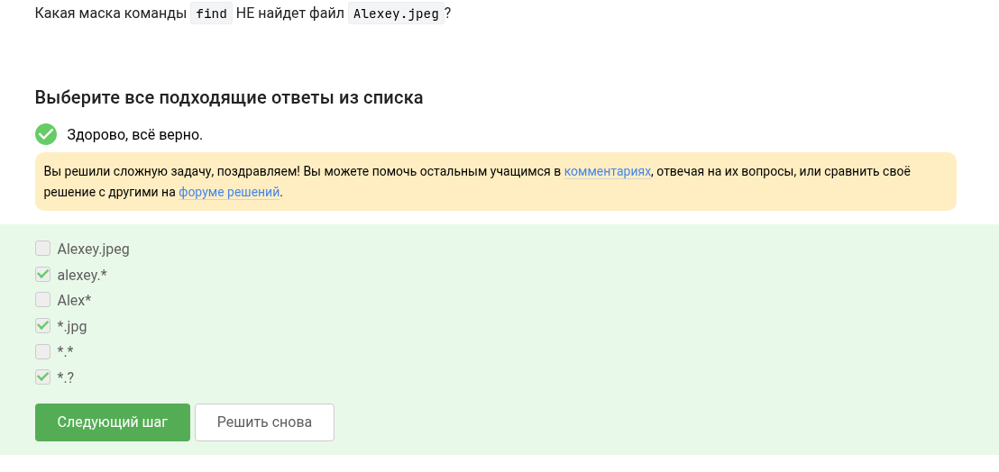{#fig-0027 width=60%}

Укажите какие строки выведет на экран команда grep "worl" text.txt(рис. [-@fig-0028])

{#fig-0028 width=60%}

Необходимо найти все строки в произведении Шекспира содержащие слово love и записать их в соответствующий файл(рис. [-@fig-0029])

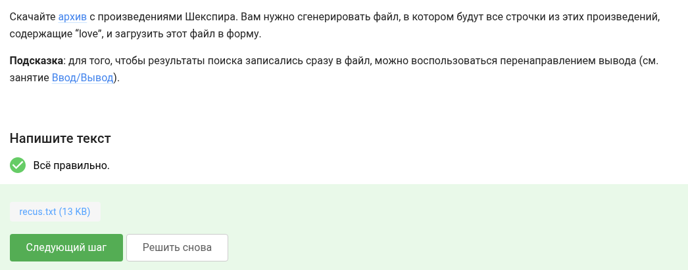{#fig-0029 width=60%}

# Выводы

Я изучил основы терминала linux и даже поработал с ним.

