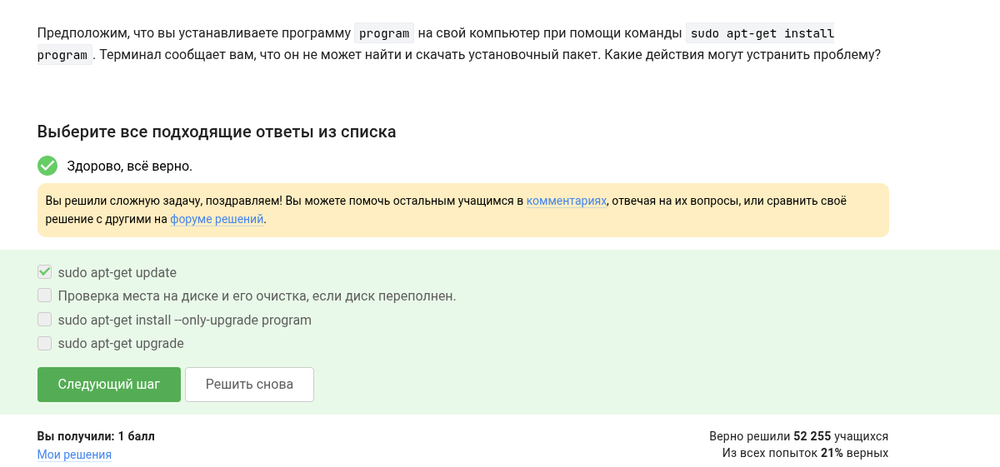
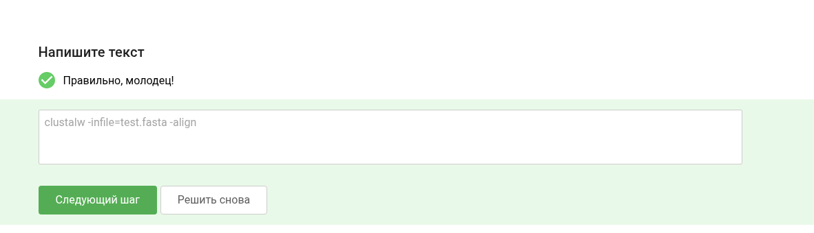
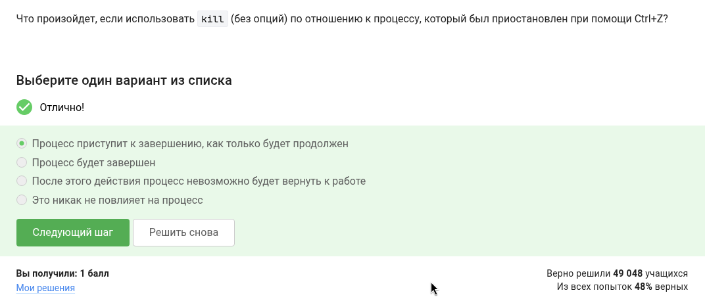
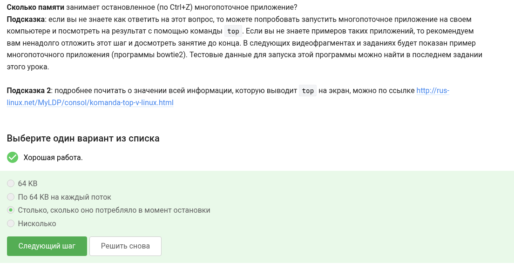
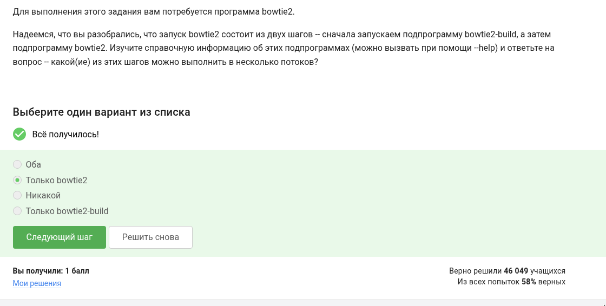
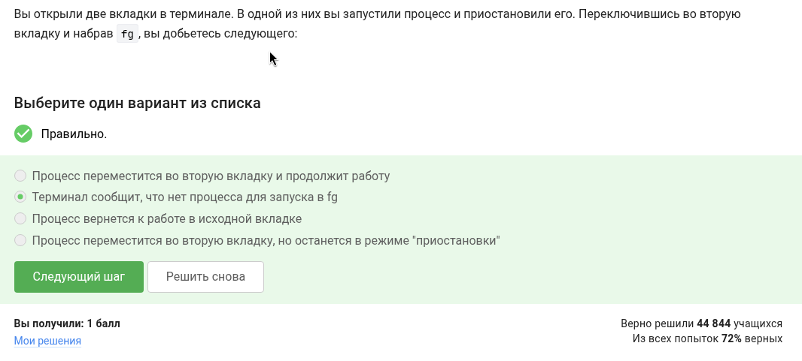
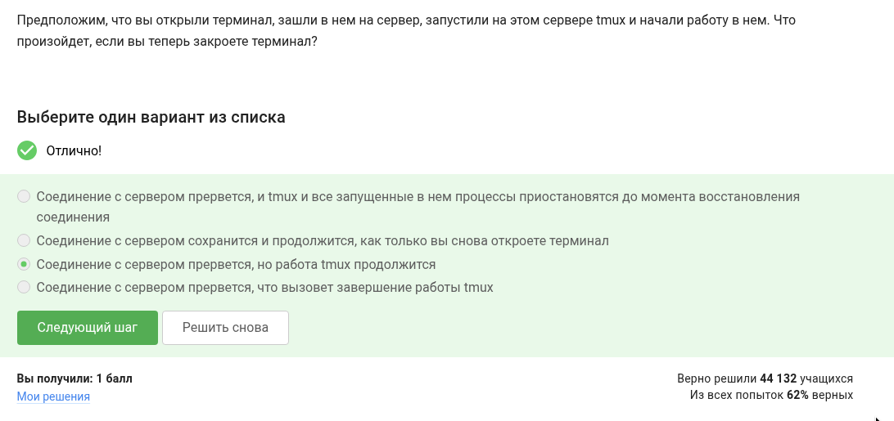
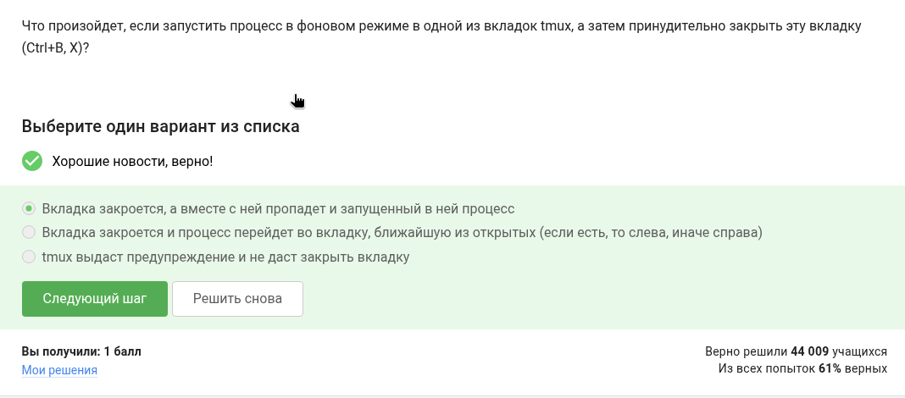
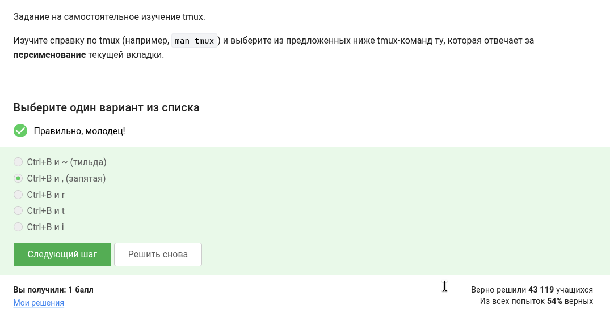
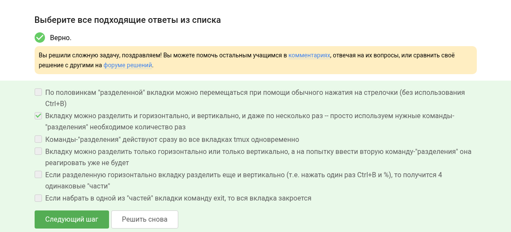

---
## Author
author:
  name: Добрынин Никита Артёмович
  email: 1132255598@rudn.ru
  affiliation:
    - name: Российский университет дружбы народов
      country: Российская Федерация
      postal-code: 117198
      city: Москва
      address: ул. Миклухо-Маклая, д. 6
## Title
title: "Презентация по прохождению внешнего курса"
subtitle: "Работа с сервером"
license: CC BY
date: today
date-format: "2026.05.12" # Example: 2025-09-06
---

# Цели и задачи работы

## Цель лабораторной работы

Ознакомиться с общей информацией о работе с сервером, попрактиковаться.

# Процесс выполнения лабораторной работы

## Задание 1

{ #fig:001 width=70% height=70% }

## Задание 2

{ #fig:002 width=70% height=70% }

## Задание 3

{ #fig:003 width=70% height=70% }

## Задание 4

{ #fig:004 width=70% height=70% }

## Задание 5

{ #fig:005 width=70% height=70% }

## Задание 6

{ #fig:006 width=70% height=70% }

## Задание 7

{ #fig:007 width=70% height=70% }

## Задание 8

{ #fig:008 width=70% height=70% }

## Задание 9

{ #fig:009 width=70% height=70% }

## Задание 10

{ #fig:0010 width=70% height=70% }

## Задание 11

{ #fig:011 width=70% height=70% }

## Задание 12

{ #fig:012 width=70% height=70% }

## Задание 13

{ #fig:013 width=70% height=70% }

## Задание 14

{ #fig:014 width=70% height=70% }

## Задание 15

{ #fig:015 width=70% height=70% }

## Задание 16

{ #fig:016 width=70% height=70% }

## Задание 17

{ #fig:017 width=70% height=70% }

## Задание 18

{ #fig:018 width=70% height=70% }

## Задание 19

{ #fig:019 width=70% height=70% }

## Задание 20 

{ #fig:020 width=70% height=70% }

## Задание 21

{ #fig:021 width=70% height=70% }

## Задание 22

{ #fig:022 width=70% height=70% }

## Задание 23

{ #fig:023 width=70% height=70% }

# Выводы
 
Я изучил работу с сервером и порешал практические задания.
