---
## Author
author:
  name: Добрынин Никита Артёмович
  email: 1032251933@rudn.ru
  affiliation:
    - name: Российский университет дружбы народов
      country: Российская Федерация
      postal-code: 117198
      city: Москва
      address: ул. Миклухо-Маклая, д. 6

## Title
title: "Отчёт по прохождению внешнего курса"
subtitle: "Работа с сервером"

---

# Цель работы
Ознакомиться с общей информацией о работе с сервером, попрактиковаться.

# Задание
Пройти второй раздел внешнего курса.

# Выполнение лабораторной работы

Для каких задач можно использовать сервер (рис. [-@fig-001])

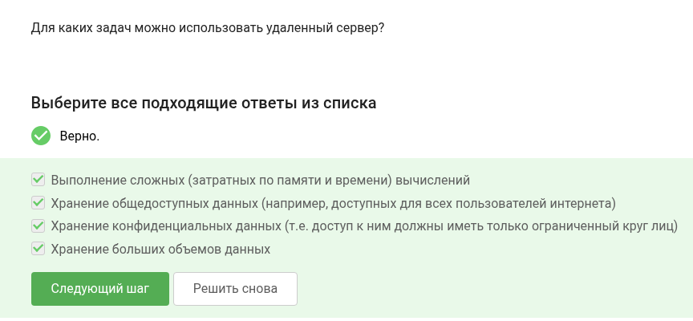{#fig-001 width=60%}

Какой из предложенных ключей можно распространять без опаски? (рис. [-@fig-002])

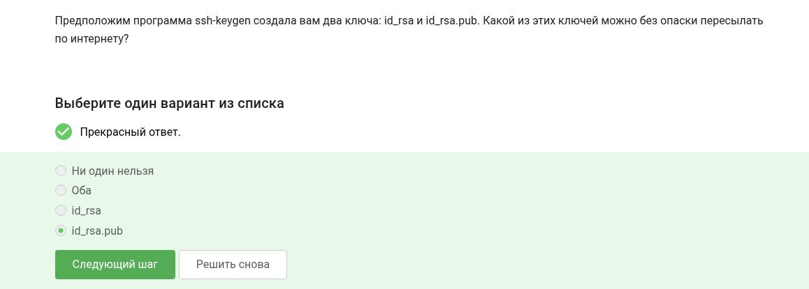{#fig-002 width=60%}

Какая из команд скопирует на сервер папку со всем содержимым (рис. [-@fig-003])

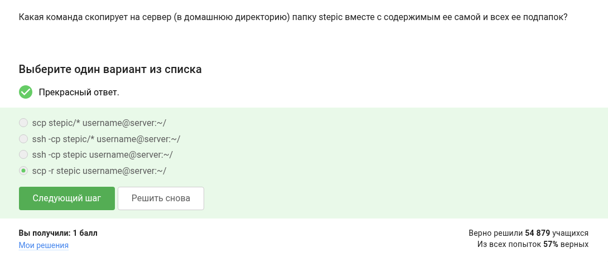{#fig-003 width=60%}

У вас не получается установить программу, какие действия помогут устранить проблему (рис. [-@fig-004])

{#fig-004 width=60%}

Для чего используется filezilla (рис. [-@fig-005])

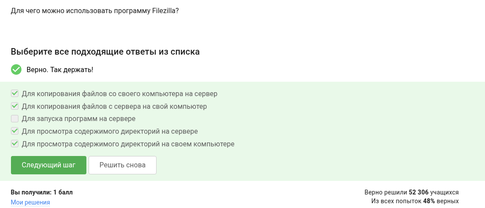{#fig-005 width=60%}

Что делать если требуется запустить графическую программу на сервере (рис. [-@fig-006])

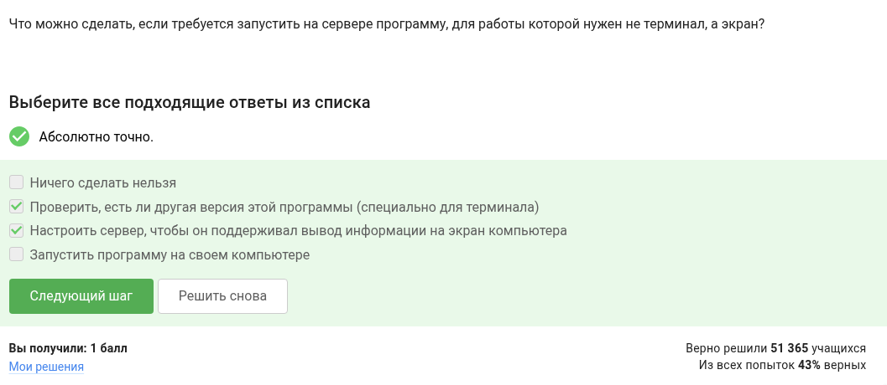{#fig-006 width=60%}

Как открыть справку по команде (рис. [-@fig-007])

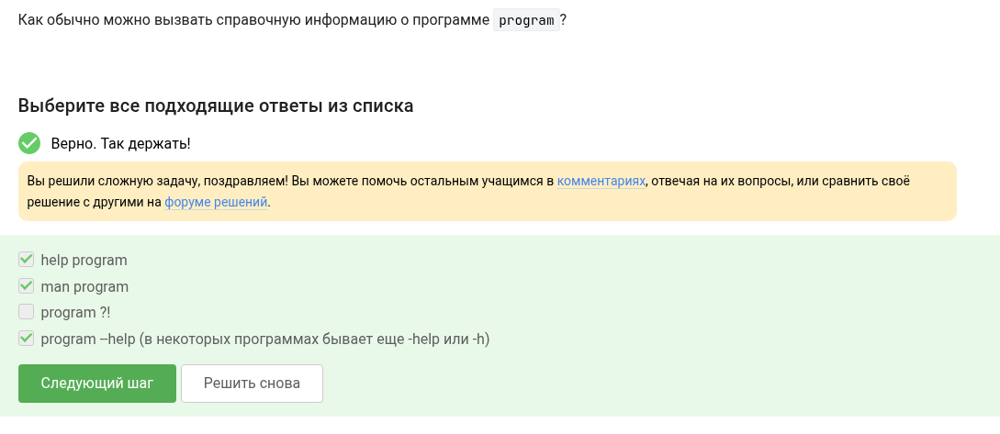{#fig-007 width=60%}

Какой формат вводных файлов поддерживает программа FastQC (рис. [-@fig-008])

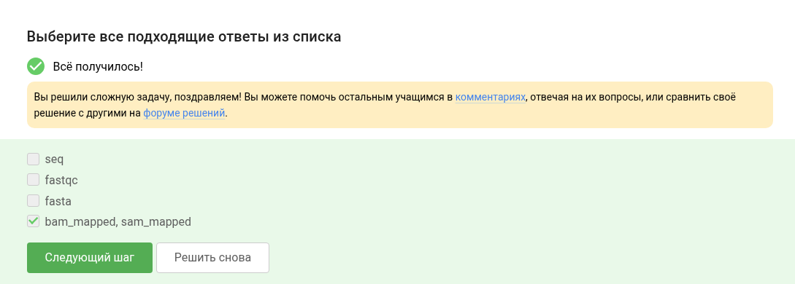{#fig-008 width=60%}

Необходимо найти команду данную по условию в задании в справочной информации, для выполнения множественного выравнивания (рис. [-@fig-009])

{#fig-009 width=60%}

По каким программам выведет информацию командой jobs (рис. [-@fig-0010])

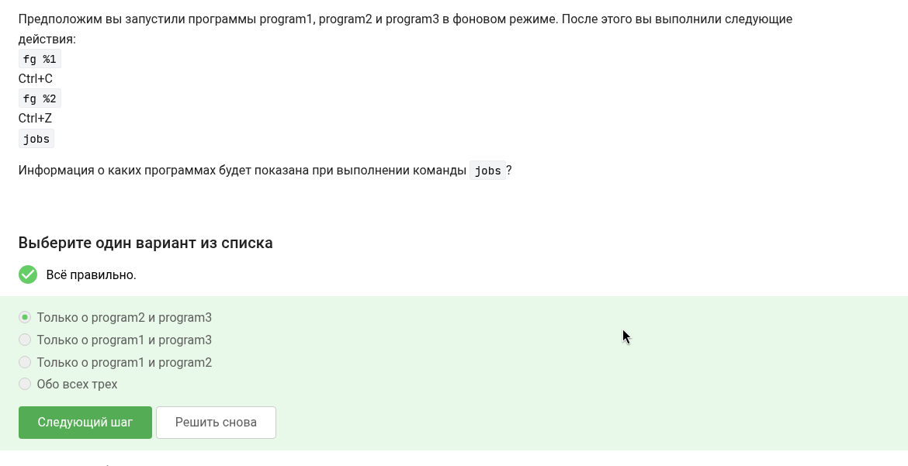{#fig-0010 width=60%}

Одинаковые ли идентификаторы у команд jobs, top, ps (рис. [-@fig-0011])

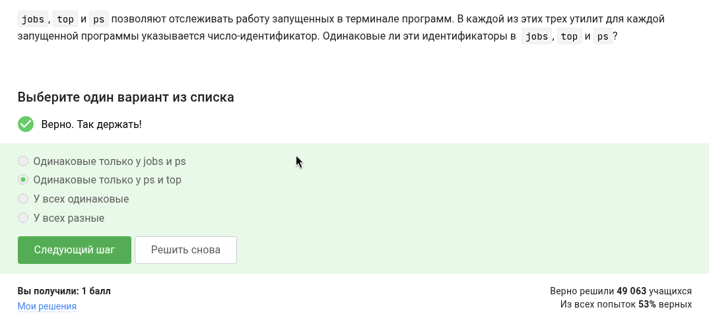{#fig-0011 width=60%}

Какой командой можно мгновенно завершить остановленный процесс (рис. [-@fig-0012])

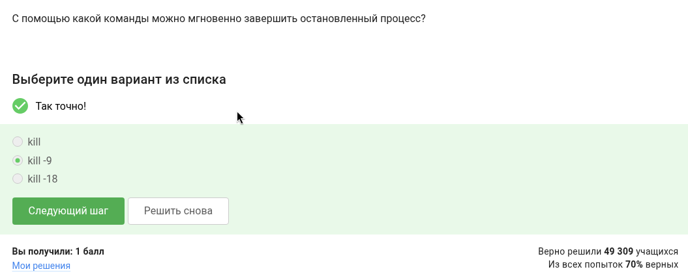{#fig-0012 width=60%}

Что произойдет если применить команду kill к приостановленной задаче  (рис. [-@fig-0013])

{#fig-0013 width=60%}

Сколько ресурсов использует приостановленное многопоточное приложение (рис. [-@fig-0014])

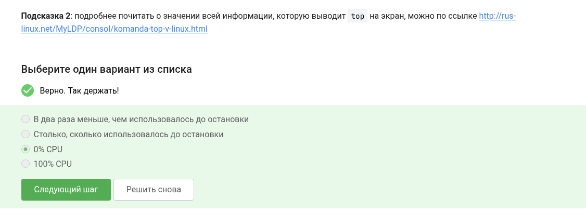{#fig-0014 width=60%}

Сколько памяти занимает остановленное многопоточное приложение (рис. [-@fig-0015])

{#fig-0015 width=60%}

Как принудительно завершить один из потоков многопоточного приложения (рис. [-@fig-0016])

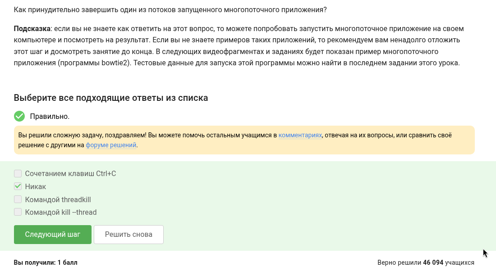{#fig-0016 width=60%}

Какой из шагов можно выполнить в несколько потоков (см. рис. [-@fig-0017])

{#fig-0017 width=60%}

Чего мы добьемся переключившись на вкладку и набрав fg (рис. [-@fig-0018])

{#fig-0018 width=60%}

В tmux осталась послденяя вкладка, что будет если написать команду exit (рис. [-@fig-0019])

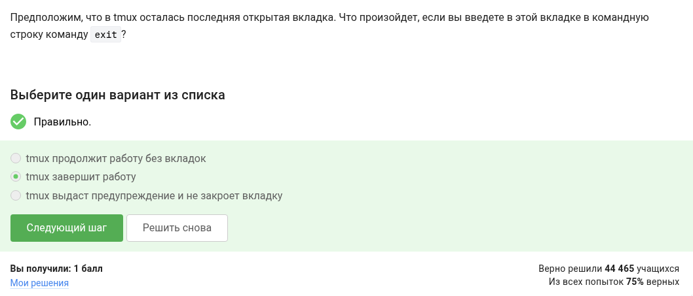{#fig-0019 width=60%}

Мы зашли на сервер и запустили tmux, что будет если закрыть терминал (рис. [-@fig-0020])

{#fig-0020 width=60%}

Что произойдет, если открыть tmux и принудительно завершить его (рис. [-@fig-0021])

{#fig-0021 width=60%}

Задание: изуть справку по tmux и ответить на вопросы (рис. [-@fig-0022])

{#fig-0022 width=60%}

Вопросы по работе с вкалдками в tmux (рис. [-@fig-0023])

{#fig-0023 width=60%}

# Выводы

Я изучил основы работы с сервером на приактике.

