---
## Author
author:
  name: Добрынин Никита Артёмович
  email: 1032251933@rudn.ru
  affiliation:
    - name: Российский университет дружбы народов
      country: Российская Федерация
      postal-code: 117198
      city: Москва
      address: ул. Миклухо-Маклая, д. 6

## Title
title: "Отчёт по прохождению внешнего курса"
subtitle: "Программирование в bash"

---

# Цель работы

Изучить базовые команды в bash и попрактиковаться.

# Задание

Пройти третий раздел внешнего курса.

# Выполнение лабораторной работы

Как выйти из редактора vim (рис. [-@fig-001])

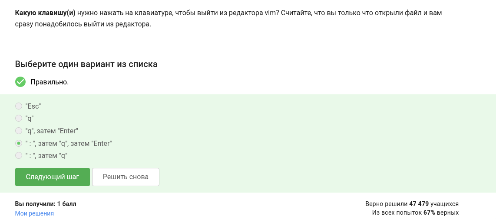{#fig-001 width=60%}

В чем разница в перемещении клавишами "w" и "W", рассмотрим на примере предложения: Strange_ TEXT is_here. 2=2 YES! (рис. [-@fig-002])

{#fig-002 width=60%}

Необходимо заменить все слова Windows на Linux в vim, какой командой это можно сделать (рис. [-@fig-003])

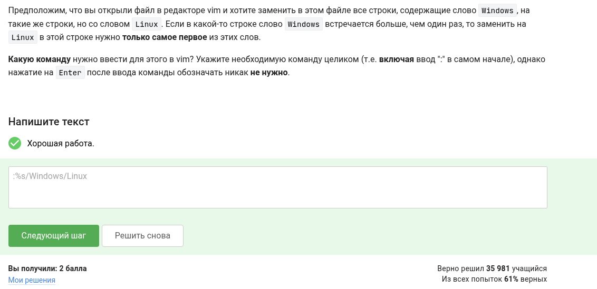{#fig-003 width=60%}

Формулировка вопроса на картинке (рис. [-@fig-004])

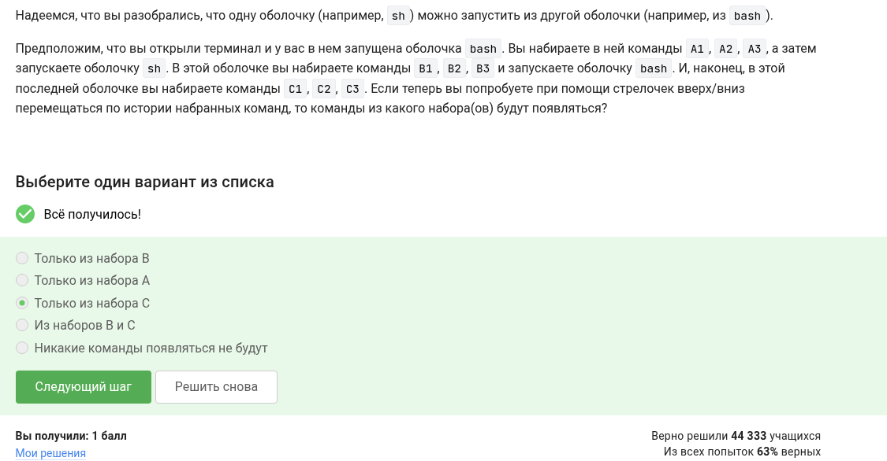{#fig-004 width=60%}

Задание на картинке (рис. [-@fig-005])

{#fig-005 width=60%}

Какие из представленных вариантов названия переменных могут быть названиями перменных в bash (рис. [-@fig-006])

{#fig-006 width=60%}

Скрипт: if [[...]] 
then
  echo "True"
fi (рис. [-@fig-007])

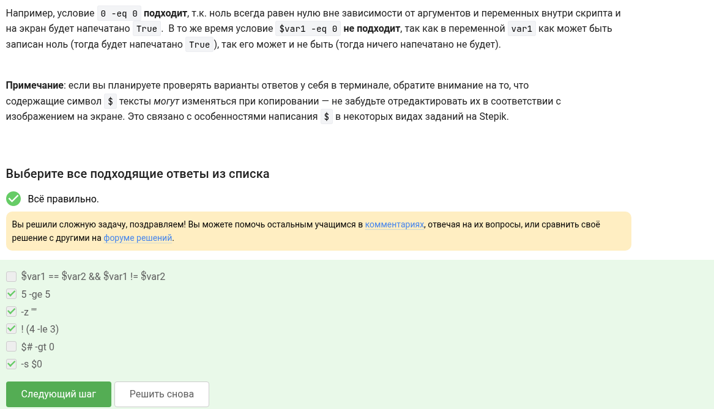{#fig-007 width=60%}

Какие из строк выведет скрипт задав var=3 или var=5 (рис. [-@fig-008])

{#fig-008 width=60%}

Сколько раз скрипт на рисунке выведет слова start и finish (рис. [-@fig-009])

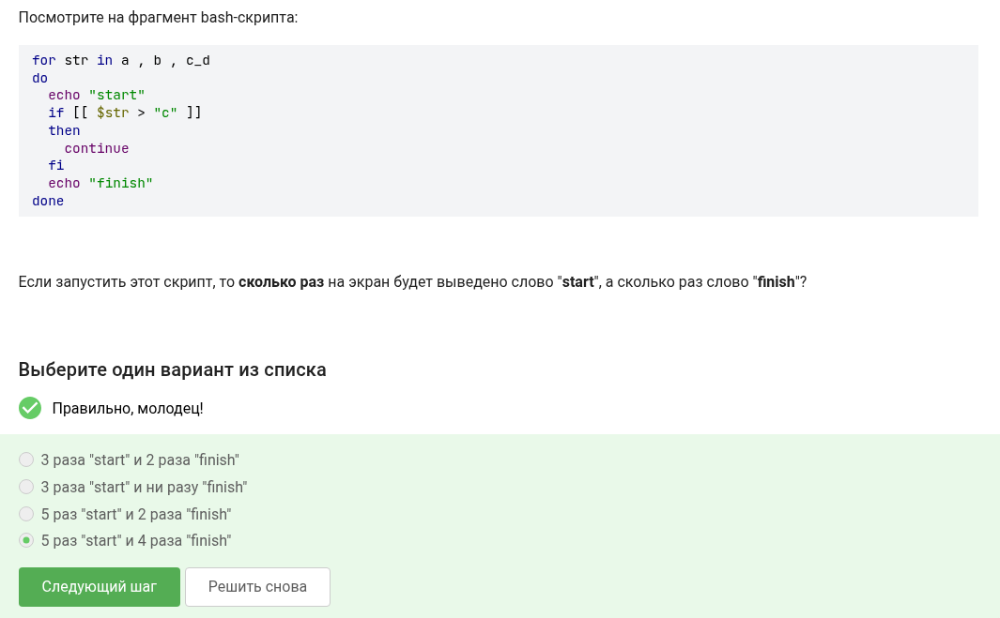{#fig-009 width=60%}

Нужно написать скрипт который принимает 2 аргумента и выводит ответ с названиями этих аргументов (рис. [-@fig-0010])

{#fig-0010 width=60%}

Напишите скрипт на bash, который принимает на вход один аргумент (целое число от 0 до бесконечности), который будет обозначать число студентов в аудитории. В зависимости от значения числа нужно вывести разные сообщения. (рис. [-@fig-0011])

{#fig-0011 width=60%}

Какие(ая) из предложенных ниже инструкций увеличат значение переменной а на значение переменной b (рис. [-@fig-0012])

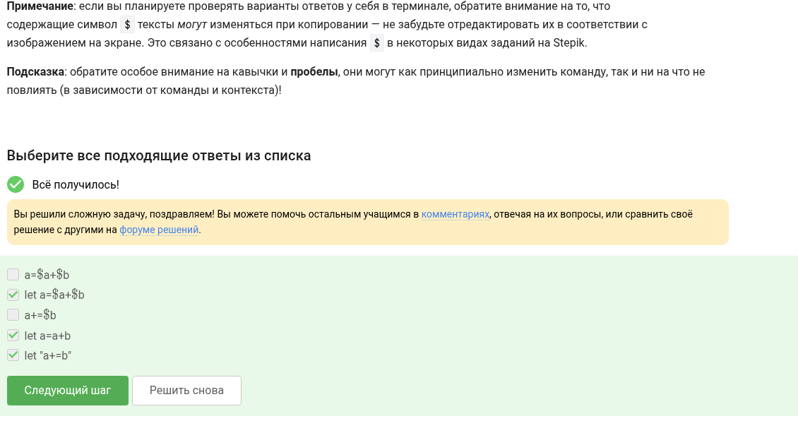{#fig-0012 width=60%}

Впишите в форму ниже строку, которую выведет на экран команда echo "counters are $c1 and $c2" если она находится в скрипте после десяти вызовов функции counter с параметрами сначала 1, затем 2, затем 3 и т.д., последний вызов с параметром 10 (рис. [-@fig-0013])

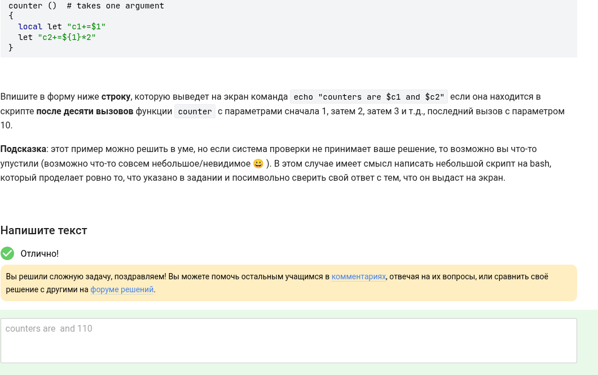{#fig-0013 width=60%}

Напишите скрипт на bash, который будет искать наибольший общий делитель (НОД, greatest common divisor, GCD) двух чисел.(рис. [-@fig-0014])

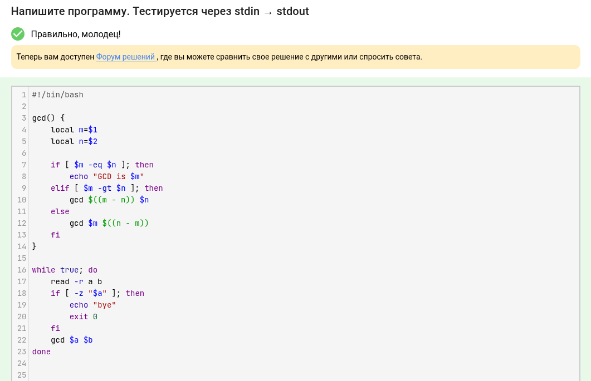{#fig-0014 width=60%}

Отметьте все файлы, которые найдет команда find /home/bi -iname "star*", но НЕ найдет команда find /home/bi -name "star*"? (рис. [-@fig-0015])

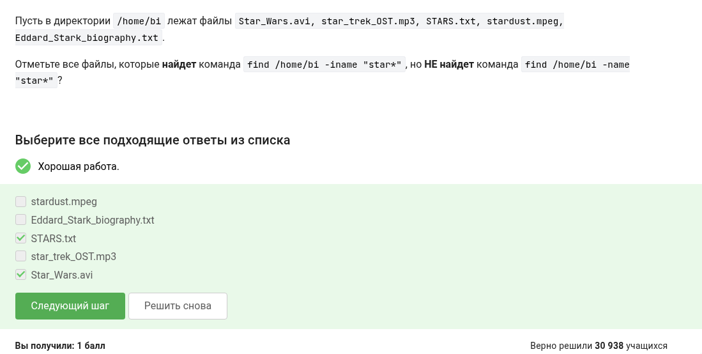{#fig-0015 width=60%}

 Задание на понимание работы опций -path и -name команды find. Отметьте все верные утверждения из перечисленных ниже(рис. [-@fig-0016])

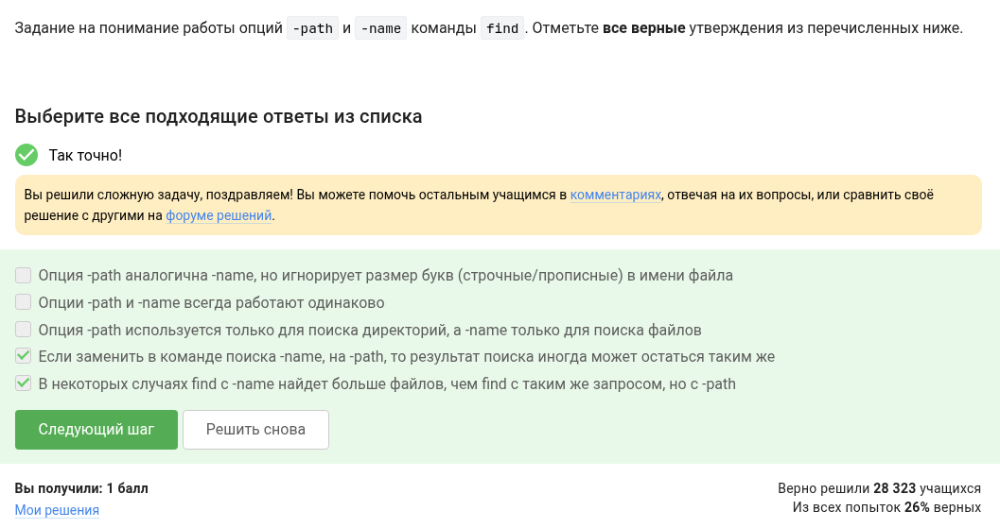{#fig-0016 width=60%}

 Какие(ой) из трех файлов (file1, file2, file3) будут найдены по команде find /home/bi -mindepth 2 -maxdepth 3 -name "file*"?(рис. [-@fig-0017])

{#fig-0017 width=60%}

Пусть у вас есть файл file.txt из 10 строк, причем в каждой строке есть слово "word". Если вы выполните на этом файле команды см рис. 18(рис. [-@fig-0018])

{#fig-0018 width=60%}

Предположим, что в файле  text.txt записаны строки, показанные среди вариантов ответа. Отметьте только те из них, которые выведет на экран команда  grep -E "[xklXKL]?[uU]buntu$" text.txt (рис. [-@fig-0019])

![1, 2, 4, 5, 6 т.к. указаны буквы "[xklXKL]?[uU]](image/19.png){#fig-0019 width=60%}

Что произойдет, если в команде sed -n "/[a-z]*/p" text.txt не указывать опцию -n? (рис. [-@fig-0020])

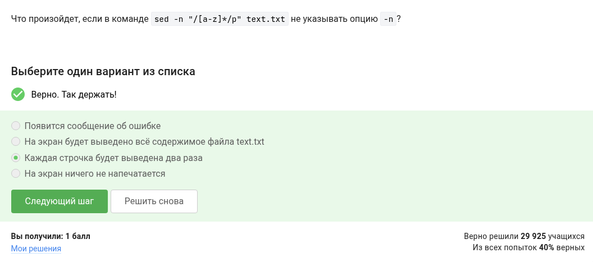{#fig-0020 width=60%}

Какую опцию нужно указать при запуске gnuplot, чтобы при его закрытии не были автоматически закрыты и все нарисованные в нём графики? (рис. [-@fig-0021])

{#fig-0021 width=60%}

Какое в этом случае будет название у построенного ряда данных и сколько будет нарисовано точек на графике? (рис. [-@fig-0022])

{#fig-0022 width=60%}

Какая команда(ы) установят файлу file.txt права доступа rwxrw-r--, если изначально у него были права r--r--r-- (рис. [-@fig-0023])

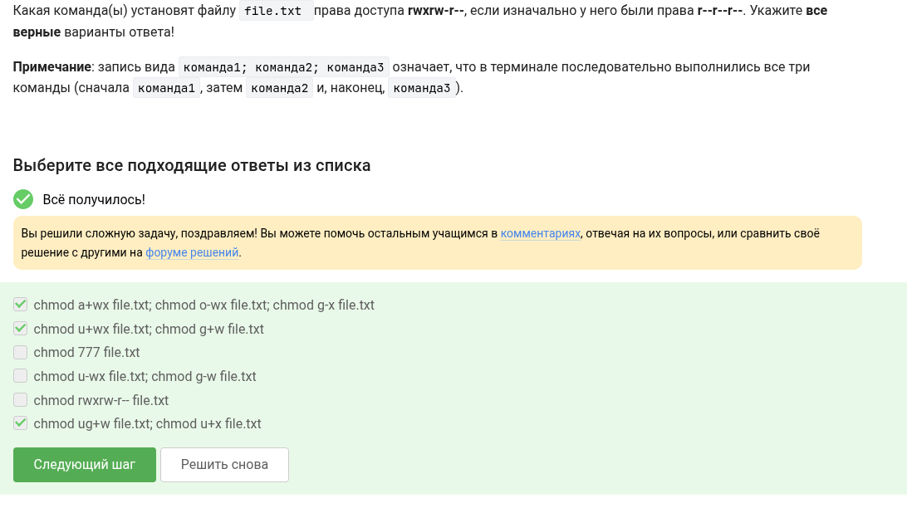{#fig-0023 width=60%}

редположим вы использовали команду sudo для создания директории dir. По умолчанию для dir были выставлены права доступа rwxr-xr-x После выполнения какой команды user из группы group всё-таки сможет создать файл внутри dir?(рис. [-@fig-0024])

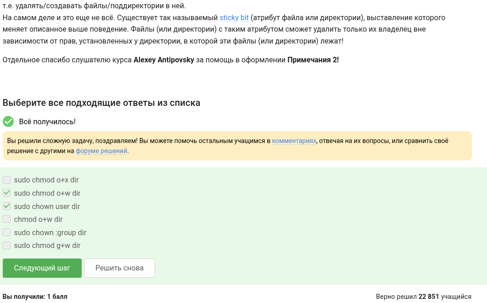{#fig-0024 width=60%}

Впишите в форму ниже команду, которая выведет сколько места на диске занимает текущая директория (рис. [-@fig-0025])

{#fig-0025 width=60%}

# Выводы

Я изучил базовый скриптинг в bash и изучил пару программ.

