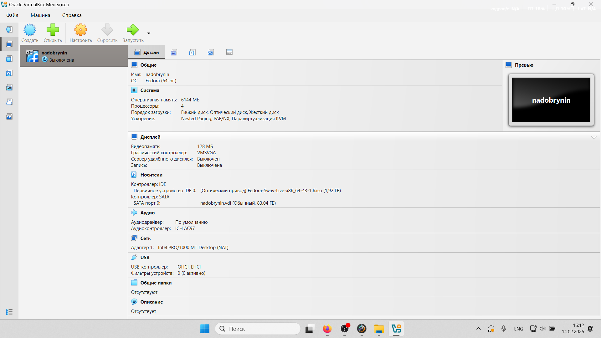
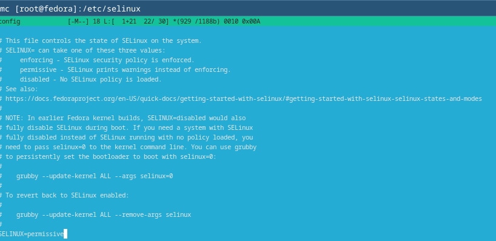
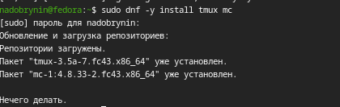
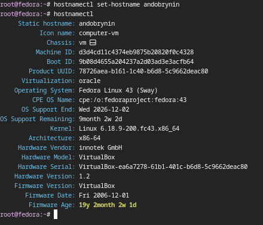
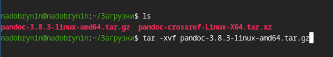

---
## Author
author:
  name: Добрынин Никита Артёмович
  email: 1132255598@rudn.ru
  affiliation:
    - name: Российский университет дружбы народов
      country: Российская Федерация
      postal-code: 117198
      city: Москва
      address: ул. Миклухо-Маклая, д. 6
## Title
title: Презентация по лабораторной работе №1
subtitle: Установка ОС на ВМ
license: CC BY
date: today
date-format: "2026-02-28" 
---

# Цели и задачи работы

## Цель лабораторной работы

Целью данной лабораторной работы является приобретение практических навыков ао установке ОС и минимально необходимого ПО для работы.

# Процесс выполнения лабораторной работы

## Создаю новую виртуальную машину

{ #fig:001 width=70% height=70% }

## Демонстрирую параметры созданной ВМ

{ #fig:002 width=70% height=70% }

## Отключаю SElinux

{ #fig:003 width=70% height=70% }

## Устанавливаю tmux mc

{ #fig:004 width=70% height=70% }

## Конфигурация клавиатуры 

{ #fig:005 width=70% height=70% }

## Параметры пользователя

{ #fig:006 width=70% height=70% }

## Установка необходимого ПО

{ #fig:007 width=70% height=70% }

# Выводы по проделанной работе

## Вывод

Я научился устанавливать ОС на ВМ а так же устанавливать минимально необходимое для работы ПО

