---
## Author
author:
  name: Добрынин Никита Артёмович
  degrees: 
  orcid: 0000-0002-0877-7063
  email: 1132255598@rudn.ru
  affiliation:
    - name: Российский университет дружбы народов
      country: Российская Федерация
      postal-code: 117198
      city: Москва
      address: ул. Миклухо-Маклая, д. 6

## Title
title: "Лабораторная работа №1"
subtitle: "Установка ОС fedora на ВМ"
license: "CC BY"
---

# Цель работы

Целью работы является приобретение практических навыков по установке ОС на виртуальную машину и настройки минимально необходимых для работы сервисов.

# Задание

При помощи команд dmesg | less  или dmesg| grep -i "...", получить следующую информацию:

Версия ядра Linux (Linux version).

Частота процессора (Detected Mhz processor).

Модель процессора (CPU0).

Объём доступной оперативной памяти (Memory available).

Тип обнаруженного гипервизора (Hypervisor detected).

Тип файловой системы корневого раздела.

Последовательность монтирования файловых систем.

# Теоретическое введение

Устанавливать ОС fedora sway live 43 я буду на свой компьютер, на ВМ VirtualBox

# Выполнение лабораторной работы

Установил ОС Fedora sway live 43 на VirtualBox([рис. @fig-001]).

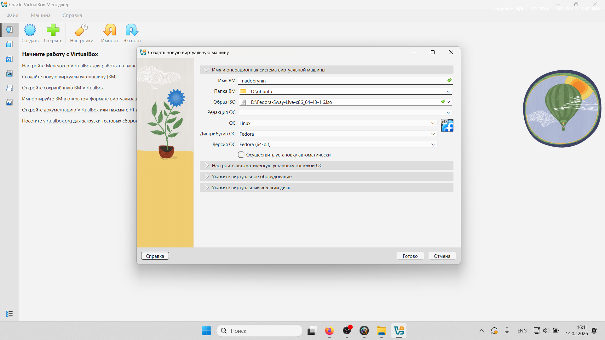{#fig-001 width=70%}

Указал необходимые параметры для ОС([рис. @fig-002])

{#fig-002 width=70%}

Запустил систему с iso образа([рис. @fig-003])

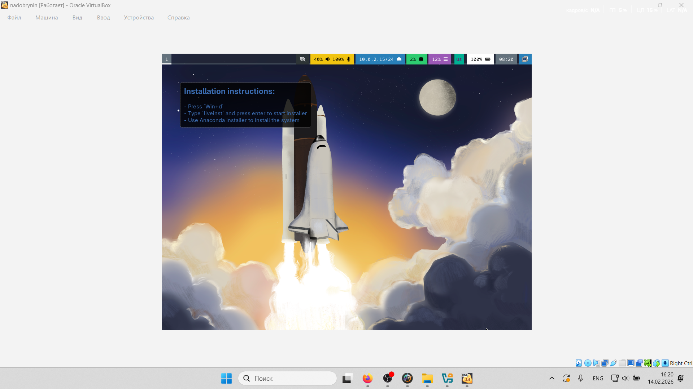{#fig-003 width=70%}

Инициализировал установку основной ОС([рис. @fig-004])

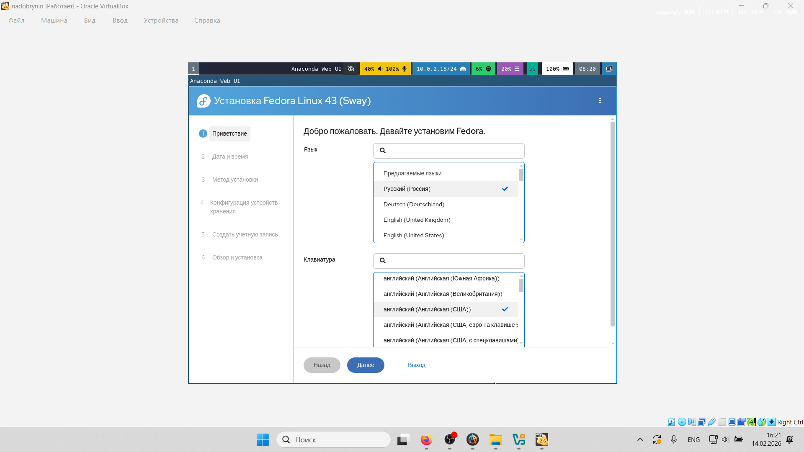{#fig-004 width=70%}

Установка выполняется на весь диск([рис. @fig-005])

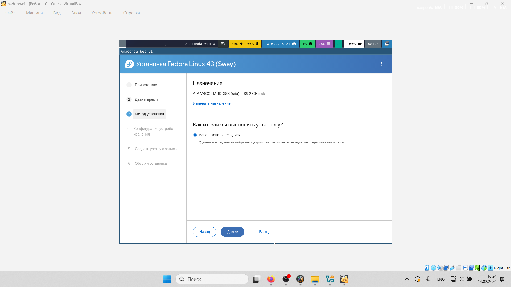{#fig-005 width=70%}

Выставил автоматические настройки времени и даты([рис. @fig-006])

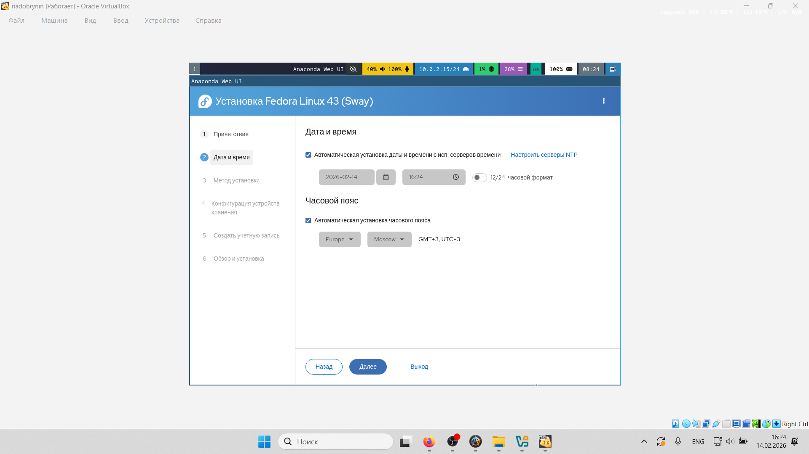{#fig-006 width=70%}

Создал учетную запись ОС, указал имя и пароль ОС, включил права суперпользователя([рис. @fig-007])

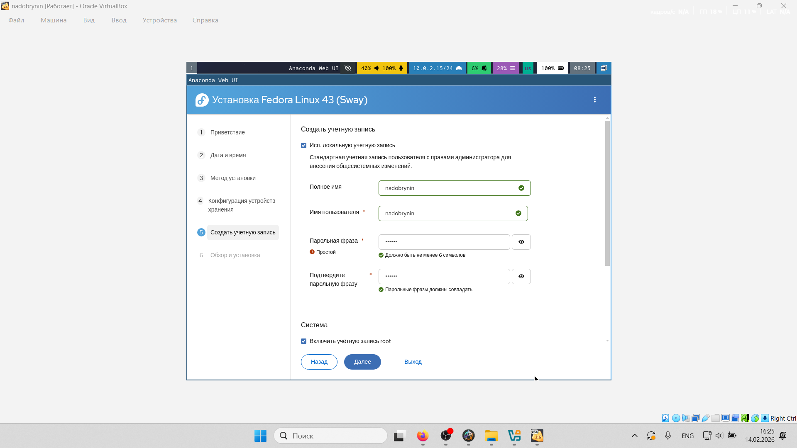{#fig-007 width=70%}

Начал установку основной ОС([рис. @fig-008])

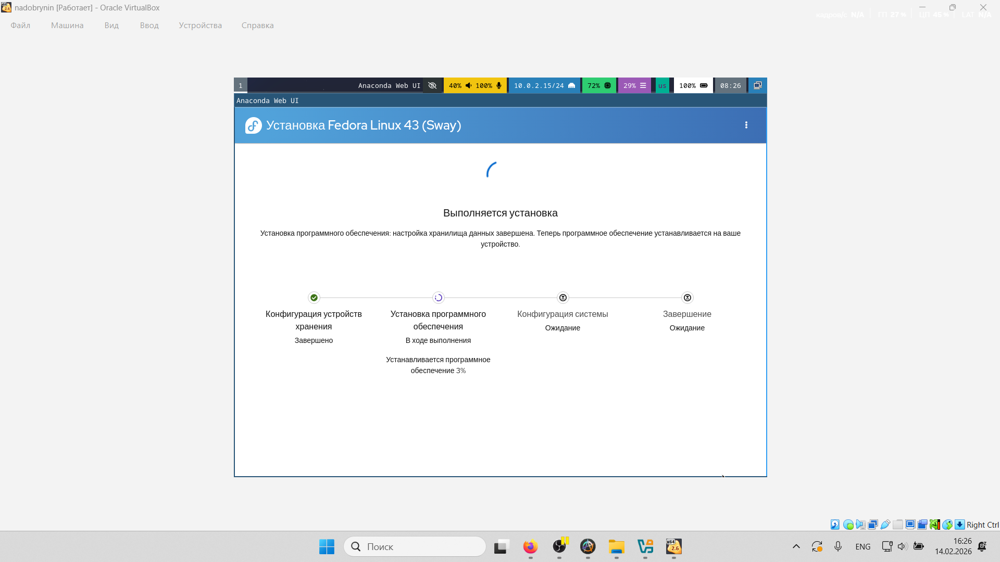{#fig-008 width=70%}

Извлёк оптический привод iso образа([рис. @fig-009])

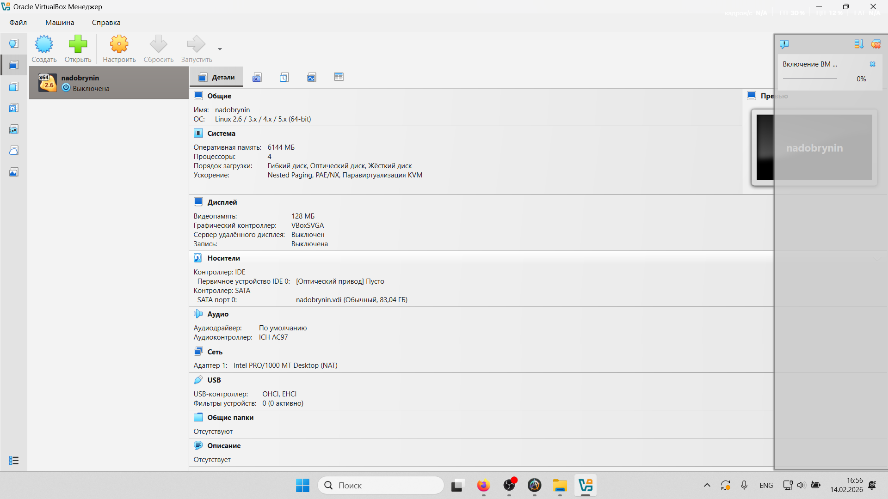{#fig-009 width=70%}

Установка завершена успешно, вошел в систему([рис. @fig-010])

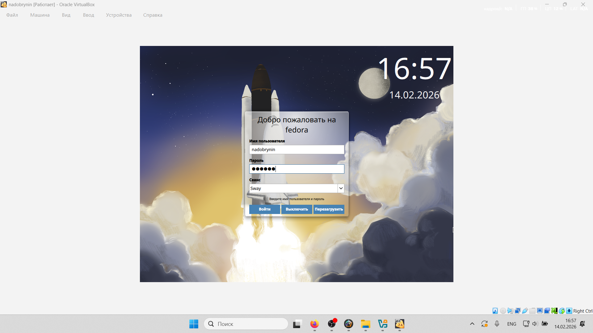{#fig-010 width=70%}

Вошел в права суперпользователя и начал установку необходимых пакетов([рис. @fig-011])

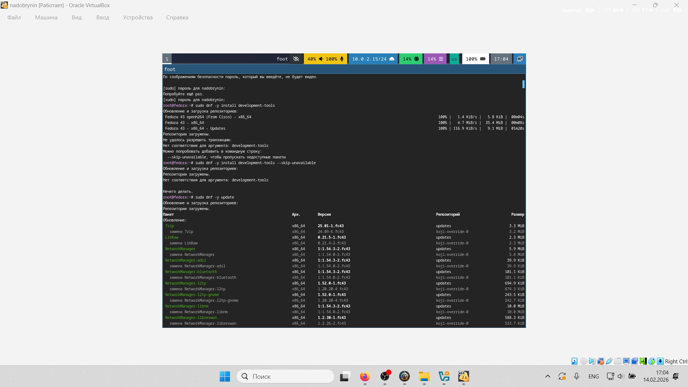{#fig-011 width=70%}

Перезагрузил и снова вошел в систему([рис. @fig-012])

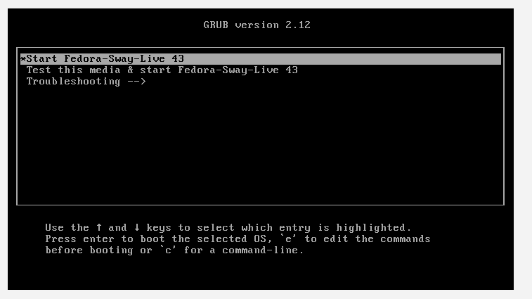{#fig-012 width=70%}

Вошел в права суперпользователя([рис. @fig-013])

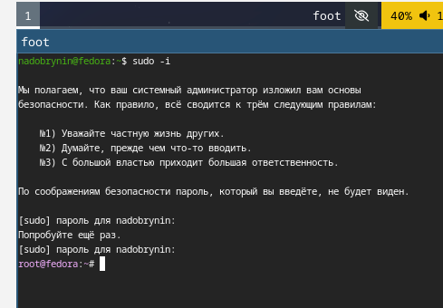{#fig-013 width=70%}

Установил пакет dnf-automatic([рис. @fig-014])

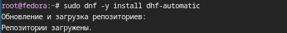{#fig-014 width=70%}

Установил мультиплексор tmux mc([рис. @fig-015])

{#fig-015 width=70%}

Перешел в каталог SElinux, открыл mc([рис. @fig-016])

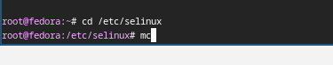{#fig-016 width=70%}

Поменял значение enforcing на permissive([рис. @fig-017])

{#fig-017 width=70%}

Перезагрузил систему([рис. @fig-018])

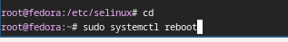{#fig-018 width=70%}

Создал каталог sway ([рис. @fig-019])

{#fig-019 width=70%}

Создал файл конфигурации клавиатуры 95-system-keyboard-config.conf([рис. @fig-020])

{#fig-020 width=70%}

Отредактировал созданный файл([рис. @fig-021])

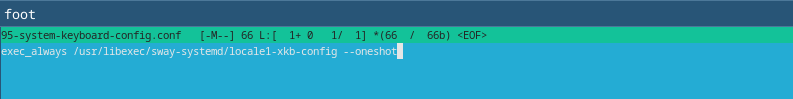{#fig-021 width=70%}

Отредактировал файл системы 00-keyboard-conf([рис. @fig-022])

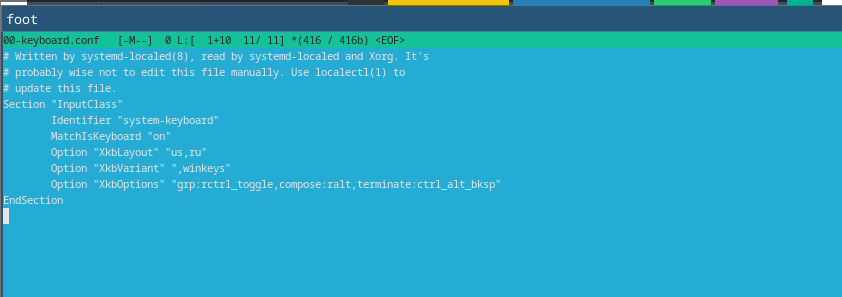{#fig-022 width=70%}

Перезагрузил систему([рис. @fig-023])

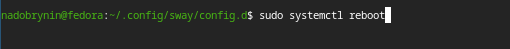{#fig-023 width=70%}

Указал имя пользователся nadobrynin c помощью комманды adduser -G wheel username([рис. @fig-024])

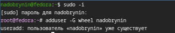{#fig-024 width=70%}

Проверил имя хоста([рис. @fig-025])

{#fig-025 width=70%}

Я решил установить pandoc и pandoc-crossref вручную([рис. @fig-026])

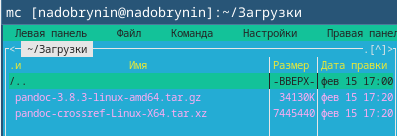{#fig-026 width=70%}

Разархивировал pandoc([рис. @fig-027])

{#fig-027 width=70%}

Разархивировал pandoc-crossref([рис. @fig-028])

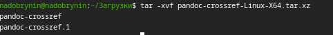{#fig-028 width=70%}

Разархивированные пакеты в каталоге "Загрузки"([рис. @fig-029])

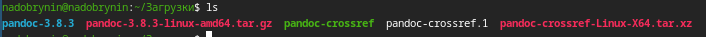{#fig-029 width=70%}

Скопировал пакеты в системный каталог([рис. @fig-030])

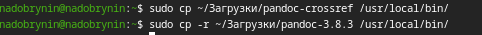{#fig-030 width=70%}

Начал установку texlive([рис. @fig-031])

{#fig-031 width=70%}

Установка texlive завершена([рис. @fig-032])

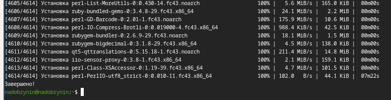{#fig-032 width=70%}

# Выполнение задания

Проверил версию ядра linux, версия ядра - 6.18.9-200.fc43.x86-64([рис. @fig-033])

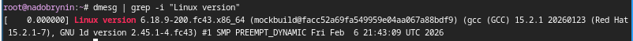{#fig-033 width=70%}

Частота процессора - 2611.200 MHz([рис. @fig-034])

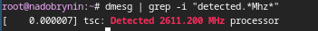{#fig-034 width=70%}

Модель процессора - Intel core i5-13420H model: 0xba([рис. @fig-035])

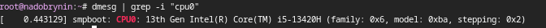{#fig-035 width=70%}

Проверил тип гипервизора([рис. @fig-036])

{#fig-036 width=70%}

Проверил объем доступной ОП([рис. @fig-037])

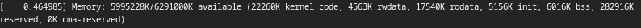{#fig-037 width=70%}

Проверил тип файловой системы коревого раздела([рис. @fig-038])

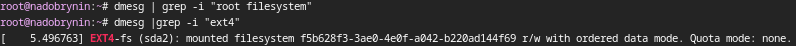{#fig-038 width=70%}

Проверил последовательность монтирования файловых систем([рис. @fig-039])

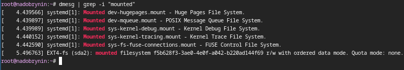{#fig-039 width=70%}

# Ответы на контрольные вопросы

1) Какую информацию содержит учётная запись пользователя?

Учетная запись пользователя содержит следкющие данные:
Имя пользователя(username)
Пароль(password)
UID(UserID)
GID(GroupID)
Домашний каталог(Home Directory)
Коммандная оболочка(Shell)
Доп. информацию(GECOS)

2) Укажите команды терминала и приведите примеры:
для получения справки по команде;
для перемещения по файловой системе;
для просмотра содержимого каталога;
для определения объёма каталога;
для создания / удаления каталогов / файлов;
для задания определённых прав на файл / каталог;
для просмотра истории команд.

Для получения справки по комманде - --help
Для перемещения - cd
Для просмотра содержимого каталога - ls
Для объема каталога - du
для создания / удаления каталогов / файлов - mkdir, rm и rmdir
для задания определённых прав на файл / каталог - chmod
для просмотра истории команд - history

3) Что такое файловая система? Приведите примеры с краткой характеристикой.

Файловая система - это способ организации, хранения и именования данных на носителях информации
Например системы ext4 для linux или NTFS для Windows

4) Как посмотреть, какие файловые системы подмонтированы в ОС?

при помощи комманды mount или комманд df -h/ df -T

5)Как удалить зависший процесс?

Необходимо найти идентификатор процесса коммандой ps или top и принудительно завершить процесс коммандой kill -9 PID(Принудительное завершение процесса ядром ОС)

# Выводы

Я приеброел практические навыки по установке ОС на ВМ и настройке минимально необходимых для работы сервисов

# Список литературы{.unnumbered}

::: {#refs}
ТУИС Лабораторная работа №1 [Электронный ресурс] - URL https://esystem.rudn.ru/mod/page/view.php?id=1358321#citeproc_bib_item_1
Dash, P. Getting Started with Oracle VM VirtualBox / P. Dash. -Packt Publishing Ltd, 2013.-86 cc.
Немет, Э. Unix и Linux: руководство системного администратора. Unix и Linux/Э.Немет,Г.Снайдер, Т.Р.Хейн, Б.Уэйли. -4-е издание - Вильямс, 2014. -1312сс.
:::
