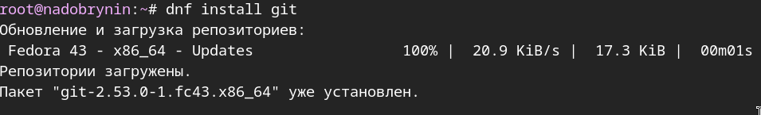
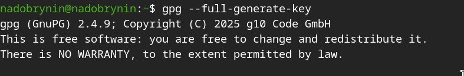
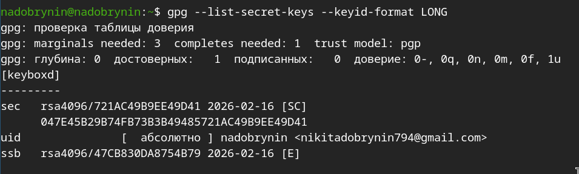
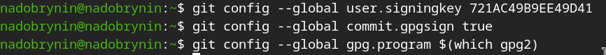
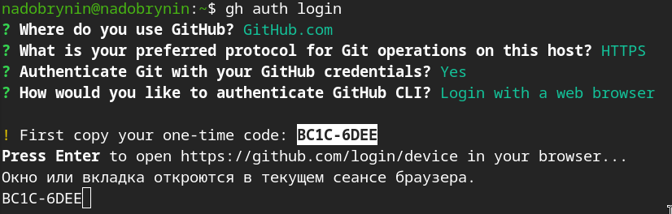
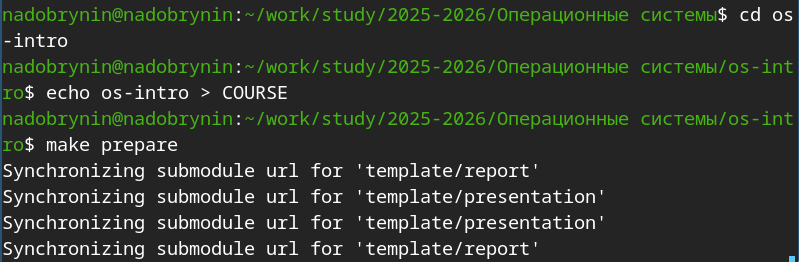

---
## Author
author:
  name: Добрынин Никита Артёмович
  email: 1132255598@rudn.ru
  affiliation:
    - name: Российский университет дружбы народов
      country: Российская Федерация
      postal-code: 117198
      city: Москва
      address: ул. Миклухо-Маклая, д. 6
## Title
title: Презентация по лабораторной работе №2
subtitle: Работа с git и github
license: CC BY
date: today
date-format: "2026.03.07" # Example: 2025-09-06
---

# Цели и задачи работы

## Цель лабораторной работы

Целью данной лабораторной работы является приобретение практических навыков по работе с git и github.

# Процесс выполнения лабораторной работы

## Устанавливаю git

{ #fig:001 width=70% height=70% }

## Устанавливаю gh

{ #fig:002 width=70% height=70% }

## Указываю свои данные для git

{ #fig:003 width=70% height=70% }

## Настраиваю git 

{ #fig:004 width=70% height=70% }

## Указываю стандартную ветку

{ #fig:005 width=70% height=70% }

## Настраиваю параметры core.autocrlf и core.safecrlf

{ #fig:006 width=70% height=70% }

## Генерирую ssh ключ алгоритмом rsa 4096

{ #fig:007 width=70% height=70% }

## Генерирую ssh ключ алгоритмом ed25519

{ #fig:008 width=70% height=70% }

## Генерирую gpg ключ

{ #fig:009 width=70% height=70% }

## Вывожу список ключей и информацию о них

{ #fig:012 width=70% height=70% }

## Настроил автоматическую подпись коммитов git

{ #fig:016 width=70% height=70% }

## Настроил gh 

{ #fig:017 width=70% height=70% }

## Создал каталог для репозитория и клонировал указанный шаблон

{ #fig:019 width=70% height=70% }

## Скопировал свой репозиторий github на свой ПК

{ #fig:020 width=70% height=70% }

## Настроил каталог курса

{ #fig:022 width=70% height=70% }

# Выводы по проделанной работе

## Вывод

Я приобрёл практические навыки по работе с git и настроил свой репозиторий на github

