---
## Author
author:
  name: Добрынин Никита Артёмович
  degrees: 
  orcid: 0000-0002-0877-7063
  email: 1132255598@rudn.ru
  affiliation:
    - name: Российский университет дружбы народов
      country: Российская Федерация
      postal-code: 117198
      city: Москва
      address: ул. Миклухо-Маклая, д. 6

## Title
title: "Лабораторная работа №2"
subtitle: "Система контроля версий git"
license: "CC BY"
---

# Цель работы
1) Изучить идеологию и применить средства контроля версий
2) Освоить умения по работе с git

# Задание
1) Создать базовую конфигурацию для рнаботы с git
2) Создать SSH ключ
3) Создать ключ PGP
4) Настроить подписи git
5) Зарегистрироваться на Github
6) Создать локальный репозиторий
# Теоретическое введение
Системы контроля версий (VCS) применяются при работе нескольких человек над одним проектом.
Основное дерево проекта хранится в локальном или удаленном репозитории к которому настроен доступ для участников проекта

# Выполнение лабораторной работы
Установил git ([рис. @fig-001]) 

{#fig-001 width=70%}

Установил gh([рис. @fig-002])

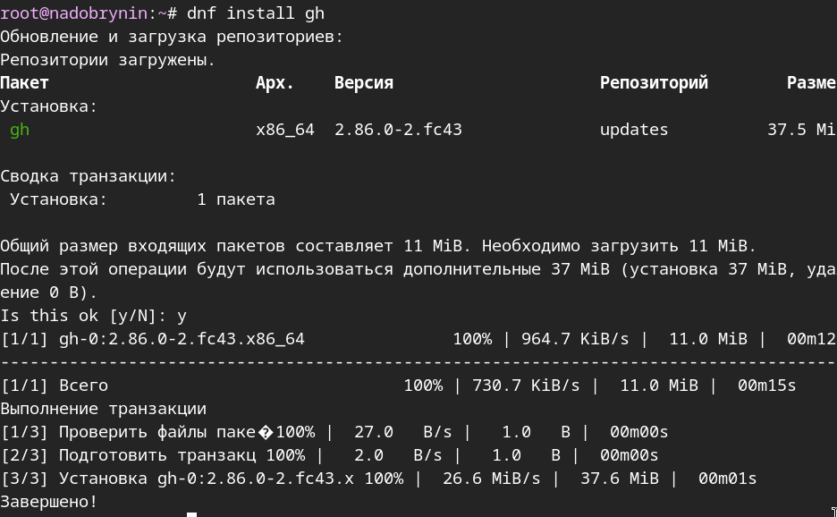{#fig-002 width=70%}

Задал имя и email владельца репозитория ([рис. @fig-003])

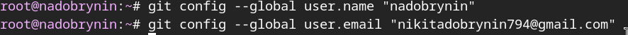{#fig-003 width=70%}

Настроил utf-8 в выводе сообщений git ([рис. @fig-004])

{#fig-004 width=70%}

Задал имя начальной ветки ([рис. @fig-005])

{#fig-005 width=70%}

Настроил параметры autocrlf и safecrlf ([рис. @fig-006])

{#fig-006 width=70%}

Создал ssh ключ по алгоритму rsa размером 4096 бит ([рис. @fig-007])

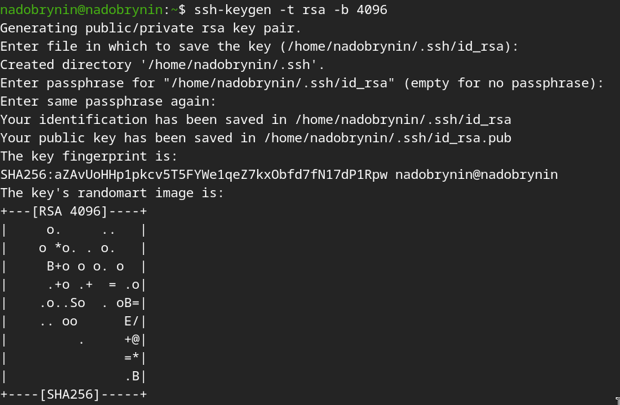{#fig-007 width=70% }

Создал ключ по алгоритму ed25519 ([рис. @fig-008])

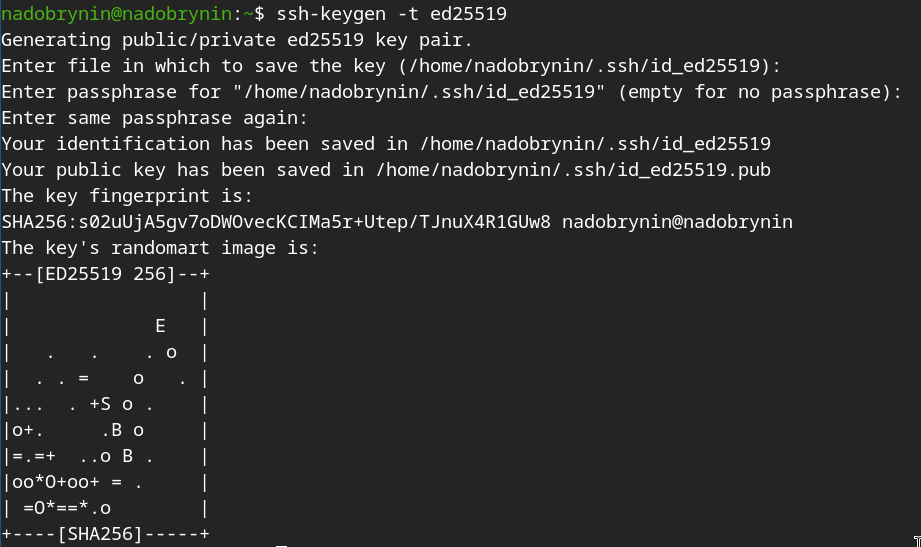{#fig-008 width=70% }

Сгенерировал ключ PGP  ([рис. @fig-009])

{#fig-009 width=70% }

Выбрал тип ключа, длину 4096 бит и указал неограниченный срок действия ключа ([рис. @fig-010]) 

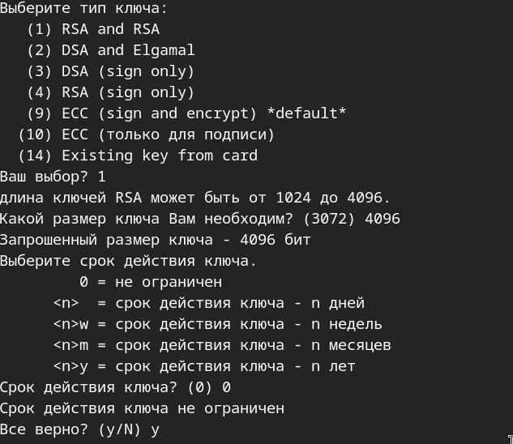{#fig-010 width=70% }

Имя и адрес ключа ([рис. @fig-011])

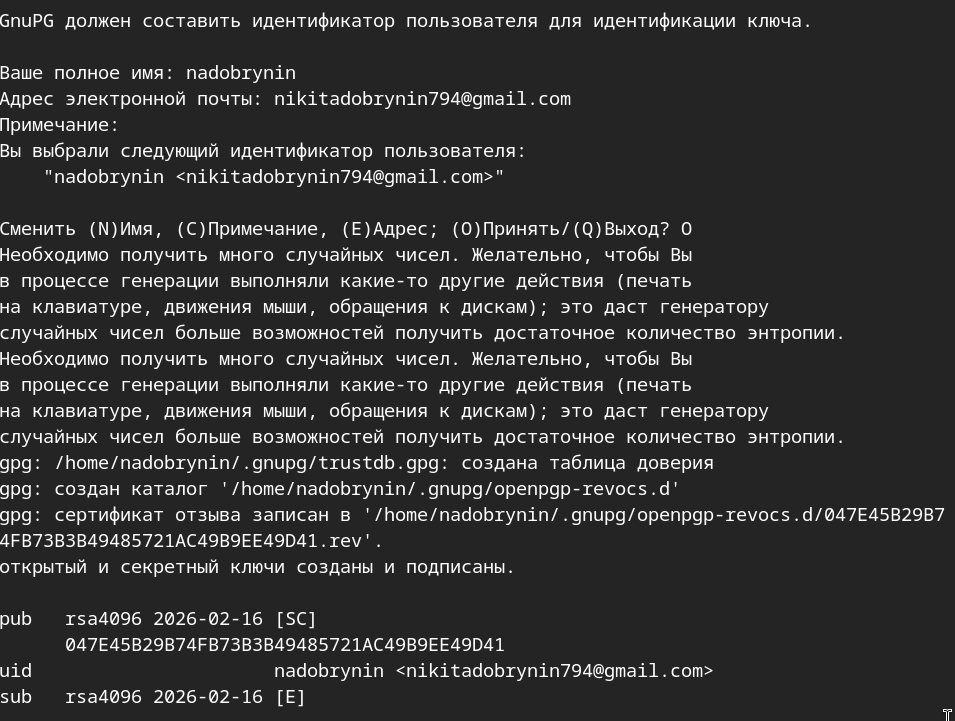{#fig-011 width=70% }

Вывел список ключей и скопировал отпечаток приватного ключа ([рис. @fig-012])

{#fig-012 width=70% }

Скопировал pgp ключ в буфер обмена  ([рис. @fig-013])

{#fig-013 width=70% }

Добавил новый pgp ключ в на свой аккаунт github ([рис. @fig-014])

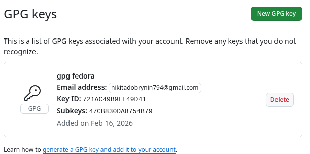{#fig-014 width=70% }

Используя введнный email, указал git применять его  ([рис. @fig-015])

{#fig-015 width=70% }

Настрил gh ([рис. @fig-016]) 

{#fig-016 width=70% }

Авторизация через браузер ([рис. @fig-017])

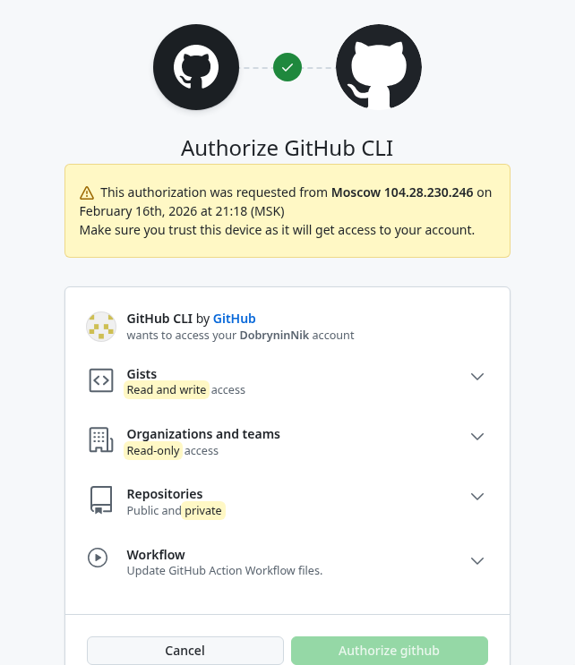{#fig-017 width=70% }

Создал репозиторий курса на основе шаблона ([рис. @fig-018]) 

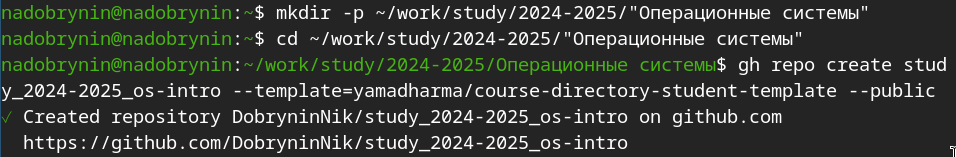{#fig-018 width=70% }

Скопировал репозиторий курса ([рис. @fig-019])

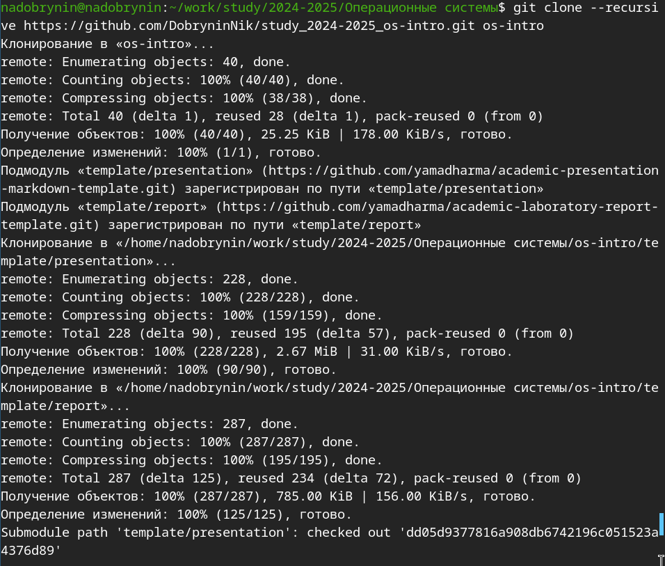{#fig-019 width=70% }

Настроил каталог курса ([рис. @fig-020]) 

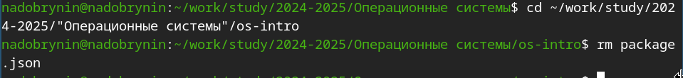{#fig-020 width=70% }

Создал каталоги курсов ([рис. @fig-021])

{#fig-021 width=70% }

Отправил файлы на сервер ([рис. @fig-022])

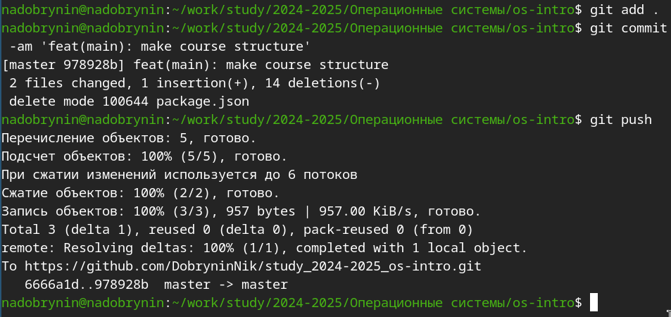{#fig-022 width=70% }

#Контрольные вопросы
1) Что такое системы контроля версий (VCS) и для решения каких задач они предназначаются?

Это системы для создания групповых проектов, система удобна тем что она храниться на удаленном сервере и к ней можно настроить доступ для участников проекта, система нужна для удобства координирования работы людей работающих над проектом

2) Объясните следующие понятия VCS и их отношения: хранилице, commit, история, рабочая копия.

Хранилище - Место где VCS хранит все файлы пректа и историю их изменений 
commit - Снимок (или же сохранение изменеий) состояния пректа со всеми изменениями
История - Список всех когда либо сделанных коммитов
рабочая копия - Локальная копия проекта на компьютере одного из разработчиков с которой он и работает 

3) Что представляют собой и чем отличаются централизованные и децентрализованные VCS? Приведите примеры VCS каждого вида.

Централизованная VCS - одно единственное место хранения на сервере к которому подключаются все разработчики что бы получить рабочую копию
Децентрализованная VCS - каждый разработчик имеет полную копию хранилища у себя на компьютере, можно выполнять работу и делать коммиты локально, не имея доступа к интернету
примеры: Git, Bazaar, Mercurial

4) Опишите действия с VCS при единоличной работе с хранилищем.

Инициализация - создать пустое хранилище в папке с проектом
Выполнение какой либо работы в рабочей копии
Добавление определенных изменений в следующий коммит
Создать коммит с описанием изменений

5) Опишите порядок работы с общим хранилищем VCS.

Клонирование - получение полной копии хранилища на свой компьютер
Добавление изменений из общего хранилища
Работа над проектом
Коммит внесенных изменений
Отправка своих изменений в общее хранилище 

6) Каковы основные задачи, решаемые инструментальным средством git?

Полный контроль версий кода без постоянного подкулючения
Обеспечение целостности истории проекта и эффективная работа с большими проектами

7)Назовите и дайте краткую характеристику командам git.

git init - Создание основного дерева репозитория
git pull - Получение обновлений текущего древа из центрального репозитория
git push - Отправка всех произведенных изменений в центральный репозиторий
git status - Просмотр списка измененных файлов в текущей директории
git diff - Просмотр текущих изменений
git add . - Добавить все изменения (каталоги, файлы)
git add files_name - Добавить конктретные изменения 
git rm files_name - Удалить файл или каталог из индекса репозитория

8)Приведите примеры использования при работе с локальным и удалённым репозиториями.

Локальный репозиторий:
Указываем имя и эл. почту владельца
git config --global user.name "Имя Фамилия" - Имя владельца репозитория
git config --global  user.email "work@mail" - email владельца репозитория
Настройка utf-8
git config --global quotepath false
Вводим команы для инициализации локального репозитория
cd 
mkdir tutorial
cd tutorial
git init
создание файла и добавление в репозитоий 
echo 'hello world' > hello.txt
git add hello.txt
git commit -am 'Новый файл'
можно прописать шаблон игнорирумых при добавлении в репозиторий типов файлов
curl -L -s https://www.gitignore.io/api/list

Удаленный репозиторий:
Генерация ключей для идентификации пользователя
ssh-keygen -C "Имя Фамилия <work@mail>"
вставляем полученный ключ в настройках github
Загрузка локального репозитория на сервер
git remote add origin 
  ssh://git@github.com/<username>/<reponame>.git
git push -u origin master
Далее на локальном компьютере можно выполнять стандартные процедуры для работы с git при наличии центрального репозитория.

9)Что такое и зачем могут быть нужны ветви (branches)?

Это отдельные линии разработки 
Они могут быть нужны для разработки новых функций, исправления ошибок или работы нескольких разработчиков

10)Как и зачем можно игнорировать некоторые файлы при commit?

Нужно создать файл с именем .gitignore, внутри него можно перечислить шаблоны имен файлов или каталогов которые git должен игнорировать
это нужно что бы например не захламлять репозиторий временными или ненужными файлами  

# Выводы

Я освоил средства контроля версий, в частности git

# Список литературы(.unnumbered)

::: {#refs}
ТУИС Лабораторная работа №2 (Электронный ресурс) URL: https://esystem.rudn.ru/mod/page/view.php?id=1358324#org2405fb6
:::
