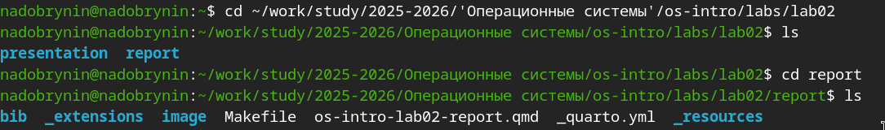
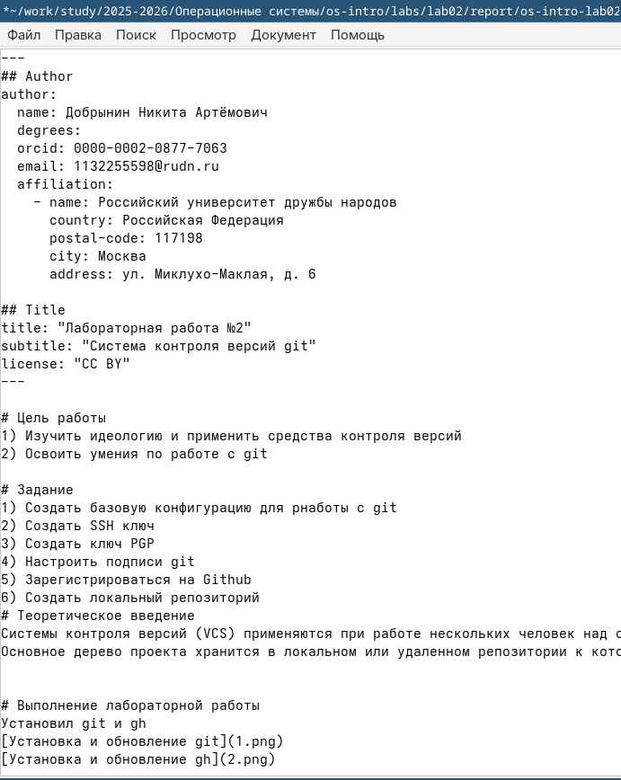

---
## Author
author:
  name: Добрынин Никита Артёмович
  email: 1132255598@rudn.ru
  affiliation:
    - name: Российский университет дружбы народов
      country: Российская Федерация
      postal-code: 117198
      city: Москва
      address: ул. Миклухо-Маклая, д. 6
## Title
title: Презентация по лабораторной работе №3
subtitle: Работа с языком разметки markdown
license: CC BY
date: today
date-format: "2026.03.07" # Example: 2025-09-06
---

# Цели и задачи работы

## Цель лабораторной работы

Целью данной лабораторной работы является приобретение практических навыков по работе легковесным языком рпзиетки markdown (md).

# Процесс выполнения лабораторной работы

## Перешел в каталог лабораторной работы №2

{ #fig:001 width=70% height=70% }

## Открываю markdown файл с помощью mousepad

{ #fig:002 width=70% height=70% }

## Создал отчёт используя язык разметки md и текстовый редактор mousepad

{ #fig:003 width=70% height=70% }

## Скомпилировал файл командой make

{ #fig:004 width=70% height=70% }

## Демонстрация готовых скомпилированных файлов в форматах .pdf и .html

{ #fig:005 width=70% height=70% }

# Выводы по проделанной работе

## Вывод

Я приобрёл практические навыки по работе с легковесным языком разметки markdown и сделал отчёт по прошлой лабораторной работе.

