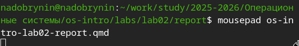
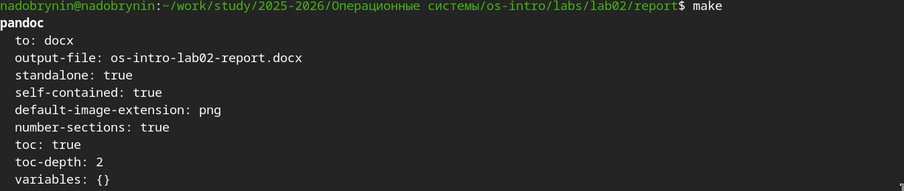
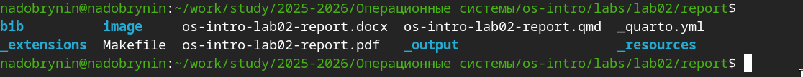

---
## Author
author:
  name: Добрынин Никита Артёмович
  degrees: 
  orcid: 0000-0002-0877-7063
  email: 1132255598@rudn.ru
  affiliation:
    - name: Российский университет дружбы народов
      country: Российская Федерация
      postal-code: 117198
      city: Москва
      address: ул. Миклухо-Маклая, д. 6

## Title
title: "Лабораторная работа №3"
subtitle: "Язык разметки markdown"
license: "CC BY"
---

# Цель работы

Познакомиться с основными возможностями разметки Markdown. Научиться выполнять отчёты с помощью языка разметки markdown.

# Задание

Необходимо сделать отчёт по предыдущей лабораторной работе в формате markdown.

# Теоретическое введение

Markdown - легковесный язык разметки.

# Выполнение лабораторной работы

Перешел в рабочий каталог([рис. @fig-001]).

{#fig-001 width=70%}

Открыл шаблон отчета при помощи текствого редактора mousepad([рис. @fig-002]).

{#fig-002 width=70%}

Сделал отчёт по лабораторной работе №2([рис. @fig-003]).

{#fig-003 width=70%}

Скомпилировал отчёт в markdown коммандой make([рис. @fig-004]).

{#fig-004 width=70%}

Отчёты скомпилировались успешно([рис. @fig-005]).

{#fig-005 width=70%}

# Выводы

Я научился работать с языком разметки markdown и сделал отчёт по предыдущей лабораторной работе

# Список литературы{.unnumbered}

::: {#refs}
ТУИС Лабораторная работа №3 [Электронный ресурс] - URL https://esystem.rudn.ru/pluginfile.php/3097163/mod_resource/content/3/003-lab_markdown.pdf
:::
