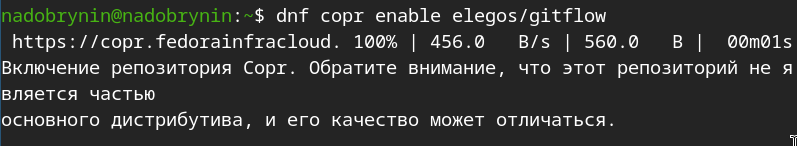
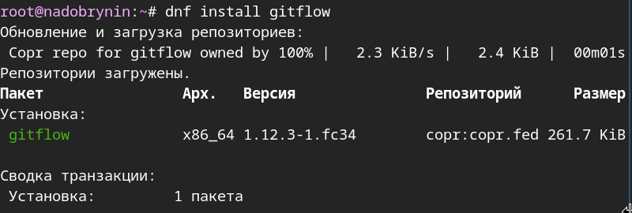

---
## Author
author:
  name: Добрынин Никита Артёмович
  email: 1132255598@rudn.ru
  affiliation:
    - name: Российский университет дружбы народов
      country: Российская Федерация
      postal-code: 117198
      city: Москва
      address: ул. Миклухо-Маклая, д. 6
## Title
title: Презентация по лабораторной работе №3
subtitle: Работа с языком разметки markdown
license: CC BY
date: today
date-format: "2026.03.07" # Example: 2025-09-06
---

# Цели и задачи работы

## Цель лабораторной работы

Целью данной лабораторной работы является углубленное изучение git и gitflow

# Процесс выполнения лабораторной работы

## Подключение copr

{ #fig:001 width=70% height=70% }

## Установка gitflow

{ #fig:002 width=70% height=70% }

## Установка node.js

{ #fig:003 width=70% height=70% }

## Установка pnpm

{ #fig:004 width=70% height=70% }

## Добавление параметров

{ #fig:006 width=70% height=70% }

## Добавление стандартных changelog

{ #fig:007 width=70% height=70% }

## Редактирование файла package.json

{ #fig:008 width=70% height=70% }

# Выводы по проделанной работе

## Вывод

Я углуьленно изучил работу с git и gitflow.