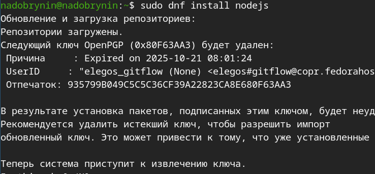
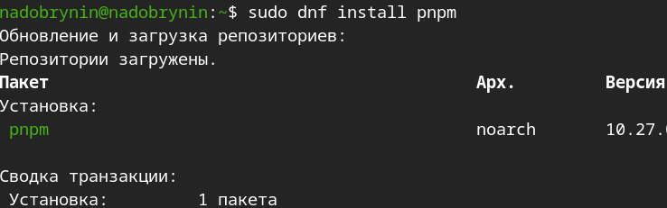
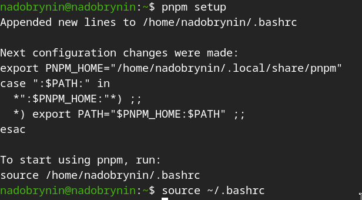
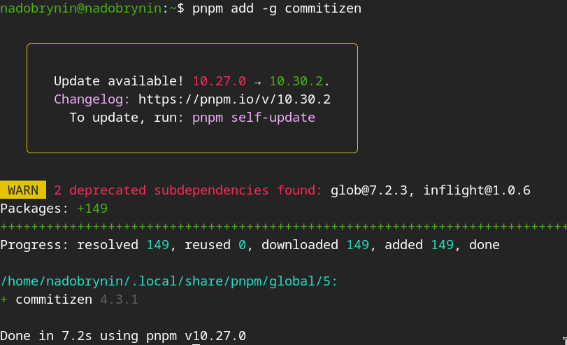
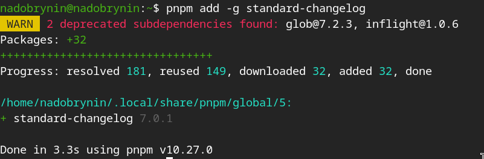
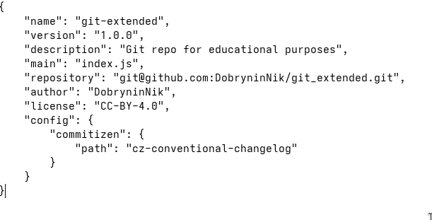

---
## Author
author:
  name: Добрынин Никита Артёмович
  email: 1132255598@rudn.ru
  affiliation:
    - name: Российский университет дружбы народов
      country: Российская Федерация
      postal-code: 117198
      city: Москва
      address: ул. Миклухо-Маклая, д. 6

## Title
title: Отчёт по лабораторной работе №4
subtitle: Углубленная работа с git, gitflow
license: "CC BY"
---

# Цель работы

Целью данной лабораторной работы является более углубленное освоение git и работа с gitflow.

# Задание

Выполнить работу для тестового репозитория.
Преобразовать рабочий репозиторий в репозиторий с git-flow и conventional commits.

# Теоретическое введение

Gitflow Workflow опубликована и популяризована Винсентом Дриссеном.
Gitflow Workflow предполагает выстраивание строгой модели ветвления с учётом выпуска проекта.
Данная модель отлично подходит для организации рабочего процесса на основе релизов.
Работа по модели Gitflow включает создание отдельной ветки для исправлений ошибок в рабочей среде.

# Выполнение лабораторной работы

Подключил библиотеку copr([рис. @fig-001]).

{#fig-001 width=70%}

Устанавливаю инструмент gitflow([рис. @fig-002]).

{#fig-002 width=70%}

Установил инструмент node.js([рис. @fig-003]).

{#fig-003 width=70%}

Скачал pnpm([рис. @fig-004]).

{#fig-004 width=70%}

Установил pnpm и запустил его([рис. @fig-005]).

{#fig-005 width=70%}

Данная программа используется для помощи в форматировании коммитов([рис. @fig-006]).

{#fig-006 width=70%}

Данная программа используется для помощи в создании логов([рис. @fig-007]).

{#fig-007 width=70%}

Изменил параметры файла package.json([рис. @fig-008]).

{#fig-008 width=70%}

# Выводы

Я изучил git и gitflow углубленно

