---
## Author
author:
  name: Добрынин Никита Артёмович
  email: 1132255598@rudn.ru
  affiliation:
    - name: Российский университет дружбы народов
      country: Российская Федерация
      postal-code: 117198
      city: Москва
      address: ул. Миклухо-Маклая, д. 6

## Title
title: Отчёт по лабораторной работе №4
subtitle: Углубленная работа с git, gitflow
license: "CC BY"
---

# Цель работы

Целью данной лабораторной работы является установка менеджера паролей pass.

# Задание

# Теоретическое введение

Pass - менеджер паролей

# Выполнение лабораторной работы

Установил менеджер паролей pass([рис. @fig-001]).

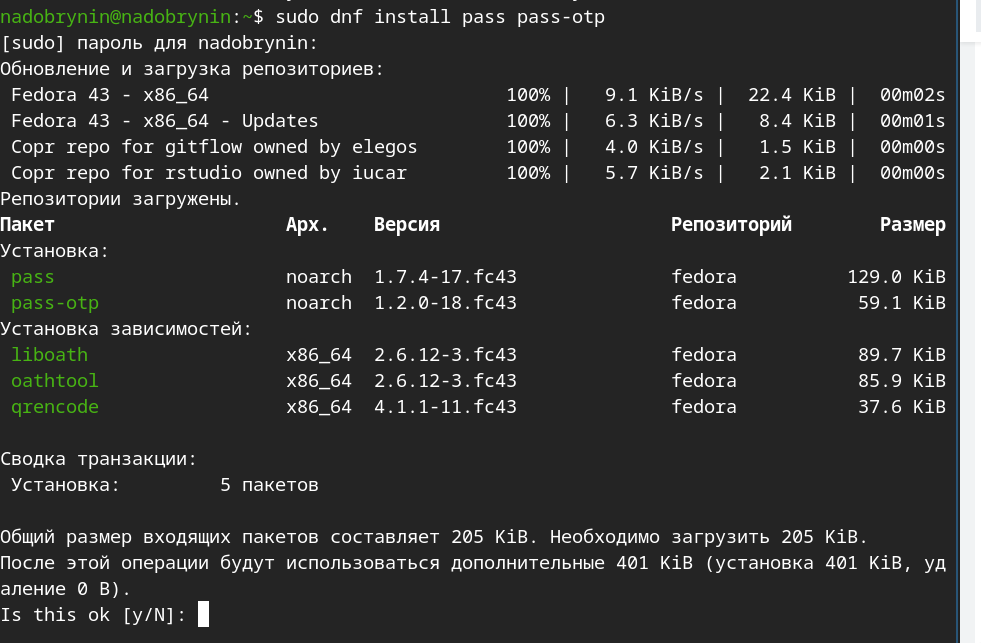{#fig-001 width=70%}

Установил gopass([рис. @fig-002]).

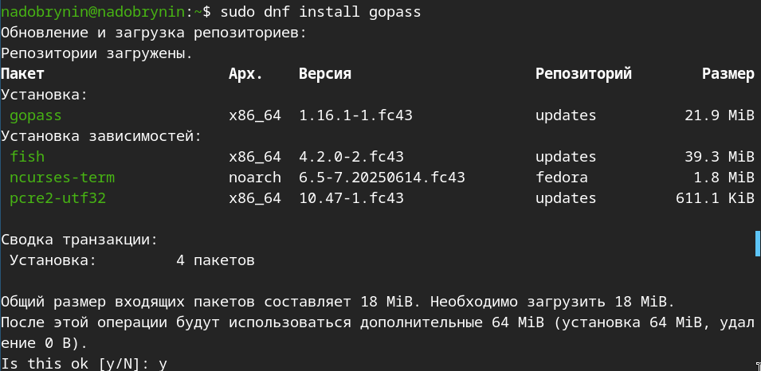{#fig-002 width=70%}

Вывелключ gpg и запустил pass([рис. @fig-003]).

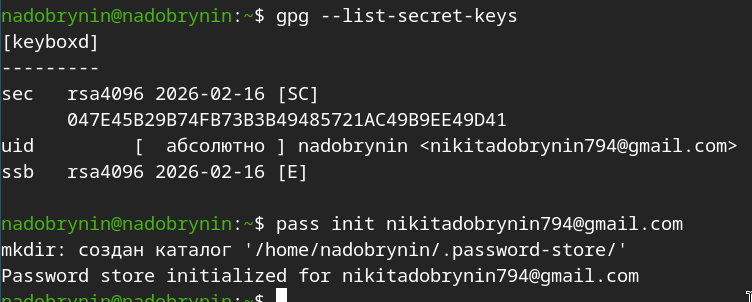{#fig-003 width=70%}

Запустил ssh-agent([рис. @fig-004]).

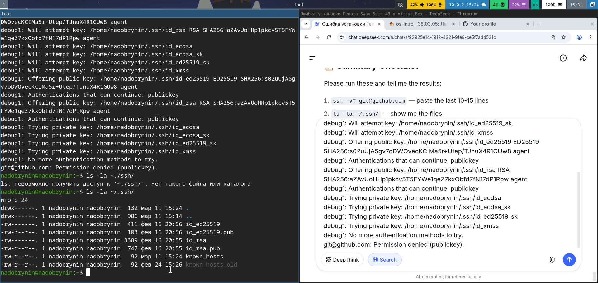{#fig-004 width=70%}

Инициировал хранилище([рис. @fig-005]).

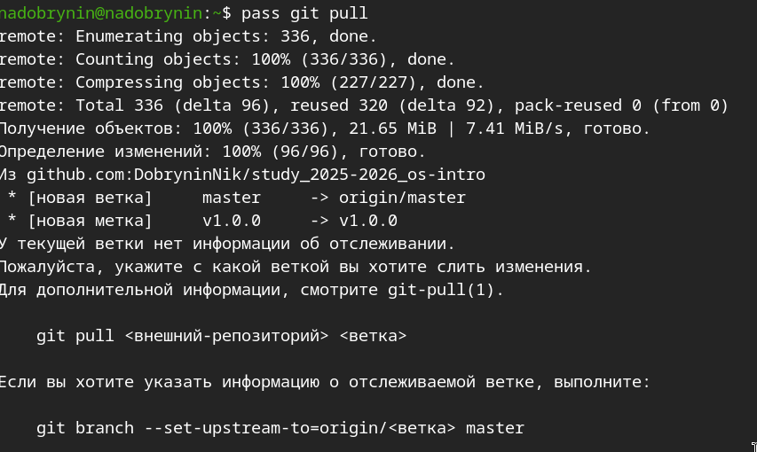{#fig-005 width=70%}

Сменил основную ветку([рис. @fig-006]).

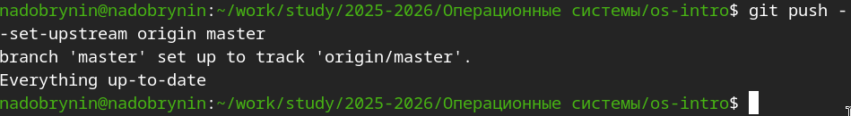{#fig-006 width=70%}

Установил browserpass([рис. @fig-007]).

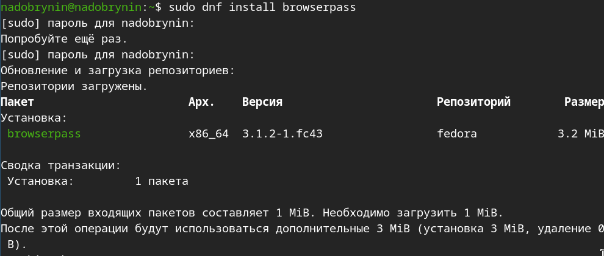{#fig-007 width=70%}

Добавил новый пароль([рис. @fig-008]).

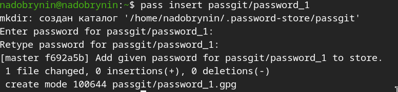{#fig-008 width=70%}

Перешел к паролю([рис. @fig-009]).

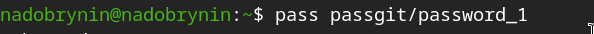{#fig-009 width=70%}

Создал новый рандомный пароль([рис. @fig-010]).

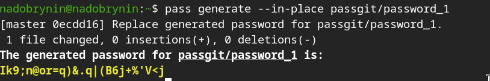{#fig-010 width=70%}

Установил необходимые библиотеки([рис. @fig-011]).

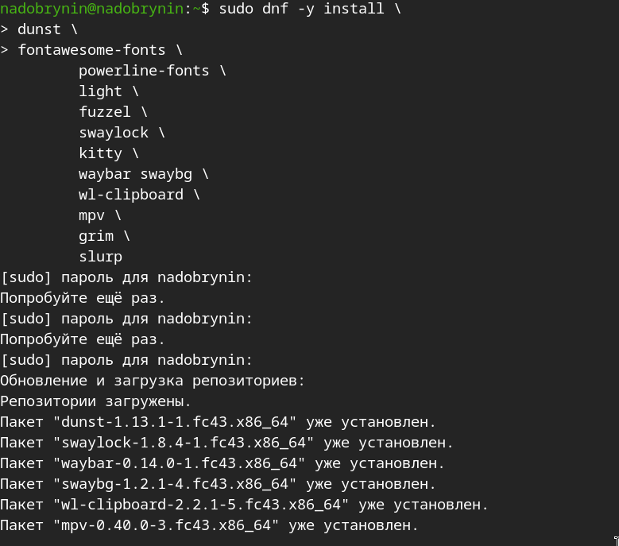{#fig-011 width=70%}

Подключил copr([рис. @fig-012]).

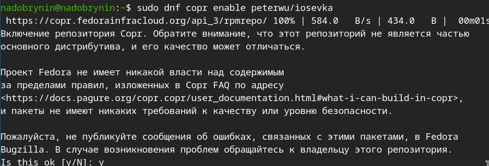{#fig-012 width=70%}

Установил шрифты iosevka([рис. @fig-013]).

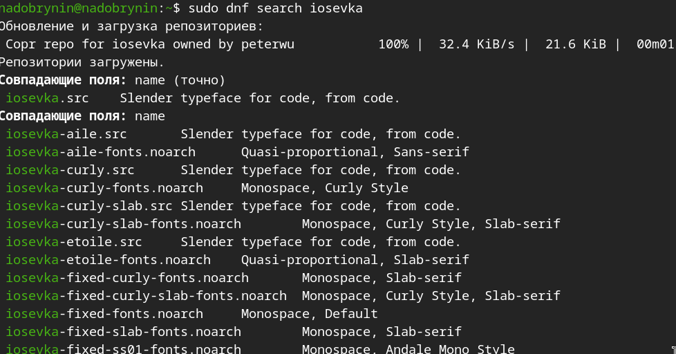{#fig-013 width=70%}

Установка шрифтов([рис. @fig-014]).

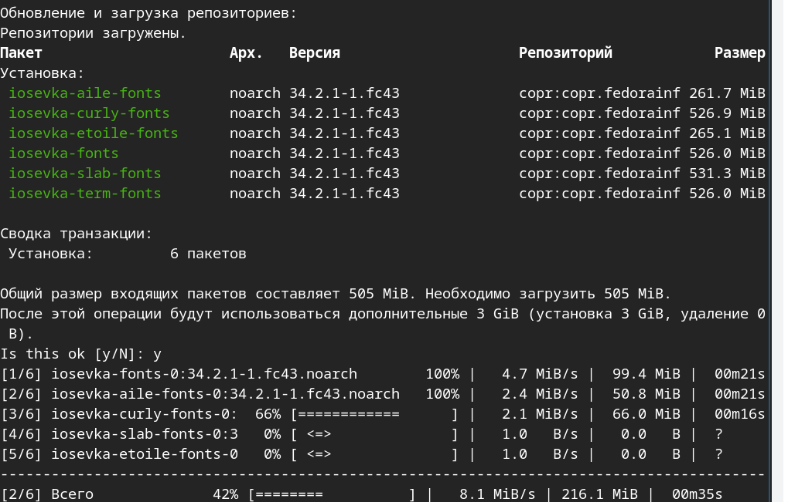{#fig-014 width=70%}

Скопировал нужный репозиторий с шаблона([рис. @fig-015]).

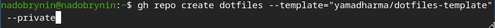{#fig-015 width=70%}

# Выводы

Я научился пользоваться pass.

