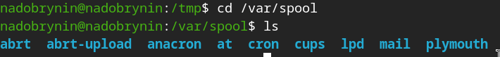
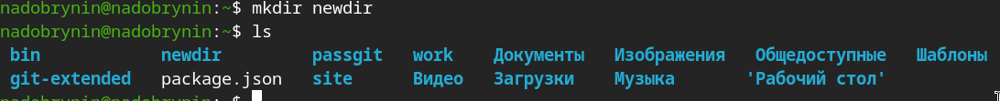
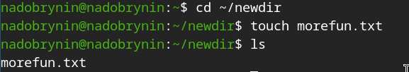
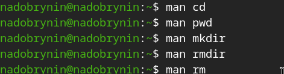
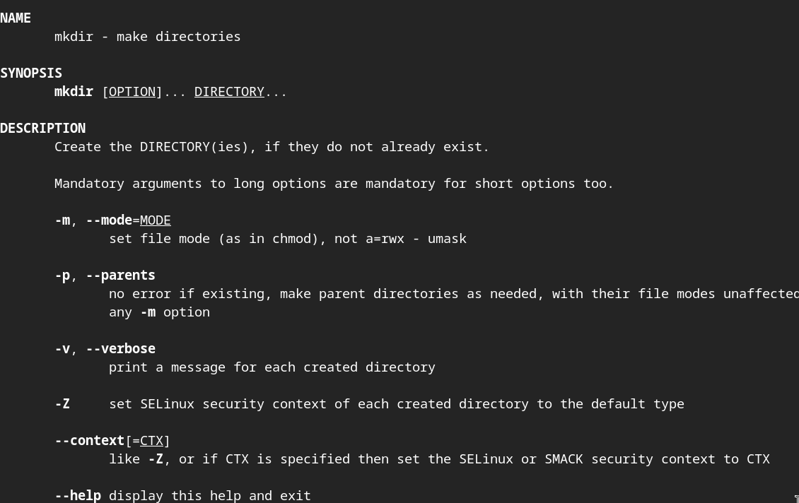

---
## Author
author:
  name: Добрынин Никита Артёмович
  email: 1132255598@rudn.ru
  affiliation:
    - name: Российский университет дружбы народов
      country: Российская Федерация
      postal-code: 117198
      city: Москва
      address: ул. Миклухо-Маклая, д. 6
## Title
title: Презентация по лабораторной работе №6
subtitle: Работа с командной строкой
license: CC BY
date: today
date-format: "2026.03.20" # Example: 2025-09-06
---

# Цели и задачи работы

## Цель лабораторной работы

Целью данной лабораторной работы является освоение командной строки Unix

# Процесс выполнения лабораторной работы

## Домашний каталог

{ #fig:001 width=70% height=70% }

## Вывод информации ls -alF

{ #fig:002 width=70% height=70% }

## Папка cron

{ #fig:003 width=70% height=70% }

## Папка newdir

{ #fig:004 width=70% height=70% }

## Создание файла morefun

{ #fig:006 width=70% height=70% }

## Создание папок

{ #fig:007 width=70% height=70% }

## Удаление папки

{ #fig:008 width=70% height=70% }

## Команда man

{ #fig:008 width=70% height=70% }

## Команда man cd

{ #fig:008 width=70% height=70% }

## Команда man pwd

{ #fig:008 width=70% height=70% }

## Команда man mkdir

{ #fig:008 width=70% height=70% }

## Команда man rmdir

{ #fig:008 width=70% height=70% }

## Команда man rm

{ #fig:008 width=70% height=70% }

## Модификация команды 

{ #fig:008 width=70% height=70% }

# Выводы по проделанной работе

## Вывод

Освоил работу с командной строкой.
