---
## Author
author:
  name: Добрынин Никита Артёмович
  email: 1132255598@rudn.ru
  affiliation:
    - name: Российский университет дружбы народов
      country: Российская Федерация
      postal-code: 117198
      city: Москва
      address: ул. Миклухо-Маклая, д. 6

## Title
title: Отчёт по лабораторной работе №4
subtitle: Углубленная работа с git, gitflow
license: "CC BY"
---

# Цель работы

Приобретение практических навыков взаимодействия пользователя с системой посредством командной строки.

# Задание

1. Что такое командная строка?

2. При помощи какой команды можно определить абсолютный путь текущего каталога?
Приведите пример.

3. При помощи какой команды и каких опций можно определить только тип файлов
и их имена в текущем каталоге? Приведите примеры.

4. Каким образом отобразить информацию о скрытых файлах? Приведите примеры.

5. При помощи каких команд можно удалить файл и каталог? Можно ли это сделать
одной и той же командой? Приведите примеры.

6. Каким образом можно вывести информацию о последних выполненных пользователем командах? работы?

7. Как воспользоваться историей команд для их модифицированного выполнения? Приведите примеры.

8. Приведите примеры запуска нескольких команд в одной строке.

9. Дайте определение и приведите примера символов экранирования.

10. Охарактеризуйте вывод информации на экран после выполнения команды ls с опцией

11. Что такое относительный путь к файлу? Приведите примеры использования относительного и абсолютного пути при выполнении какой-либо команды.

12. Как получить информацию об интересующей вас команде?

13. Какая клавиша или комбинация клавиш служит для автоматического дополнения
вводимых команд?

# Теоретическое введение

# Выполнение лабораторной работы

Определил название и путь домашнего каталога([рис. @fig-001]).

{#fig-001 width=70%}

Пререшел в каталог /tmp и вывел его содержимое командой ls([рис. @fig-002]).

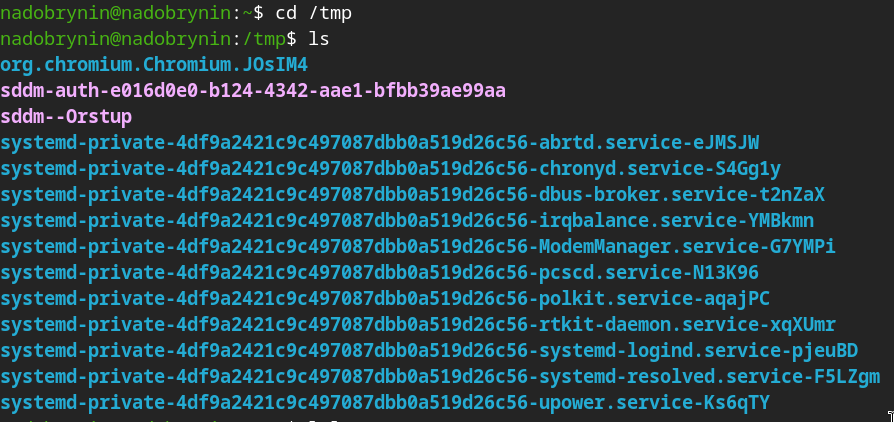{#fig-002 width=70%}

Вывел файлы командой ls -a([рис. @fig-003]).

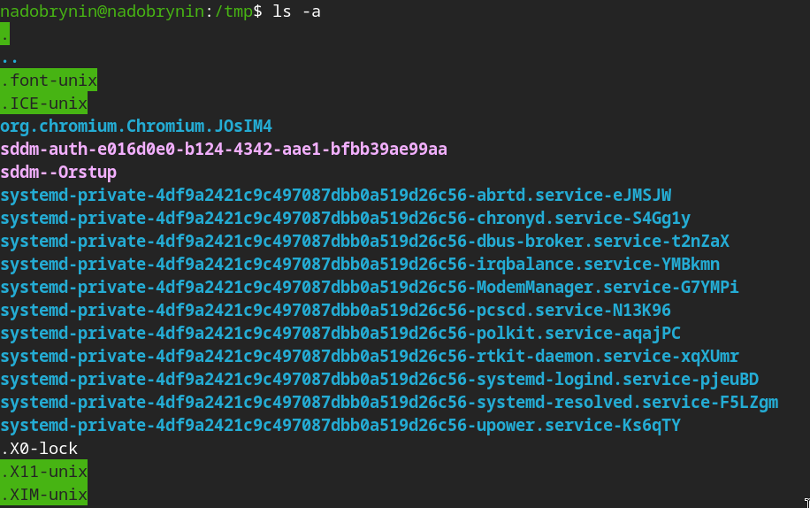{#fig-003 width=70%}

Вывел файлы командой ls -F([рис. @fig-004]).

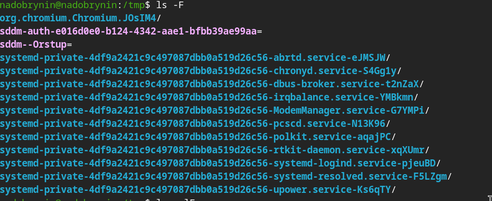{#fig-004 width=70%}

Вывел файлы и прочие данные командой с мультиопцией ls -alF([рис. @fig-005]).

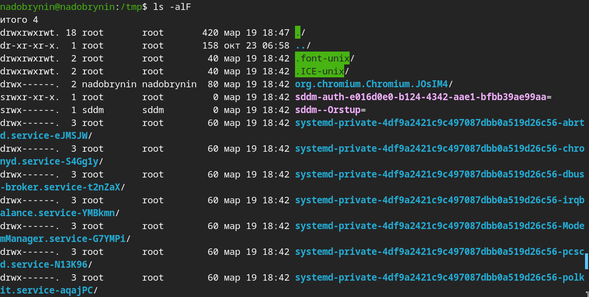{#fig-005 width=70%}

Перегел в каталог /var/spool и вывел его содержимое, там содержится файл cron([рис. @fig-006]).

{#fig-006 width=70%}

В домашнем каталоге создал новый каталог newdir([рис. @fig-008]).

{#fig-008 width=70%}

Перешел в созданный каталог и создал новый файл morefun.txt([рис. @fig-009]).

{#fig-009 width=70%}

Создал три новых каталога одной командой([рис. @fig-011]).

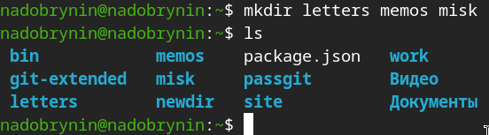{#fig-011 width=70%}

Принудительно удалил каталог newdir с его содержимым([рис. @fig-012]).

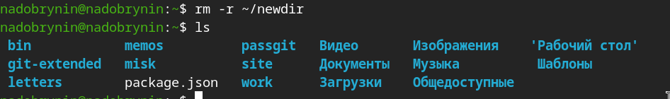{#fig-012 width=70%}

Командой man ls узнал как вывести список для просмотра содержимого не только указанного каталога, но и подкаталогов,
входящих в него.([рис. @fig-013]).

{#fig-013 width=70%}

Командой man ls нашел опцию позволяющую отсортировать по времени последнего изменения выводимый список с развёрнутым описанием файлов([рис. @fig-014]).

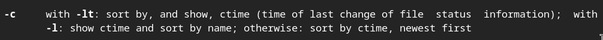{#fig-014 width=70%}

Вывел содержимое командой ls -clt([рис. @fig-015]).

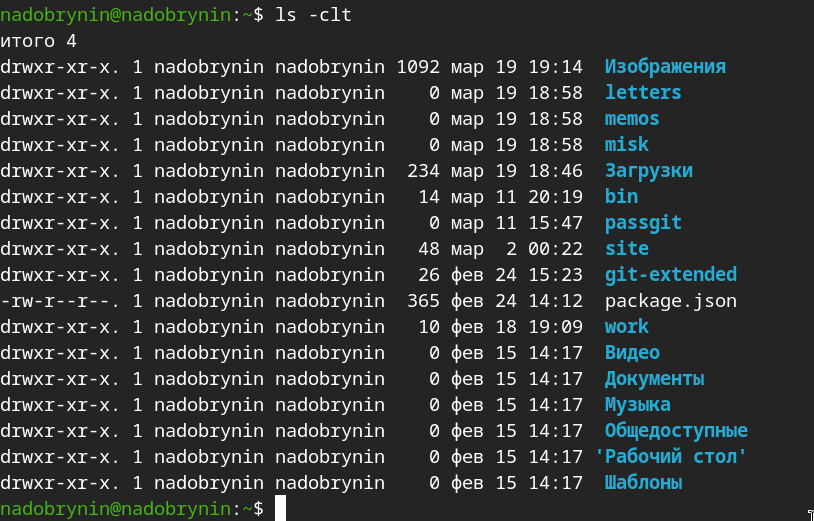{#fig-015 width=70%}

Использовал команду man cd([рис. @fig-016]).

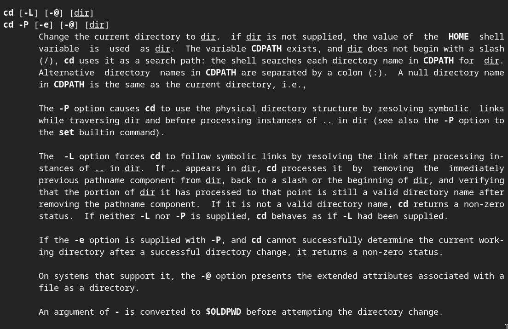{#fig-016 width=70%}

Использовал команду man pwd([рис. @fig-017]).

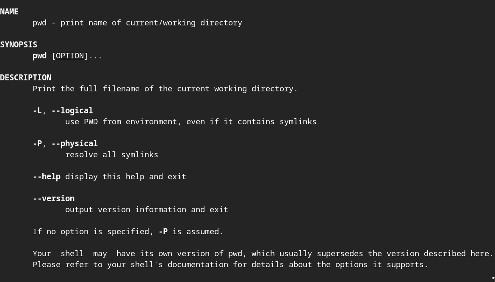{#fig-017 width=70%}

Использовал команду man mkdir([рис. @fig-018]).

{#fig-018 width=70%}

Использовал команду man rmdir([рис. @fig-019]).

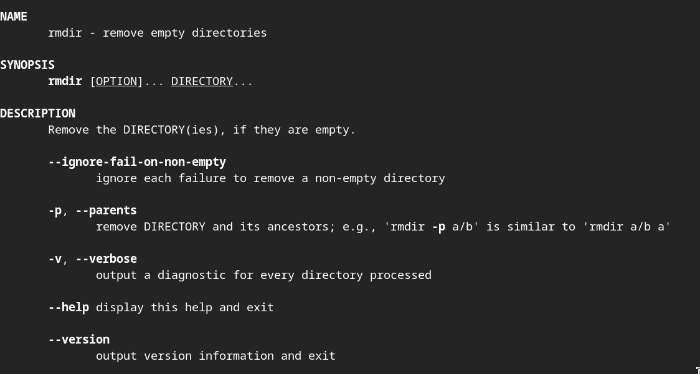{#fig-019 width=70%}

Использовал команду man rm([рис. @fig-020]).

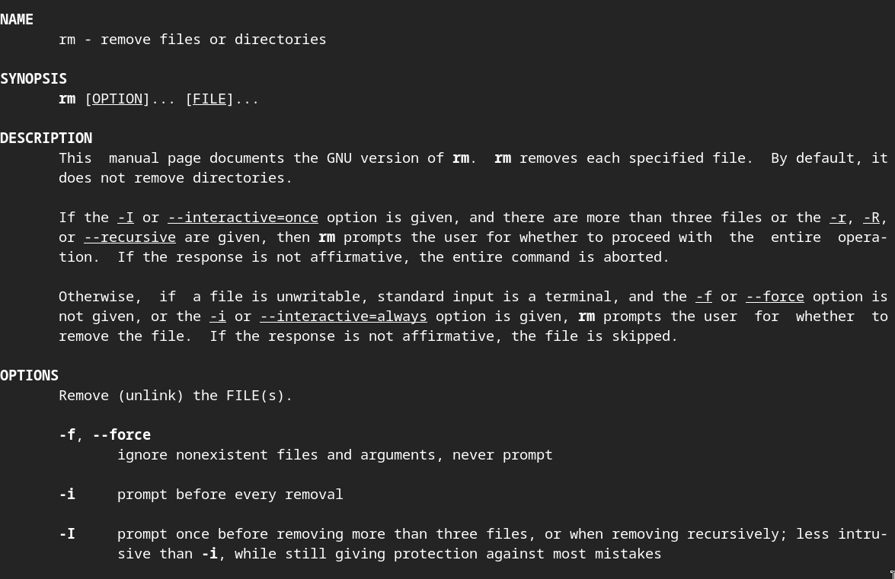{#fig-020 width=70%}

Используемые команды для прошлых действий ([рис. @fig-021]).

![Команды man [...]](image/21.png){#fig-021 width=70%}

Модифицировал команду из истории команд 'history'([рис. @fig-022]).

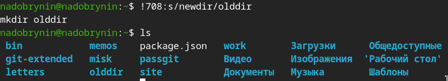{#fig-022 width=70%}

# Ответы на контрольные вопросы

1) Командная строка - это среда в которую вписываются команды

2) Командой pwd можно определить абсолютный путь текущего каталога 
Например: pwd 

3) Командой ls выводим список файлов, опция -F покажет тип файлов, опция -a покажет скрытые файлы

4) Как было сказано ранее опцией команды ls -a

5) Командой rmdir можно удалять каталоги, командой rm файлы

6) Командой history

7) Написать команду history и модифицировать ее конструкцией !<номер_команды>:s/<что_меняем>/<на_что_меняем>

8) Если я введу команду cd ; ls будучи не в домашнем каталоге то перейду в него и получу список файлов домашнего каталога

9) Символ экранирования - (обратный слеш \) позволяет использовать спец символ как обычный и показывает системе где пробер в названии каталога 
например: cd ~/work/Операционные\ системы

10) Опция -l позволит увидеть дполнительную информацию о файлах и каталогах: время создания, кем был создан

11) Относительный путь начинается из каталога в котором вы находитесь, абсолютный путь начинается с домашнего каталога

12) Добавить опцию к интересующей вас информации --help

13) Клавиша Tab

# Выводы

Я приобрел практические навыки взаимодействия с системой посредством командной строки.

