---
## Author
author:
  name: Добрынин Никита Артёмович
  email: 1132255598@rudn.ru
  affiliation:
    - name: Российский университет дружбы народов
      country: Российская Федерация
      postal-code: 117198
      city: Москва
      address: ул. Миклухо-Маклая, д. 6

## Title
title: Отчёт по лабораторной работе №4
subtitle: Углубленная работа с git, gitflow
license: "CC BY"
---

# Цель работы

Ознакомление с файловой системой Linux, её структурой, именами и содержанием
каталогов. Приобретение практических навыков по применению команд для работы
с файлами и каталогами, по управлению процессами (и работами), по проверке использования диска и обслуживанию файловой системы.

# Задание

1. Дайте характеристику каждой файловой системе, существующей на жёстком диске
компьютера, на котором вы выполняли лабораторную работу.
2. Приведите общую структуру файловой системы и дайте характеристику каждой директории первого уровня этой структуры.
3. Какая операция должна быть выполнена, чтобы содержимое некоторой файловой
системы было доступно операционной системе?
4. Назовите основные причины нарушения целостности файловой системы. Как устранить повреждения файловой системы?
5. Как создаётся файловая система?
6. Дайте характеристику командам для просмотра текстовых файлов.
7. Приведите основные возможности команды cp в Linux.
8. Приведите основные возможности команды mv в Linux.
9. Что такое права доступа? Как они могут быть изменены?

# Теоретическое введение

# Выполнение лабораторной работы

Посмотрел опции команды cp([рис. @fig-001]).

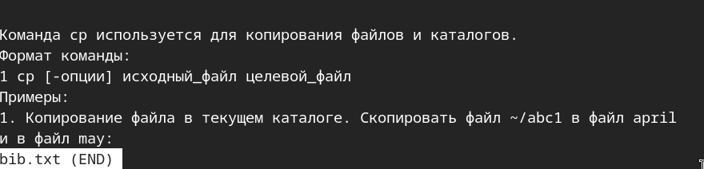{#fig-001 width=70%}

Создал файл bib.txt и заполнил его([рис. @fig-002]).

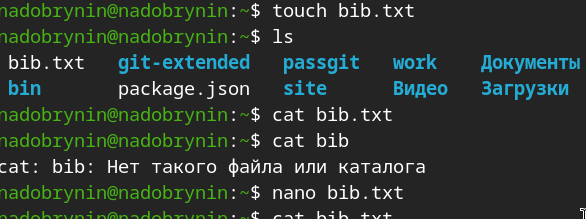{#fig-002 width=70%}

Проверил внутренний текст командой cat less head([рис. @fig-003]).

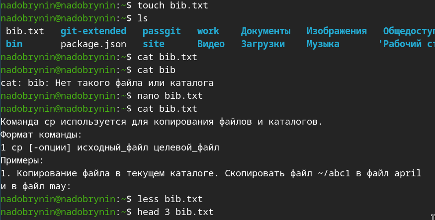{#fig-003 width=70%}

Скопировал файл io.h в домашний каталог и создал каталог ski.plases([рис. @fig-004]).

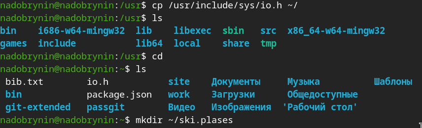{#fig-004 width=70%}

Создал вайл equipment.txt, переместил его в новый каталог переименовал equipment в equiplist([рис. @fig-005]).

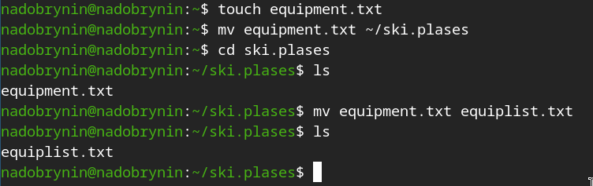{#fig-005 width=70%}

Создал каталог abc1 и переместил его в ski.plases и создал каталог equipment([рис. @fig-006]).

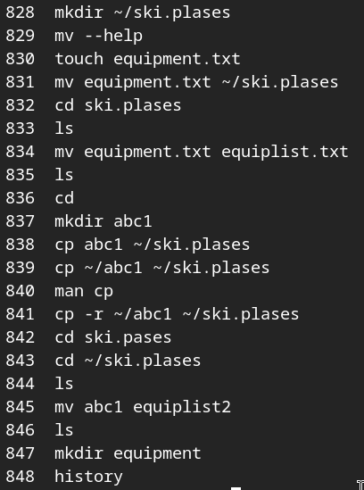{#fig-006 width=70%}

Показал файлы и каталоги в новом каталоге([рис. @fig-007]).

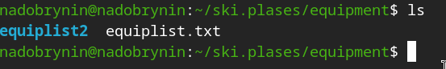{#fig-007 width=70%}

Создвл каталог newdir, перместил в каталог ski.plases, переименовал в plans([рис. @fig-008]).

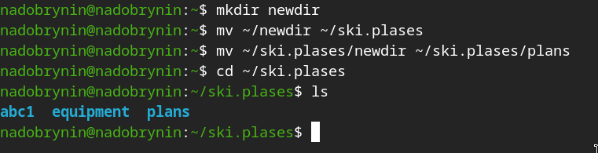{#fig-008 width=70%}

Изменил права к каталогу australia([рис. @fig-009]).

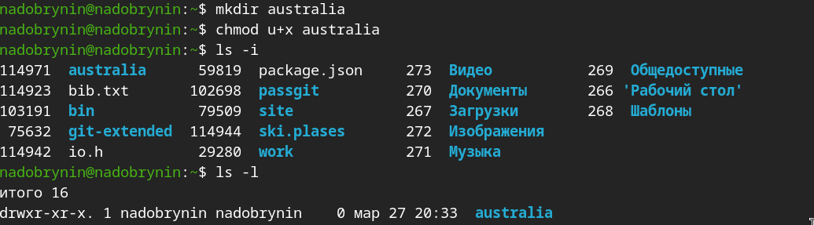{#fig-009 width=70%}

Изменил права к каталогу play([рис. @fig-011]).

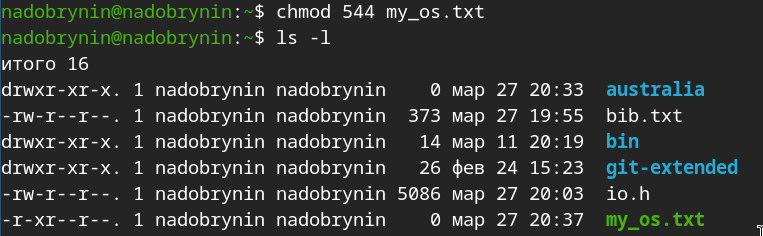{#fig-011 width=70%}

Изменил права к каталогу my_os([рис. @fig-012]).

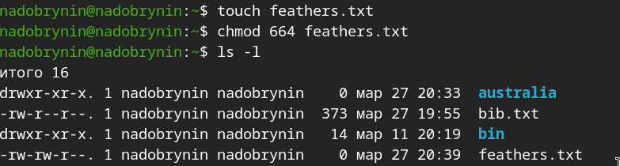{#fig-012 width=70%}

Изменил права к каталогу feathers([рис. @fig-013]).

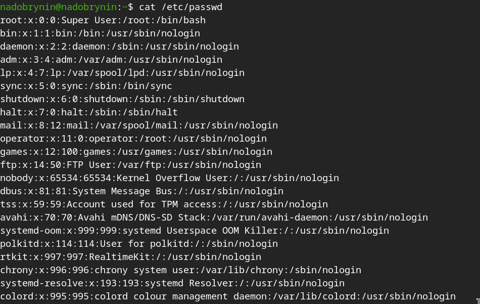{#fig-013 width=70%}

Скопировал feathers в file.old, переместил файлы и каталоги в каталог fun, перемеиновал fun в play ([рис. @fig-014]).

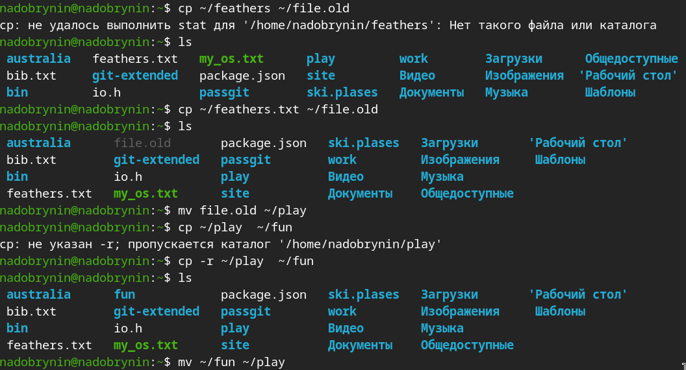{#fig-014 width=70%}

Изменил параметры доступа к нужным каталогам([рис. @fig-015]).

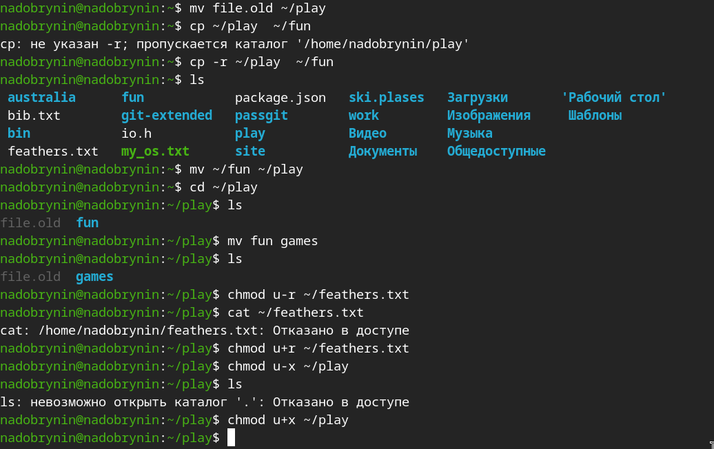{#fig-015 width=70%}

Опции команды mount([рис. @fig-016]).

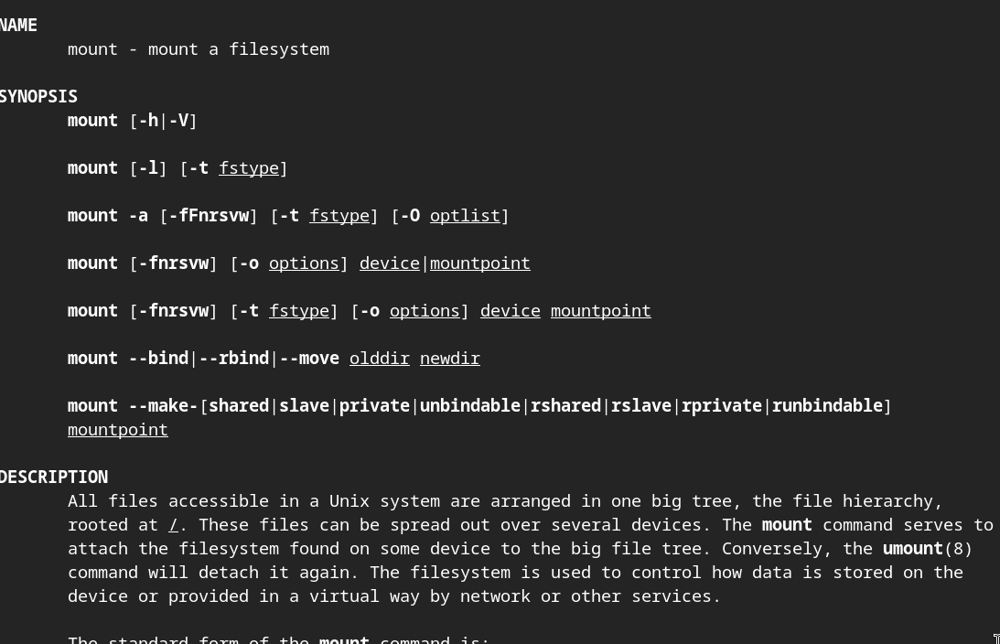{#fig-016 width=70%}

Опции команды fsck([рис. @fig-017]).

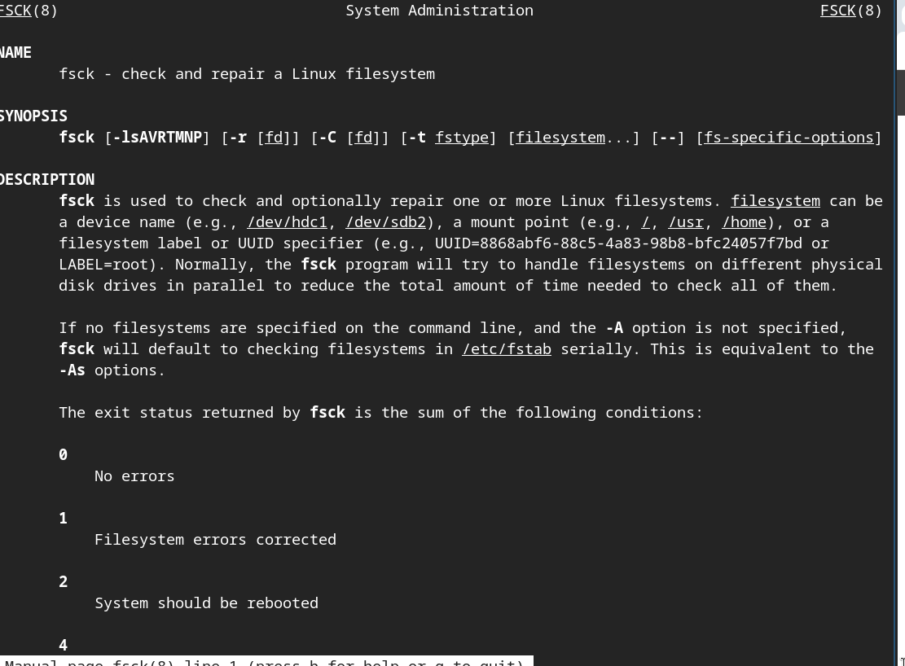{#fig-017 width=70%}

Опции команды mkfs([рис. @fig-018]).

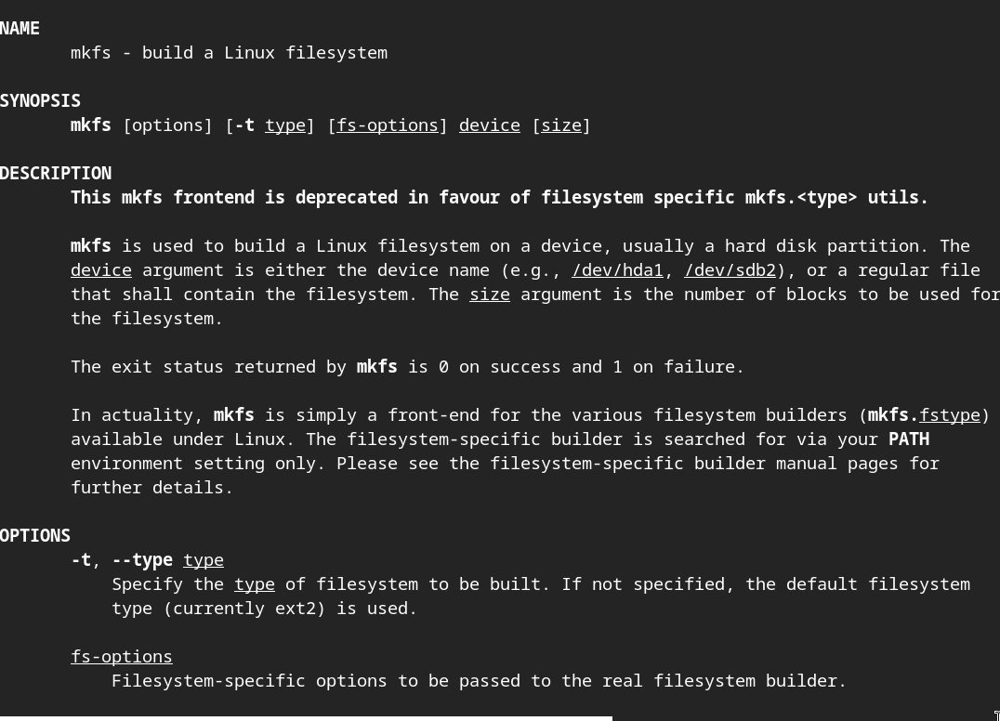{#fig-018 width=70%}

Опции команды kill([рис. @fig-019]).

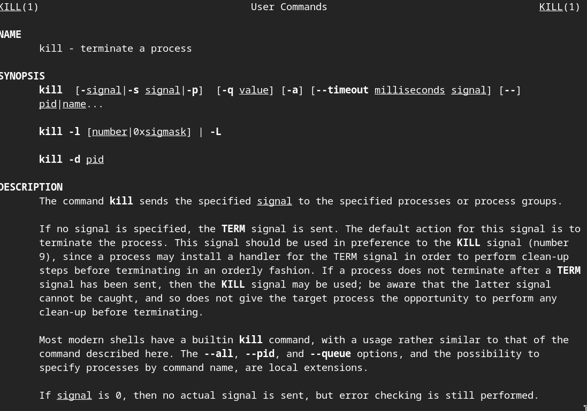{#fig-019 width=70%}

# Вывод

Ознакомился с файловой системой linux, структурой, именами, содержанием. 
