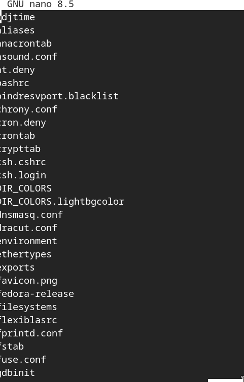
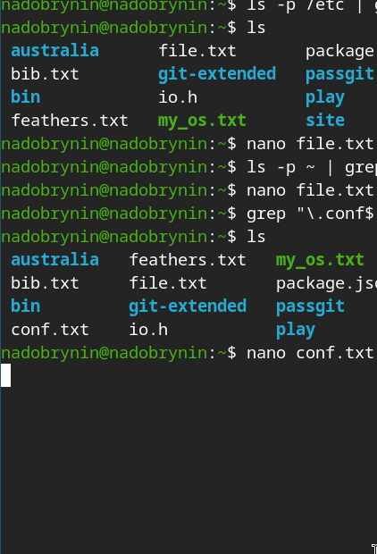
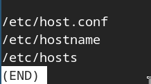
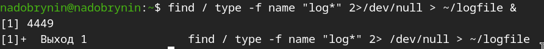
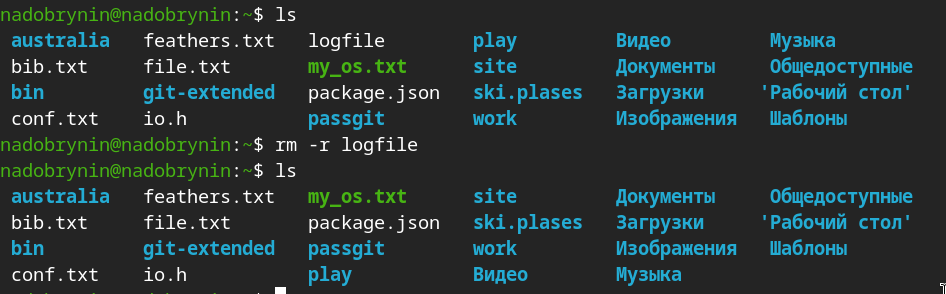
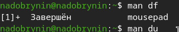
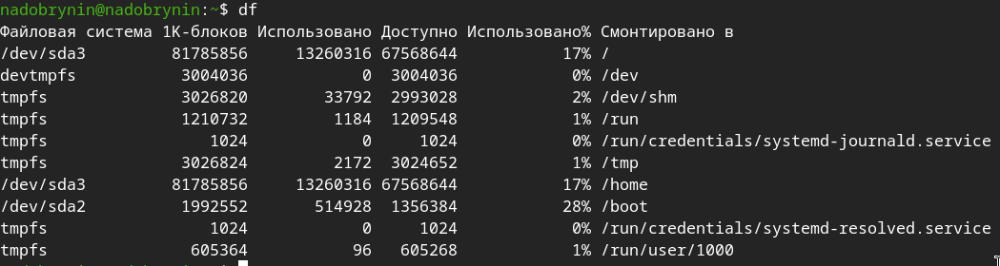
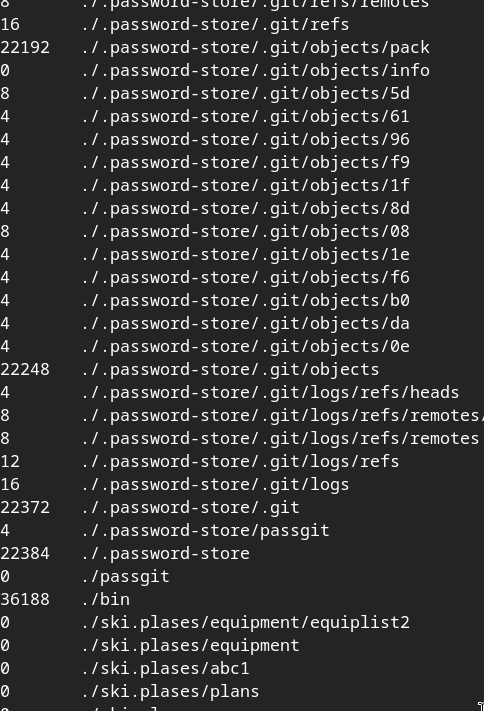
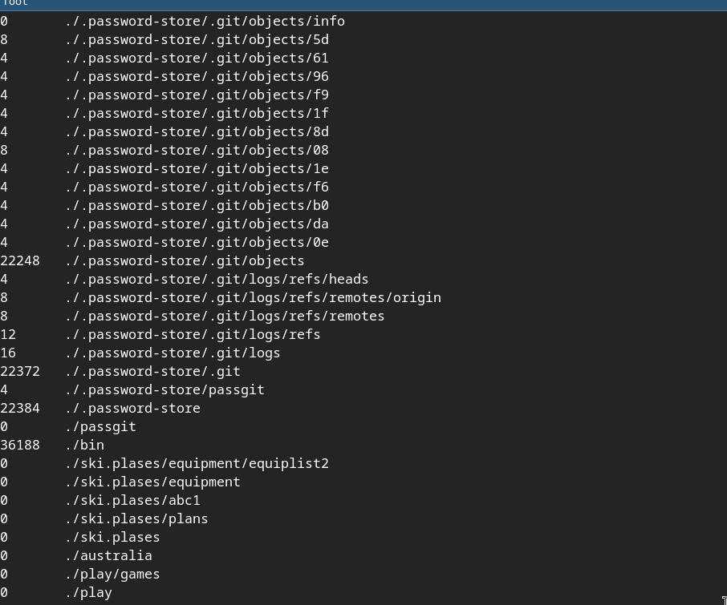

---
## Author
author:
  name: Добрынин Никита Артёмович
  email: 1132255598@rudn.ru
  affiliation:
    - name: Российский университет дружбы народов
      country: Российская Федерация
      postal-code: 117198
      city: Москва
      address: ул. Миклухо-Маклая, д. 6

## Title
title: Отчёт по лабораторной работе №8
subtitle: Поиск файлов. Перенаправление ввода-вывода.
license: "CC BY"
---

# Цель работы

Ознакомление с инструментами поиска файлов и фильтрации текстовых данных.
Приобретение практических навыков: по управлению процессами (и заданиями), по
проверке использования диска и обслуживанию файловых систем.

# Контрольные вопросы

1. Какие потоки ввода вывода вы знаете?
2. Объясните разницу между операцией > и >>.
3. Что такое конвейер?
4. Что такое процесс? Чем это понятие отличается от программы?
5. Что такое PID и GID?
6. Что такое задачи и какая команда позволяет ими управлять?
7. Найдите информацию об утилитах top и htop. Каковы их функции?
8. Назовите и дайте характеристику команде поиска файлов. Приведите примеры использования этой команды.
9. Можно ли по контексту (содержанию) найти файл? Если да, то как?
10. Как определить объем свободной памяти на жёстком диске?
11. Как определить объем вашего домашнего каталога?
12. Как удалить зависший процесс?

# Теоретическое введение

В системе по умолчанию открыто три специальных потока:
– stdin — стандартный поток ввода (по умолчанию: клавиатура), файловый дескриптор
0;
– stdout — стандартный поток вывода (по умолчанию: консоль), файловый дескриптор
1;
– stderr — стандартный поток вывод сообщений об ошибках (по умолчанию: консоль),
файловый дескриптор 2.
Конвейер (pipe) служит для объединения простых команд или утилит в цепочки, в которых результат работы предыдущей команды передаётся последующей

# Выполнение лабораторной работы

Записал названия файлов в файл file.txt([рис. @fig-001]).

{#fig-002 width=70%}

Дополнил файл названиями каталогов в доиашнем каталоге([рис. @fig-002]).

{#fig-003 width=70%}

Список в файле([рис. @fig-003]).

{#fig-004 width=70%}

Вывел файлы с расширением .conf и записал в отдельный файл([рис. @fig-004]).

{#fig-005 width=70%}

Файл .conf появился([рис. @fig-005]).

{#fig-006 width=70%}

Определил все файлы с названием начинающимся с символа "c"([рис. @fig-006]).

{#fig-007 width=70%}

Второй вариант поиска символа([рис. @fig-007]).

{#fig-008 width=70%}

Определил все файлы с названием на "h" и вывел их постранично([рис. @fig-008]).

{#fig-011 width=70%}

Постранично выведенные файлы([рис. @fig-009]).

{#fig-009 width=70%}

Определил файлы с 'log' в названии ([рис. @fig-010]).

{#fig-012 width=70%}

Удалил файл с логами([рис. @fig-011]).

{#fig-013 width=70%}

Запустил в фоновом режиме mousepad([рис. @fig-012]).

{#fig-014 width=70%}

Прочитал инструкцию к команде kill, определил идентификатор процесса и отключил его([рис. @fig-013]).

{#fig-015 width=70%}

прочитал инструкцию к командам man df, du([рис. @fig-014]).

{#fig-017 width=70%}

Вывод команды df([рис. @fig-015]).

{#fig-018 width=70%}

Вывод команды du([рис. @fig-016]).

{#fig-019 width=70%}

Вывод команды du([рис. @fig-017]).

{#fig-022 width=70%}

Вывел список каталого домашнего каталога([рис. @fig-018]).

{#fig-023 width=70%}

# Ответы на вопросы

1) Существует 3 спец. потока: stdin, stdout, stderr

2) > - создает новый файл

>> - записывает данные в существующий файл

3) Конвейер (pipe) служит для объединения простых команд или утилит в цепочки, в которых результат работы предыдущей команды передаётся последующей

4) Процесс - совокупность взаимосвязанных системных ресурсов на основе отдельного адресного процесса, а программа сама по себе — лишь пассивная последовательность инструкций 

5) PID - идентификатор процесса, GID - идентификатор группы

6) Задачи - программы запущенные в фоновом режиме, что бы узнать какие задачи запущены нужно написать команду jobs

7)top и htop — это консольные утилиты в Linux для мониторинга процессов и использования системных ресурсов (ЦП, ОЗУ) в реальном времени

8) Команда find, удобный, мощный и гибкий инструмент для поиска файлов с системе, примеры есть в лабораторной работе

9) Можно, командой grep

10) Командой df -h

11) Командой df -h

12) Узнать идентификатор пройесса и использовать команду kill  

# Вывод

Я ознакомился с инструментами файловой системы, поиска файлов и фильтрации.
