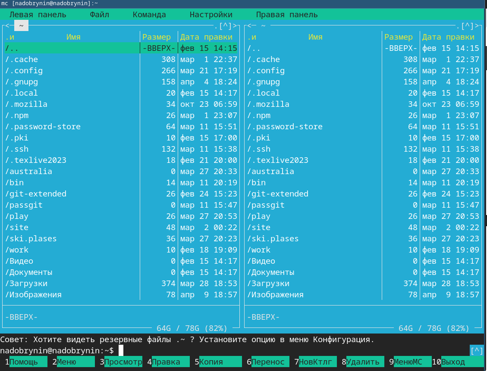
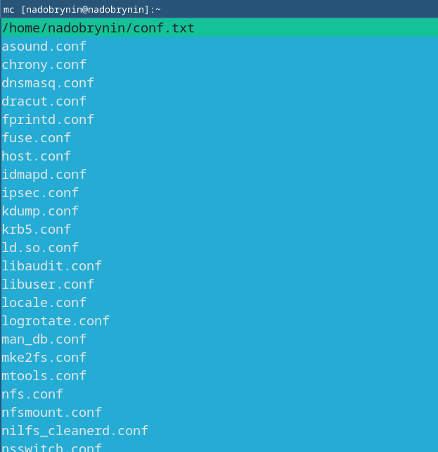
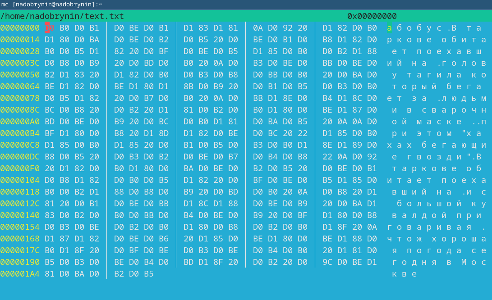

---
## Author
author:
  name: Добрынин Никита Артёмович
  email: 1132255598@rudn.ru
  affiliation:
    - name: Российский университет дружбы народов
      country: Российская Федерация
      postal-code: 117198
      city: Москва
      address: ул. Миклухо-Маклая, д. 6
## Title
title: Презентация по лабораторной работе №9
subtitle: Midnight Commander 
license: CC BY
date: today
date-format: "2026.04.09" # Example: 2025-09-06
---

# Цели и задачи работы

## Цель лабораторной работы

Освоение основных возможностей командной оболочки Midnight Commander. Приобретение навыков практической работы по просмотру каталогов и файлов; манипуляций
с ними.

# Процесс выполнения лабораторной работы

## Оболочка mc

{ #fig:001 width=70% height=70% }

## Просмотр файла 

{ #fig:002 width=70% height=70% }

## Меню настройки mc

{ #fig:003 width=70% height=70% }

## Древо каталогов

{ #fig:004 width=70% height=70% }

## Редактирование файла

{ #fig:005 width=70% height=70% }

## Редактирование файла

{ #fig:006 width=70% height=70% }

## Редактирование файла 

{ #fig:007 width=70% height=70% }

## Файл в языке программирования

{ #fig:008 width=70% height=70% }

# Выводы

Я научился работать с Midnight Commander.
