---
## Author
author:
  name: Добрынин Никита Артёмович
  email: 1132255598@rudn.ru
  affiliation:
    - name: Российский университет дружбы народов
      country: Российская Федерация
      postal-code: 117198
      city: Москва
      address: ул. Миклухо-Маклая, д. 6

## Title
title: Отчёт по лабораторной работе №9
subtitle: Командная оболочка Midnight Commander
license: "CC BY"
---

# Цель работы

Освоение основных возможностей командной оболочки Midnight Commander. Приобретение навыков практической работы по просмотру каталогов и файлов; манипуляций
с ними.

# Задание

1. Создайте текстовой файл text.txt.
2. Откройте этот файл с помощью встроенного в mc редактора.
3. Вставьте в открытый файл небольшой фрагмент текста, скопированный из любого
другого файла или Интернета.
4. Проделайте с текстом следующие манипуляции, используя горячие клавиши:
4.1. Удалите строку текста.
4.2. Выделите фрагмент текста и скопируйте его на новую строку.
Кулябов Д. С. и др. Операционные системы 69
4.3. Выделите фрагмент текста и перенесите его на новую строку.
4.4. Сохраните файл.
4.5. Отмените последнее действие.
4.6. Перейдите в конец файла (нажав комбинацию клавиш) и напишите некоторый
текст.
4.7. Перейдите в начало файла (нажав комбинацию клавиш) и напишите некоторый
текст.
4.8. Сохраните и закройте файл.
5. Откройте файл с исходным текстом на некотором языке программирования (например C или Java)
6. Используя меню редактора, включите подсветку синтаксиса, если она не включена,
или выключите, если она включена.

# Выполнение лабораторной работы

Использовал команду man для получения информации по mc([рис. @fig-001]).

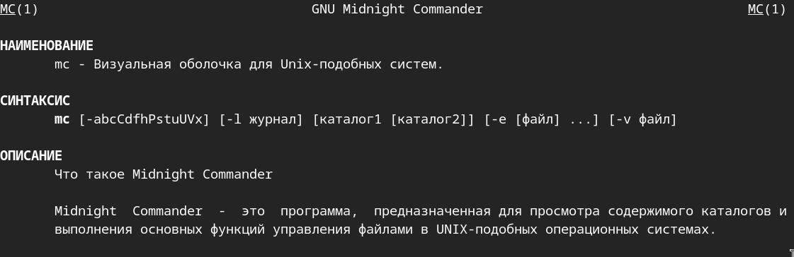{#fig-001 width=70%}

Изучил меню mc([рис. @fig-002]).

{#fig-002 width=70%}

Удалил ненужный каталог через mc([рис. @fig-003]).

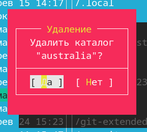{#fig-003 width=70%}

Просмотрел содержимое файла([рис. @fig-004]).

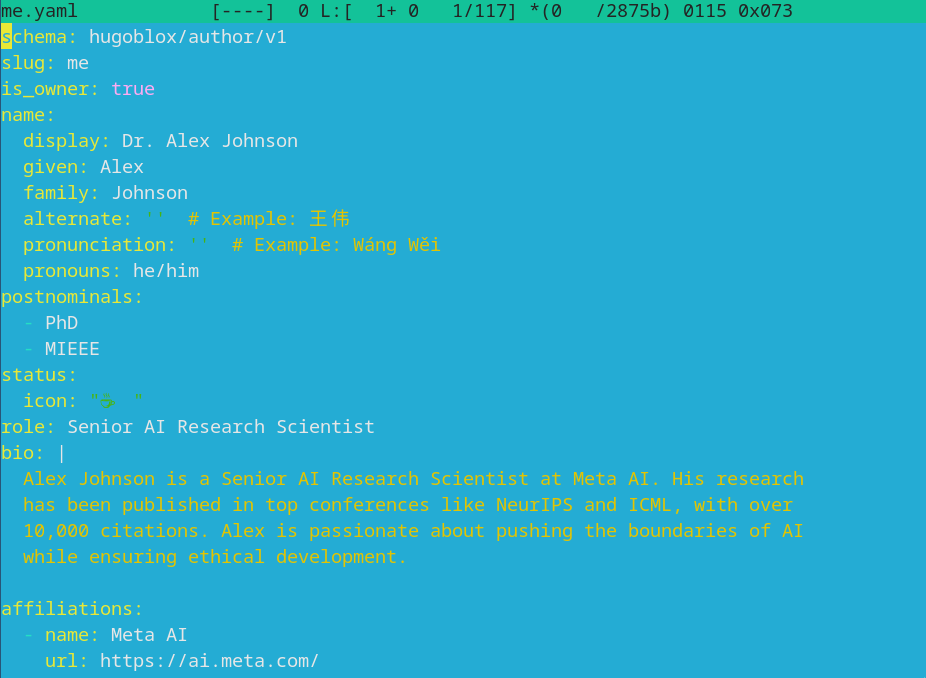{#fig-004 width=70%}

Просмотрел содержимое файла([рис. @fig-005]).

{#fig-005 width=70%}

Воспользовался панелями([рис. @fig-006]).

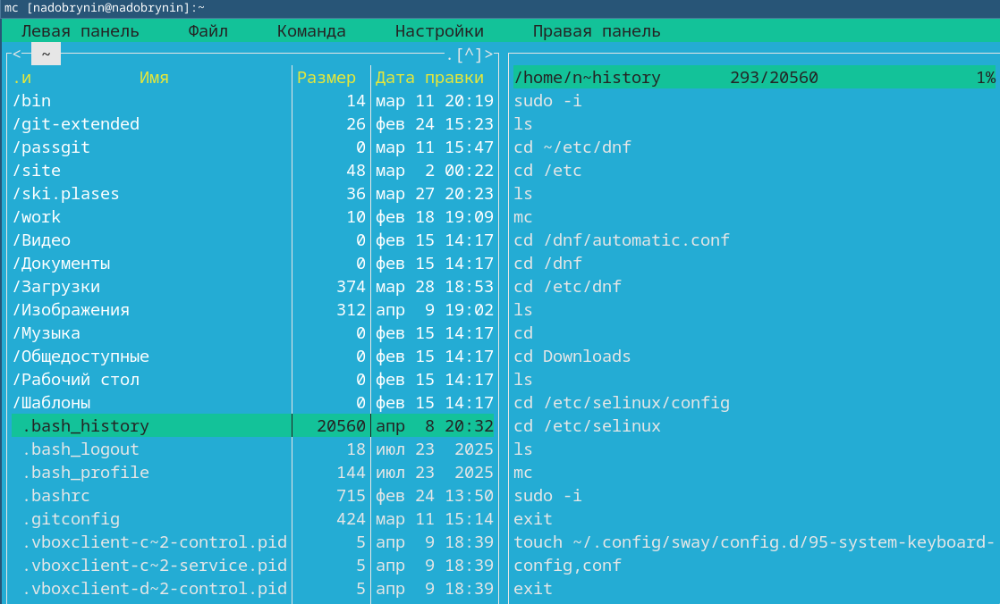{#fig-006 width=70%}

Воспользовался настройкой "Дерево"([рис. @fig-007]).

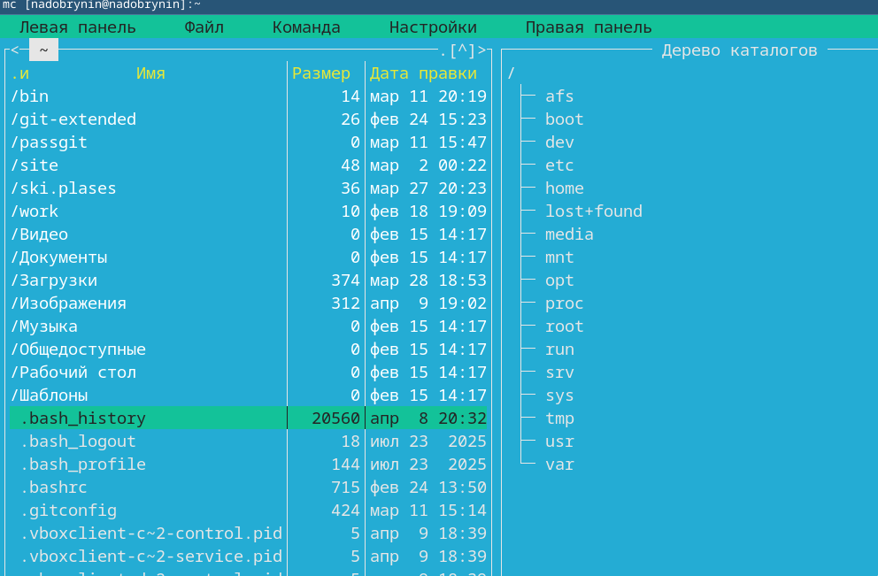{#fig-007 width=70%}

Панель меню файл([рис. @fig-008]).

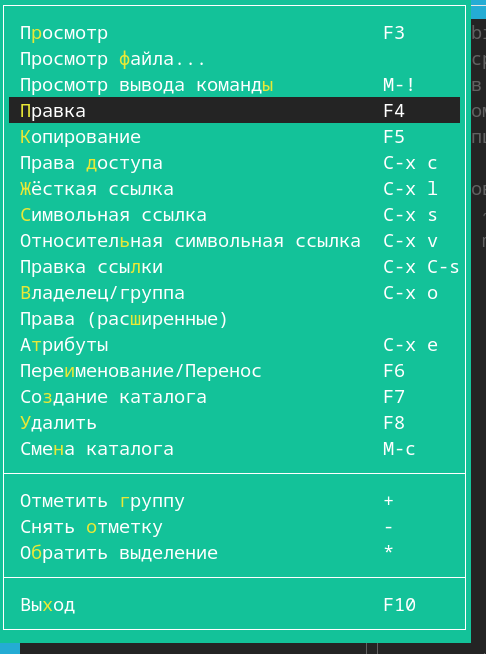{#fig-008 width=70%}

Поиск по файлу ([рис. @fig-009]).

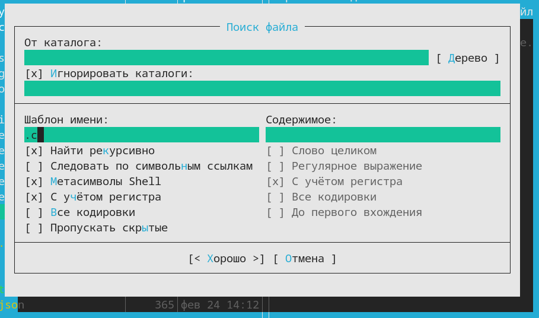{#fig-009 width=70%}

Древо каталогов([рис. @fig-010]).

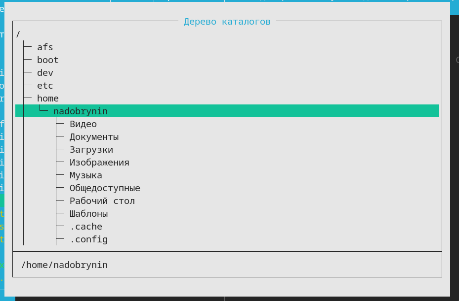{#fig-010 width=70%}

Просмотрел системный файл mc([рис. @fig-011]).

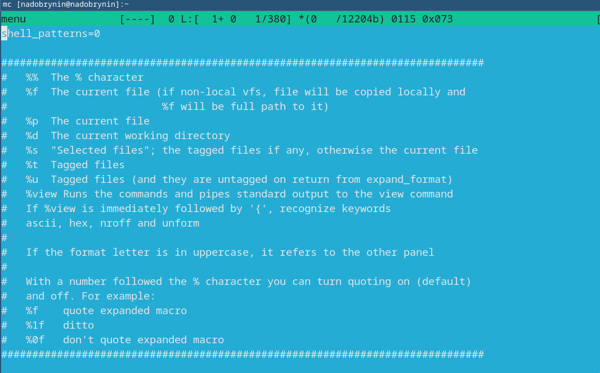{#fig-011 width=70%}

Настройки внешнего вида([рис. @fig-012]).

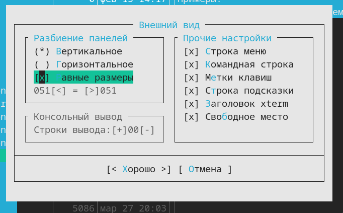{#fig-012 width=70%}

Создал файл([рис. @fig-013]).

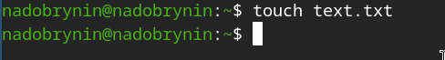{#fig-013 width=70%}

Заполнил файл txt([рис. @fig-014]).

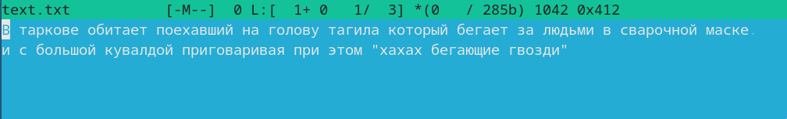{#fig-014 width=70%}

Удалил строку([рис. @fig-015]).

![mc текст]){#fig-015 width=70%}

Скопировал выделенную строку([рис. @fig-016]).

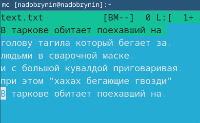{#fig-016 width=70%}

Перенес выделенную строку([рис. @fig-017]).

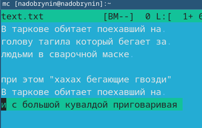{#fig-017 width=70%}

Сохранил файл ([рис. @fig-018]).

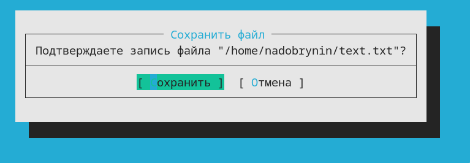{#fig-018 width=70%}

Дописал строки([рис. @fig-019]).

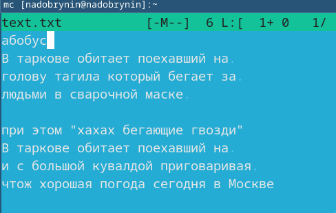{#fig-019 width=70%}

Открыл файл в ассемблере и включил выделение текста([рис. @fig-020]).

{#fig-020 width=70%}

# Выводы

Я научился пользоваться Midnight Commander.

