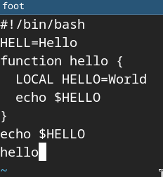
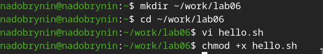
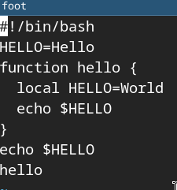

---
## Author
author:
  name: Добрынин Никита Артёмович
  email: 1132255598@rudn.ru
  affiliation:
    - name: Российский университет дружбы народов
      country: Российская Федерация
      postal-code: 117198
      city: Москва
      address: ул. Миклухо-Маклая, д. 6

## Title
title: Отчёт по лабораторной работе №10
subtitle: Редактор vi.
license: "CC BY"
---

# Цель работы

Познакомиться с операционной системой Linux. Получить практические навыки работы с редактором vi, установленным по умолчанию практически во всех дистрибутивах.

# Задание

1. Дайте краткую характеристику режимам работы редактора vi.
2. Как выйти из редактора, не сохраняя произведённые изменения?
3. Назовите и дайте краткую характеристику командам позиционирования.
4. Что для редактора vi является словом?
5. Каким образом из любого места редактируемого файла перейти в начало (конец)
файла?
6. Назовите и дайте краткую характеристику основным группам команд редактирования.
7. Необходимо заполнить строку символами $. Каковы ваши действия?
8. Как отменить некорректное действие, связанное с процессом редактирования?
9. Назовите и дайте характеристику основным группам команд режима последней строки.
10. Как определить, не перемещая курсора, позицию, в которой заканчивается строка?
11. Выполните анализ опций редактора vi (сколько их, как узнать их назначение и т.д.).
12. Как определить режим работы редактора vi?
13. Постройте граф взаимосвязи режимов работы редактора vi.

# Теоретическое введение

В большинстве дистрибутивов Linux в качестве текстового редактора по умолчанию
устанавливается интерактивный экранный редактор vi (Visual display editor).

# Выполнение лабораторной работы

Создал каталог перешл в него и создал файл([рис. @fig-001]).

{#fig-001 width=70%}

Заполнил файл текстом с кодом([рис. @fig-002]).

{#fig-002 width=70%}

Сделал файл исполняемым([рис. @fig-003]).

{#fig-003 width=70%}

Отредактированный файл([рис. @fig-004]).

{#fig-004 width=70%}

Сохраненный файл([рис. @fig-005]).

{#fig-005 width=70%}

# Ответы на вопросы

1) Редактор vi имеет три режима работы:
– командный режим — предназначен для ввода команд редактирования и навигации по
редактируемому файлу;
– режим вставки — предназначен для ввода содержания редактируемого файла;
– режим последней (или командной) строки — используется для записи изменений в файл
и выхода из редактора

2) ;q

3) 0 - переход в начало строки
 $ - переход в конец строки
 G - переход в конец файла

4) Следует помнить, что vi различает прописные и строчные буквы при наборе
(восприятии) команд

5) nG - переход на n строку

6) команды для вставки текста - a, A, i
 команды для вставки строки - о, О
 команды для удаления текста - x, dw, d$ и т. д.

7) нажать i и заполнить строку

8) нажать u

9) Припомощи клавишь shift+u можно перейти в режим терминала и вводить команды

# Выводы

Я научился работать в vi
