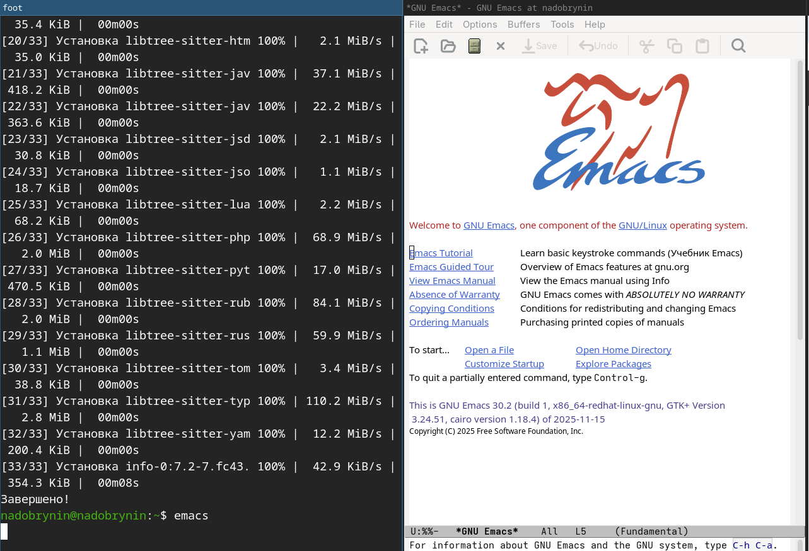
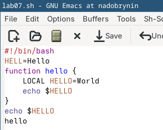
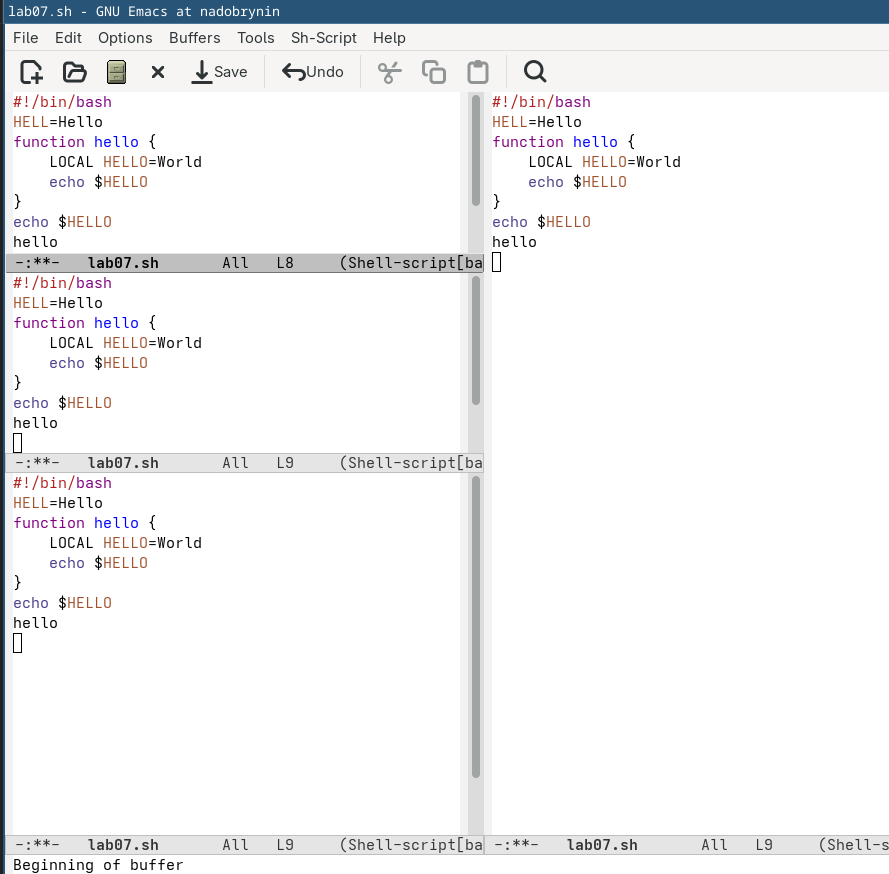

---
## Author
author:
  name: Добрынин Никита Артёмович
  email: 1132255598@rudn.ru
  affiliation:
    - name: Российский университет дружбы народов
      country: Российская Федерация
      postal-code: 117198
      city: Москва
      address: ул. Миклухо-Маклая, д. 6
## Title
title: Презентация по лабораторной работе №11
subtitle: Редактор emacs.
license: CC BY
date: today
date-format: "2026.04.21" # Example: 2025-09-06
---

# Цели и задачи работы

## Цель лабораторной работы

Познакомиться с операционной системой Linux. Получить практические навыки работы с редактором Emacs.

# Процесс выполнения лабораторной работы

## Редактор emacs

{ #fig:001 width=70% height=70% }

## Редактор emacs

{ #fig:002 width=70% height=70% }

## Редактор emacs

{ #fig:003 width=70% height=70% }

## Редактор emacs

{ #fig:004 width=70% height=70% }

## Редактор emacs

{ #fig:005 width=70% height=70% }

## Редактор emacs

{ #fig:006 width=70% height=70% }

## Редактор emacs

{ #fig:007 width=70% height=70% }

# Выводы

Я освоил редактор emacs.
