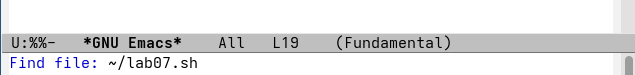
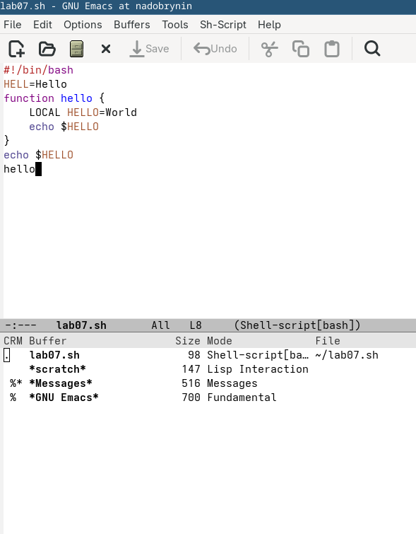
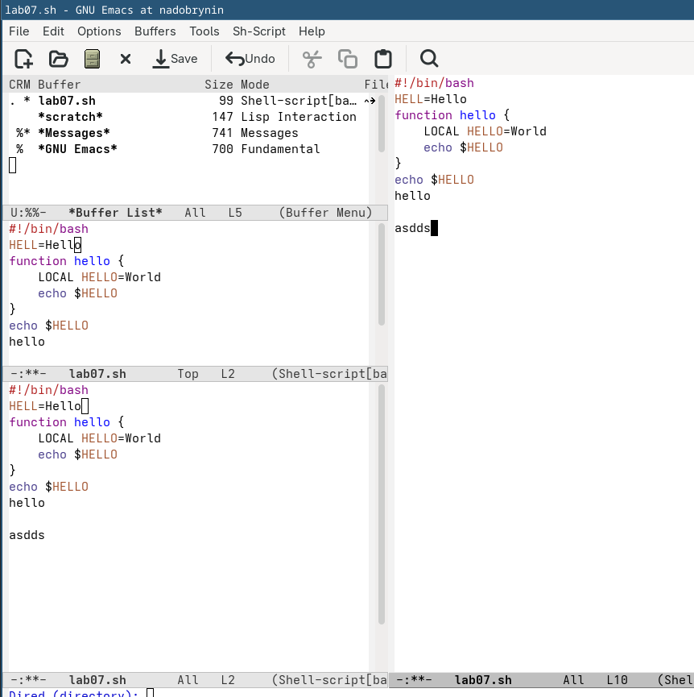
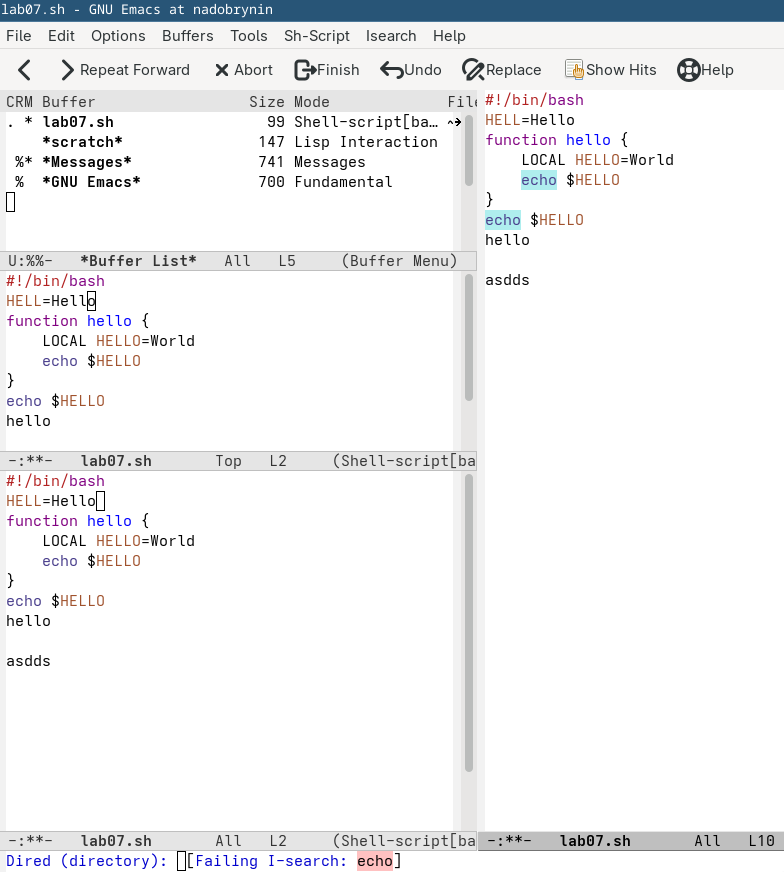

---
## Author
author:
  name: Добрынин Никита Артёмович
  email: 1132255598@rudn.ru
  affiliation:
    - name: Российский университет дружбы народов
      country: Российская Федерация
      postal-code: 117198
      city: Москва
      address: ул. Миклухо-Маклая, д. 6

## Title
title: Отчёт по лабораторной работе №11
subtitle: Текстовый редактор emacs
license: "CC BY"
---

# Цель работы

Познакомиться с операционной системой Linux. Получить практические навыки работы с редактором Emacs

# Задание

1. Кратко охарактеризуйте редактор emacs.
2. Какие особенности данного редактора могут сделать его сложным для освоения новичком?
3. Своими словами опишите, что такое буфер и окно в терминологии emacs’а.
4. Можно ли открыть больше 10 буферов в одном окне?
5. Какие буферы создаются по умолчанию при запуске emacs?
6. Какие клавиши вы нажмёте, чтобы ввести следующую комбинацию C-c | и C-c C-|?
7. Как поделить текущее окно на две части?
8. В каком файле хранятся настройки редактора emacs?
9. Какую функцию выполняет клавиша и можно ли её переназначить?
10. Какой редактор вам показался удобнее в работе vi или emacs? Поясните почему

# Теоретическое введение

Emacs представляет собой мощный экранный редактор текста, написанный на языке
высокого уровня Elisp.

# Выполнение лабораторной работы

Запустил emacs([рис. @fig-001]).

{#fig-001 width=70%}

Создал файл lab07 в emacs([рис. @fig-002]).

{#fig-002 width=70%}

Набрал текст из задания в созданном файле([рис. @fig-003]).

{#fig-003 width=70%}

Открыл буфер обмена([рис. @fig-004]).

{#fig-004 width=70%}

Разделил на 4 фрейма([рис. @fig-005]).

{#fig-005 width=70%}

Заполнил файл текстом в одном из фреймов([рис. @fig-006]).

{#fig-006 width=70%}

Переключился на режим поиска и нашел слово echo([рис. @fig-007]).

{#fig-007 width=70%}

# Ответы на вопросы

1) emacs - графический редактор текста

2) у emacs много нетипичных настроек в его редакторе

3) Буфер — объект, представляющий какой-либо текст, Окно — прямоугольная область фрейма, отображающая один из буферов.

4) да можно

5) При стандартном запуске Emacs (без открытия файлов) автоматически создаются буферы *scratch* (для временных заметок и тестирования кода Lisp) и *Messages* (для логов сообщений и ошибок)

6) клавишу Ctrl

7) Командой C-x 3

8) ~/.emacs (или ~/.emacs.el) 

9) Отмена действия, можно переназначить в настройках редактора

10) vi оказался для меня удобнее, он менее нагружен ненужными для меня функциями

# Выводы

Я освоил редактор emacs.
