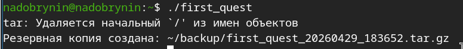
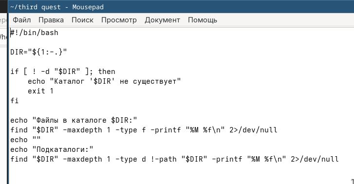
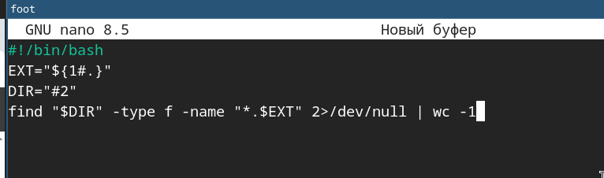
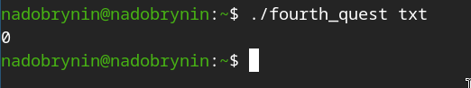

---
## Author
author:
  name: Добрынин Никита Артёмович
  email: 1132255598@rudn.ru
  affiliation:
    - name: Российский университет дружбы народов
      country: Российская Федерация
      postal-code: 117198
      city: Москва
      address: ул. Миклухо-Маклая, д. 6
## Title
title: Презентация по лабораторной работе №12
subtitle: Программирование в командном процессоре UNIX
license: CC BY
date: today
date-format: "2026.05.01" # Example: 2025-09-06
---

# Цели и задачи работы

## Цель лабораторной работы

Изучить основы программирования в оболочке ОС UNIX/Linux. Научиться писать
небольшие командные файлы.

# Процесс выполнения лабораторной работы

## Скрипт первого файла

{ #fig:001 width=70% height=70% }

## Исполнение скрипта

{ #fig:002 width=70% height=70% }

## Скрипт второго файла

{ #fig:003 width=70% height=70% }

## Исполнение файла

{ #fig:004 width=70% height=70% }

## Скрипт третьего файла

{ #fig:005 width=70% height=70% }

## Исполнение файла

{ #fig:006 width=70% height=70% }

## Скрипт четвертого файла

{ #fig:005 width=70% height=70% }

## Исполнение файла

{ #fig:006 width=70% height=70% }

# Выводы

Я освоил базовые команды UNIX и написал 4 простых скрипта.

