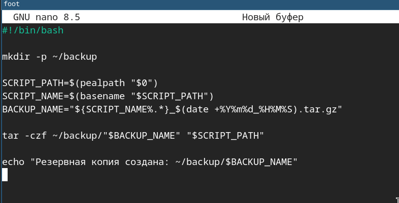
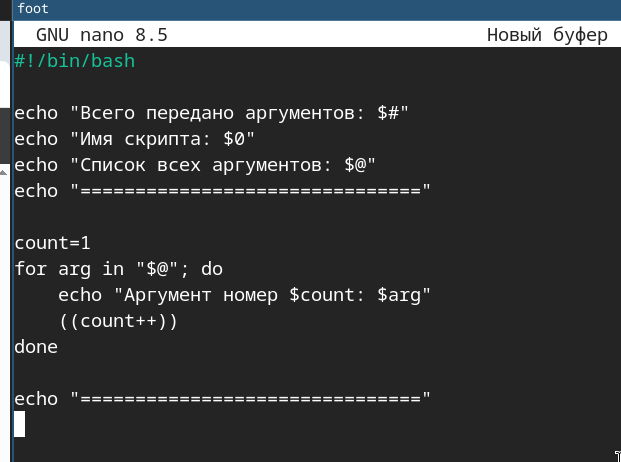
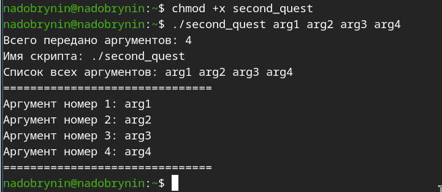
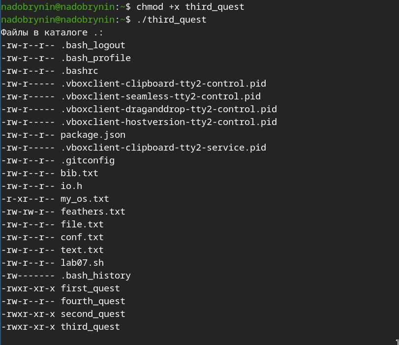

---
## Author
author:
  name: Добрынин Никита Артёмович
  email: 1132255598@rudn.ru
  affiliation:
    - name: Российский университет дружбы народов
      country: Российская Федерация
      postal-code: 117198
      city: Москва
      address: ул. Миклухо-Маклая, д. 6

## Title
title: Отчёт по лабораторной работе №12
subtitle: Программирование в командном процессоре UNIX
license: "CC BY"
---

# Цель работы

Изучить основы программирования в оболочке ОС UNIX/Linux. Научиться писать
небольшие командные файлы.

# Задание

1. Объясните понятие командной оболочки. Приведите примеры командных оболочек.
Чем они отличаются?
2. Что такое POSIX?
3. Как определяются переменные и массивы в языке программирования bash?
4. Каково назначение операторов let и read?
5. Какие арифметические операции можно применять в языке программирования bash?
6. Что означает операция (( ))?
7. Какие стандартные имена переменных Вам известны?
8. Что такое метасимволы?
9. Как экранировать метасимволы?
10. Как создавать и запускать командные файлы?
11. Как определяются функции в языке программирования bash?
12. Каким образом можно выяснить, является файл каталогом или обычным файлом?
13. Каково назначение команд set, typeset и unset?
14. Как передаются параметры в командные файлы?
15. Назовите специальные переменные языка bash и их назначение.

# Выполнение лабораторной работы

Написал скрип который делает резервную копию самого себя([рис. @fig-001]).

{#fig-001 width=70%}

Сделал скрипт исполняемым([рис. @fig-002]).

{#fig-002 width=70%}

Запустил скрипт([рис. @fig-003]).

{#fig-003 width=70%}

Написал скрипт который обрабатывает произвольное количество входящих аргументов([рис. @fig-004]).

{#fig-004 width=70%}

Сделал файл исполняемым и запустил его([рис. @fig-005]).

{#fig-005 width=70%}

Написал скрипт, аналог команды ls([рис. @fig-006]).

{#fig-006 width=70%}

Сделал файл исполняемым и запустил его([рис. @fig-007]).

{#fig-007 width=70%}

Написал простой скрипт который выводит количество указанных файлов в текущем каталоге([рис. @fig-008]).

{#fig-008 width=70%}

Сделал его исполняемым и запустил([рис. @fig-009]).

{#fig-009 width=70%}

# Ответы на вопросы

1) Командная оболочка (shell) - программа которая принимает команды пользователя и передает ее ОС
Примеры: sh, bash, zsh, fish

2) POSIX - набор стандартов IEEE, определяющий единый интерфейс для UNIX-подобных ОС

3) Переменные определяются без знака $

4) let - выполняет арифметические операции над целыми числами, read - считывает ввод пользователя и сохраняет в перменные

5) Сложение, вычитание, умножение, сравнения, логические операции и т. д.

6) Двойные круглые скобки используются для арифметических вычислений и проверок без вызова let

7) HOME, PATH, USER, SHELL, PWD, RANDOM, OLDPWD, UID.

8) Метасимволы - символы, имеющие спец значение для оболочки 

9) Метасимвол можно экранировать как и обычный символ обратным слэшем - "\"

10) Создать файл с расширением .sh, добавить в файл "#!" и путь к интерпритатору, сделать файл исполняемым

11) Командой function

12) Используя условные операторы [] или [[]]

13) set - выводит параметры окружения и локальные переменные, typeset - используется для задания атрибутов переменной

14) При запуске параметры передаются через пробел после строки запуска скрипта

15) $0 - имя скрипта, $# - кол-во параметров, $@ - параметры как отдельные слова, $* - все параметры как одно слово, $$ - PID текущего процесса оболочки

# Выводы

Я освоил базовые команды UNIX и написал 4 простых скрипта.