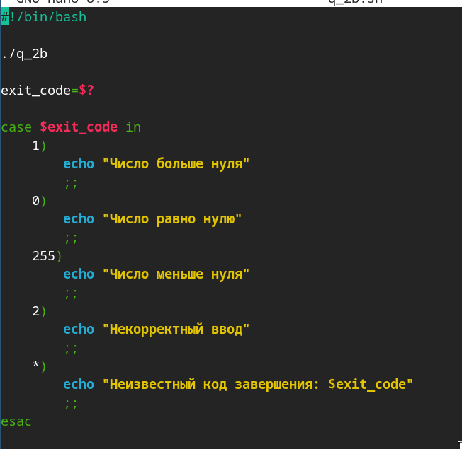
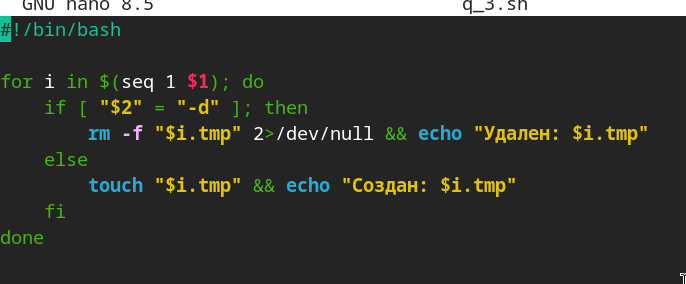
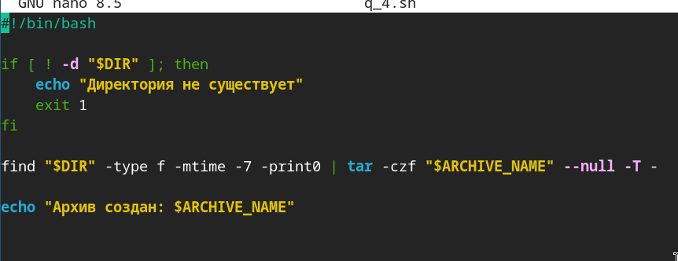

---
## Author
author:
  name: Добрынин Никита Артёмович
  email: 1132255598@rudn.ru
  affiliation:
    - name: Российский университет дружбы народов
      country: Российская Федерация
      postal-code: 117198
      city: Москва
      address: ул. Миклухо-Маклая, д. 6
## Title
title: Презентация по лабораторной работе №13
subtitle: Ветвления и циклы
license: CC BY
date: today
date-format: "2026.05.06" # Example: 2025-09-06
---

# Цели и задачи работы

## Цель лабораторной работы

Изучить основы программирования в оболочке ОС UNIX. Научится писать более
сложные командные файлы с использованием логических управляющих конструкций
и циклов.

# Процесс выполнения лабораторной работы

## Программа №1

{ #fig:001 width=70% height=70% }

## Программа №2а

{ #fig:002 width=70% height=70% }

## Программа №2б

{ #fig:003 width=70% height=70% }

## Программа №3

{ #fig:004 width=70% height=70% }

## Программа №4

{ #fig:005 width=70% height=70% }

# Выводы

Я научился создавать ветвления и циклы в UNIX.

