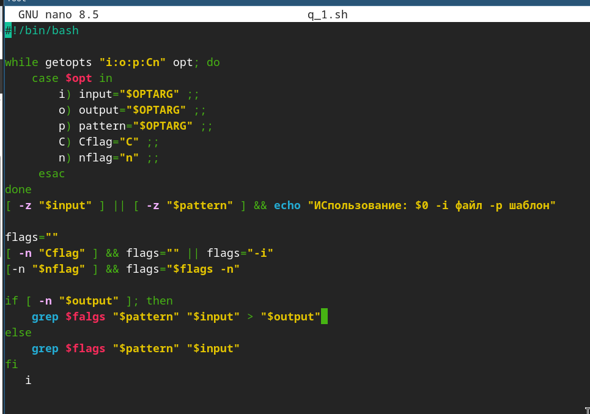
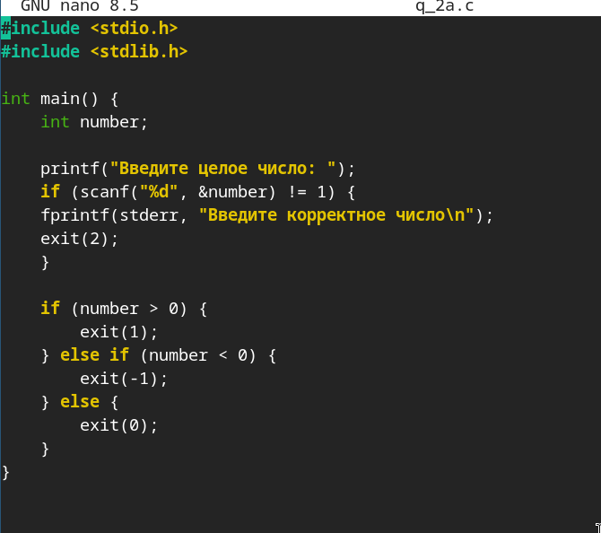

---
## Author
author:
  name: Добрынин Никита Артёмович
  email: 1132255598@rudn.ru
  affiliation:
    - name: Российский университет дружбы народов
      country: Российская Федерация
      postal-code: 117198
      city: Москва
      address: ул. Миклухо-Маклая, д. 6

## Title
title: Отчёт по лабораторной работе №13
subtitle: Ветвления и циклы
license: "CC BY"
---

# Цель работы

Изучить основы программирования в оболочке ОС UNIX. Научится писать более
сложные командные файлы с использованием логических управляющих конструкций
и циклов.

# Задание

1. Каково предназначение команды getopts?
2. Какое отношение метасимволы имеют к генерации имён файлов?
3. Какие операторы управления действиями вы знаете?
4. Какие операторы используются для прерывания цикла?
5. Для чего нужны команды false и true?
6. Что означает строка if test -f man$s/$i.$s, встреченная в командном файле?
7. Объясните различия между конструкциями while и until.

# Выполнение лабораторной работы

Написал программу которая анализирует командную строку с ключами([рис. @fig-001]).

{#fig-001 width=70%}

написал программу на языке Си которая определяет число([рис. @fig-002]).

{#fig-002 width=70%}

связал программу на Си с командной строкой посредством bash([рис. @fig-003]).

{#fig-003 width=70%}

Программа которая создает указанное кол-во файлов([рис. @fig-004]).

{#fig-004 width=70%}

Скрипт который записывает файлы в указанной директории([рис. @fig-005]).

{#fig-005 width=70%}

# Ответы на вопросы

1) getopts - встроенная комманда bash, которая парсит опции командной строки

2) Прямое. Метасимволы - механизм командной оболочки который превращает шаблон в список реальных имен файлов

3) ; - последовательное выполнение

 && - логический оператор И

 || - логический оператор ИЛИ

 & - запуск команды в фоновом режиме

и т. д.

4) break, continue

5) Логические операторы: true - 1, false - 0, заглушки, циклы и др.

6) Она проверяет существует ли файл по пути, сформированному с помощью подстановки переменных

7) while - останавливается когда условие ложное, until - останавливается когда условие становится истинным

# Вывод

Я научился создавать ветвления и циклы в UNIX.

