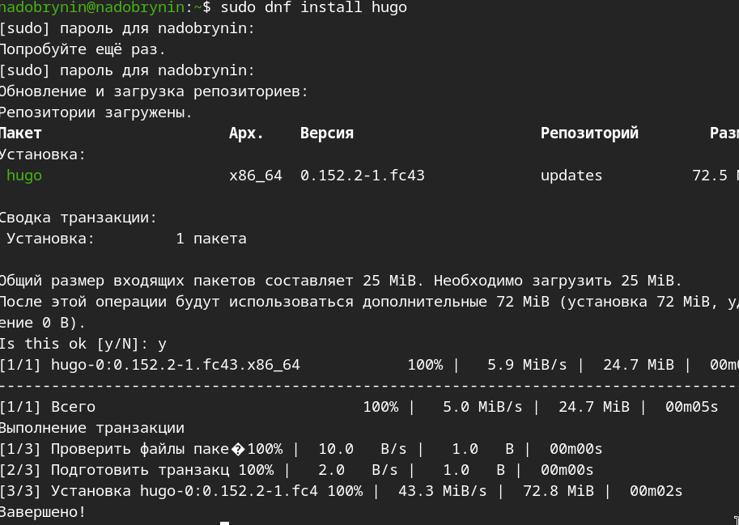
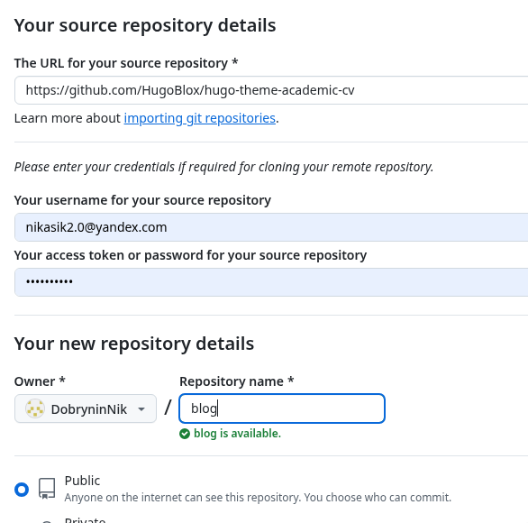
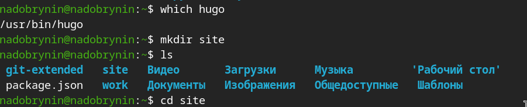
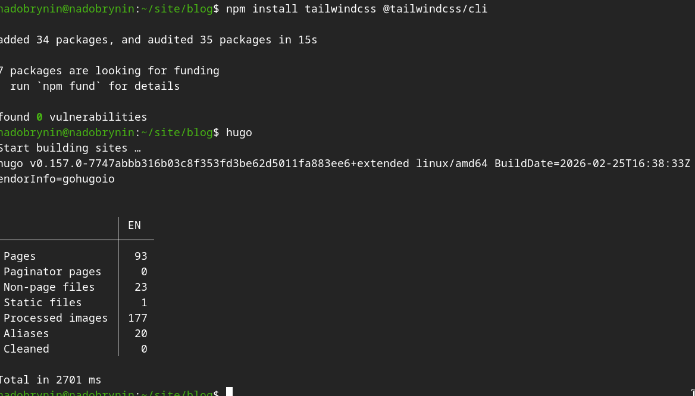
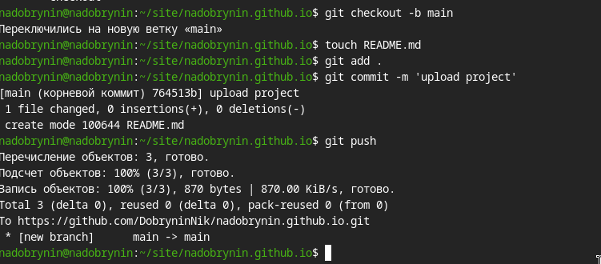
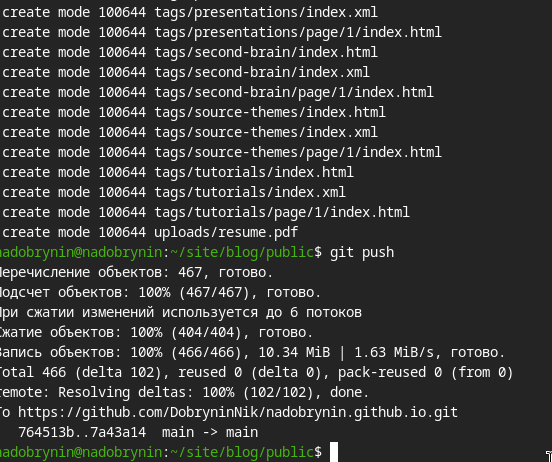

---
## Author
author:
  name: Добрынин Никита Артёмович
  email: 1132255598@rudn.ru
  affiliation:
    - name: Российский университет дружбы народов
      country: Российская Федерация
      postal-code: 117198
      city: Москва
      address: ул. Миклухо-Маклая, д. 6
## Title
title: Презентация по 1-му этапу персонального проекта
subtitle: Размещение шаблона сайта визитки на github pages
license: CC BY
date: today
date-format: "2026.03.07" # Example: 2025-09-06
---

# Цели и задачи работы

## Цель 1-го этапа проекта

Целью 1-го этапа персонального проекта является размещение заготовки сайта визтки на github pages.

# Процесс выполнения 1-го этапа проекта

## Скачал и установил статический генератор сайтов hugo

{ #fig:001 width=70% height=70% }

## Создал репозиторий на основе шаблона hugo-academic-cv

{ #fig:002 width=70% height=70% }

## Проверил расположение hugo и создал каталог site и перешел в него

{ #fig:003 width=70% height=70% }

## Скопировал репозиторий blog с github в локальный каталог site

{ #fig:004 width=70% height=70% }

## Установил необходимое программное обеспечение и запустил hugo

{ #fig:005 width=70% height=70% }

## Запустил локальный сайт hugo

{ #fig:006 width=70% height=70% }

## Создал новый репозиторий и скопировал его в локальный каталог site и перешел в него

{ #fig:007 width=70% height=70% }

## Подготовил репозиторий для установки файла public

{ #fig:008 width=70% height=70% }

## Добавил файл public и запустил hugo

{ #fig:009 width=70% height=70% }

## Выгрузил файлы на github

{ #fig:010 width=70% height=70% }

# Выводы по проделанной работе

## Вывод

Я ознакомился с генератором сайтов hugo, создал заготовку сайта визитки и разместил его на github pages.

