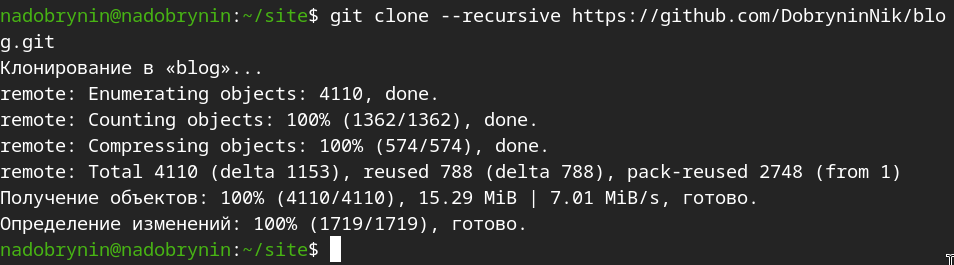
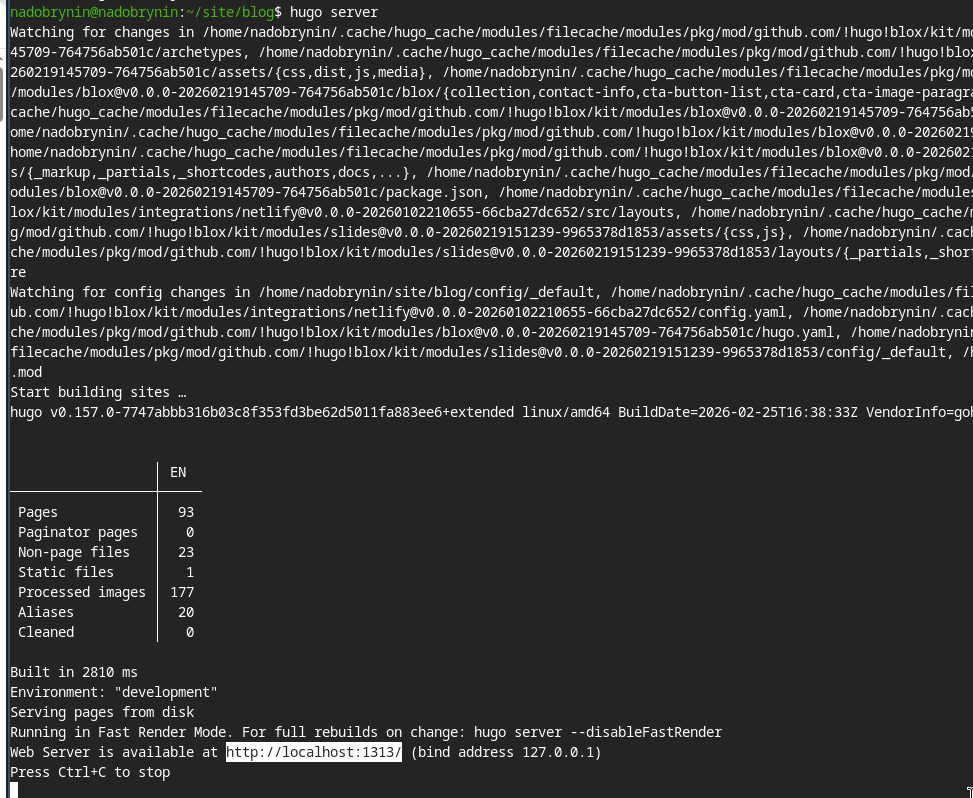
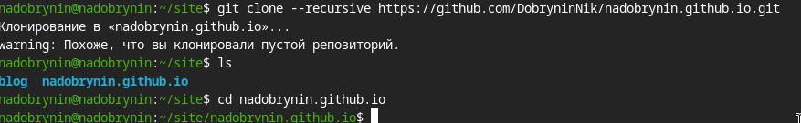
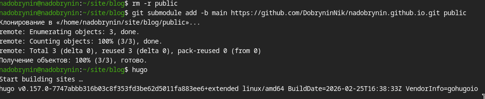

---
## Author
author:
  name: Ддобрынин Никита Артёмович
  degrees: 
  orcid:
  email: 1132255598@rudn.ru
  affiliation:
    - name: Российский университет дружбы народов
      country: Российская Федерация
      postal-code: 117198
      city: Москва
      address: ул. Миклухо-Маклая, д. 6

## Title
title: "Отчет №1 по Индивидуальному проекту"
subtitle: "Размещение сайта на Github pages"
license: "CC BY"
---

# Цель работы

Целью работы является размещение и развертывание заготовки для персонального сайта на платформе github pages 

# Задание

1) Установить необходимое программное обеспечение.
2) Скачать шаблон темы сайта.
3) Разместить его на хостинге git.
4) Установить параметр для URLs сайта.
5) Разместить заготовку сайта на Github pages.

# Выполнение лабораторной работы

Скачал и установил статический генератор hugo ([рис. @fig-001]).

{#fig-001 width=70%}

Создал репозиторий на github под названием 'blog'([рис. @fig-002]).

{#fig-002 width=70%}

Создал каталог site и перешел в него ([рис. @fig-003]).

{#fig-003 width=70%}

Скопировал репозиторий blog на свой ПК ([рис. @fig-004]).

{#fig-004 width=70%}

Загрузил необходимое програмное обеспечениеи запустил hugo ([рис. @fig-005]).

{#fig-005 width=70%}

Запустил локальный сайт ([рис. @fig-006]).

{#fig-006 width=70%}

Загрузил репозиторий с шаблоном сайта ([рис. @fig-007]).

{#fig-007 width=70%}

Подготовил репозиторий к связыванию с public ([рис. @fig-008]).

{#fig-008 width=70%}

Добавил доп. модуль public в репозиторий и снова запустил hugo([рис. @fig-009]).

{#fig-009 width=70%}

Выгрузил все данные в репозиторий github([рис. @fig-010]).

{#fig-010 width=70%}

# Выводы

Я развернул заготовку своего сайта визитки при помощи hugo.

# Список литературы{.unnumbered}

::: {#refs}
:::
