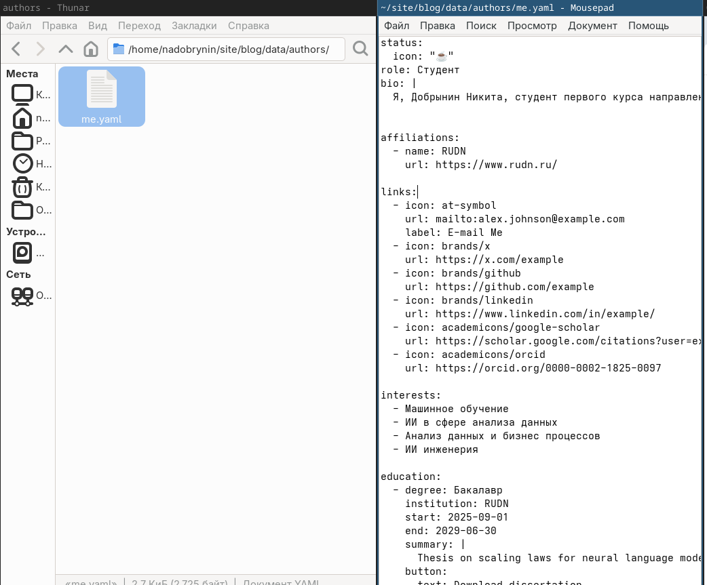
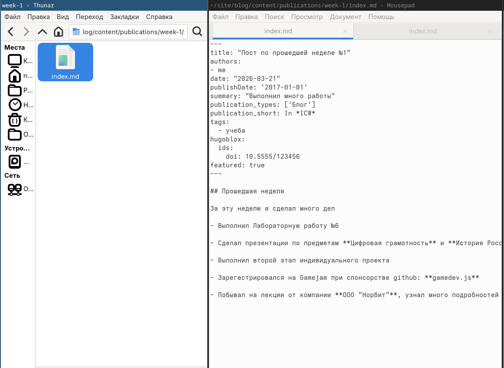
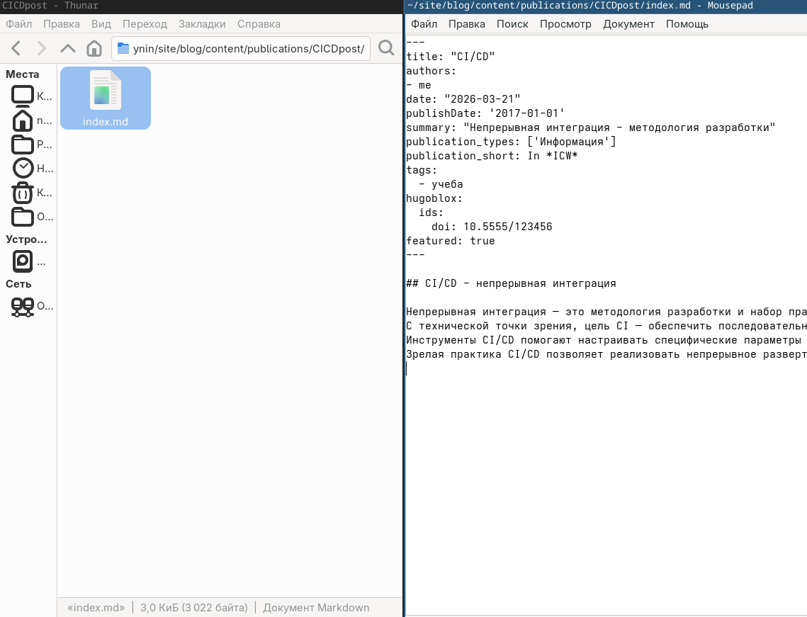

---
## Author
author:
  name: Добрынин Никита Артёмович
  email: 1132255598@rudn.ru
  affiliation:
    - name: Российский университет дружбы народов
      country: Российская Федерация
      postal-code: 117198
      city: Москва
      address: ул. Миклухо-Маклая, д. 6
## Title
title: Презентация по 2-му этапу персонального проекта
subtitle: Добавление информации о себе
license: CC BY
date: today
date-format: "2026.03.21" # Example: 2025-09-06
---

# Цели и задачи работы

## Цель 2-го этапа проекта

Целью 2-го этапа персонального проекта является размещение информации о себе на сайте

# Процесс выполнения 1-го этапа проекта

## Редактирование информации "О себе"

{ #fig:002 width=70% height=70% }

## Пост по прошедшей неделе

{ #fig:001 width=70% height=70% }

## Пост о CI/CD

{ #fig:003 width=70% height=70% }

## Информация "О себе"

{ #fig:004 width=70% height=70% }

## Посты

{ #fig:005 width=70% height=70% }

# Выводы по проделанной работе

## Вывод

Я добавил информацию "О себе" и сделал 2 поста.
