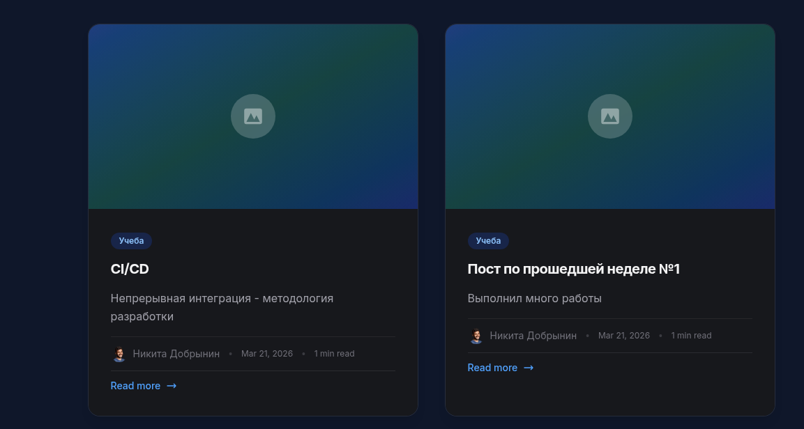

---
## Author
author:
  name: Добрынин Никита Артёмович
  degrees: 
  orcid:
  email: 1132255598@rudn.ru
  affiliation:
    - name: Российский университет дружбы народов
      country: Российская Федерация
      postal-code: 117198
      city: Москва
      address: ул. Миклухо-Маклая, д. 6

## Title
title: "Отчет №2 по Индивидуальному проекту"
subtitle: "Добавление информации о себе"
license: "CC BY"
---

# Цель работы

Добавление на сайт информации о себе, а так же создание двух постов на выделенные темы

# Задание

Добавить к сайту данные о себе.

-Разместить фотографию владельца сайта.
-Разместить краткое описание владельца сайта (Biography).
-Добавить информацию об интересах (Interests).
-Добавить информацию от образовании (Education).
-Сделать пост по прошедшей неделе.
Добавить пост на тему по выбору:
-Управление версиями. Git.
-Непрерывная интеграция и непрерывное развертывание (CI/CD).

# Выполнение лабораторной работы

Изменил файл me.yaml и вставил информацию о себе ([рис. @fig-002]).

{#fig-002 width=70%}

Создал каталог с названием week-1 и создал пост отредактировав файл([рис. @fig-001]).

{#fig-001 width=70%}

В качестве поста на выбор я выбрал пост о CI/CD, создал каталог и отредактировал файл([рис. @fig-003]).

{#fig-003 width=70%}

Шапка сайта изменилась, теперь тут мои данные([рис. @fig-004]).

{#fig-004 width=70%}

Опубликованные посты на моем сайте([рис. @fig-005]).

{#fig-005 width=70%}

# Выводы

Я добавил информацию о себе и сделал пару постов.

