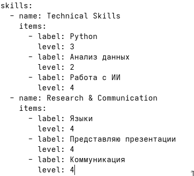
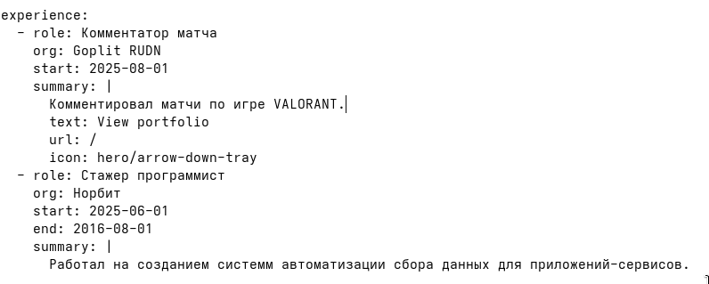
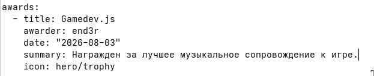

---
## Author
author:
  name: Добрынин Никита Артёмович
  email: 1132255598@rudn.ru
  affiliation:
    - name: Российский университет дружбы народов
      country: Российская Федерация
      postal-code: 117198
      city: Москва
      address: ул. Миклухо-Маклая, д. 6
## Title
title: Презентация по 3-му этапу персонального проекта
subtitle: Добавление достижений, навыков и наград
license: CC BY
date: today
date-format: "2026.04.08" # Example: 2025-09-06
---

# Цели и задачи работы

## Цель 3-го этапа проекта

Целью 3-го этапа персонального проекта является размещение информации о достижениях, навыков и наград

# Процесс выполнения 3-го этапа проекта

## Редактирование информации "Навыки"

{ #fig:001 width=70% height=70% }

## Редактирование информации "Опыт"

{ #fig:002 width=70% height=70% }

## Редактирование информации "Достижения"

{ #fig:003 width=70% height=70% }

## Посты

{ #fig:004 width=70% height=70% }

## Посты

{ #fig:004 width=70% height=70% }

# Выводы по проделанной работе

## Вывод

Я добавил информацию о своих навыках, достижениях и наградах, и сделал 2 поста.
