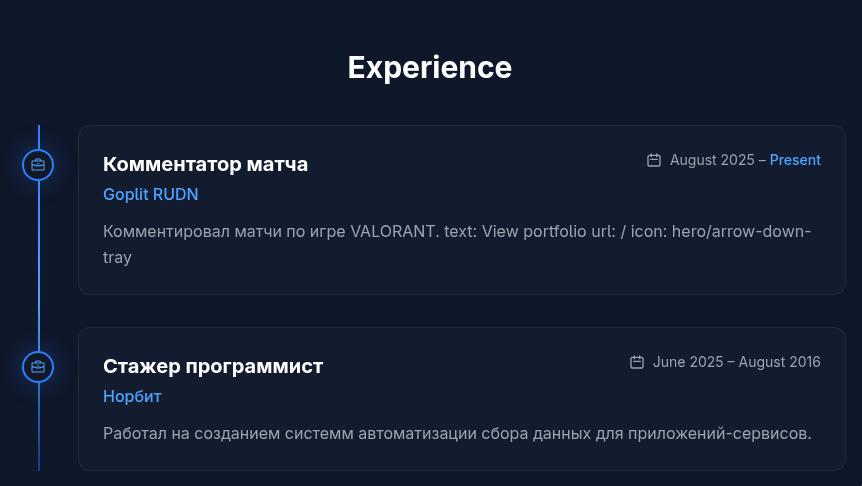
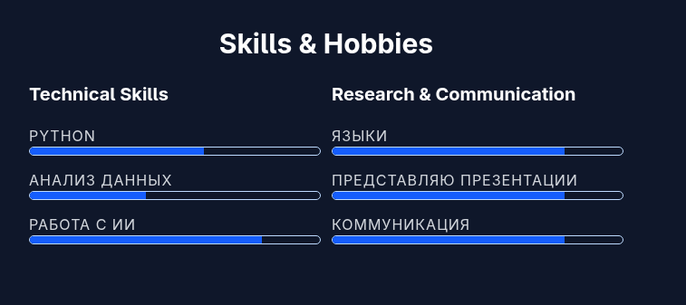
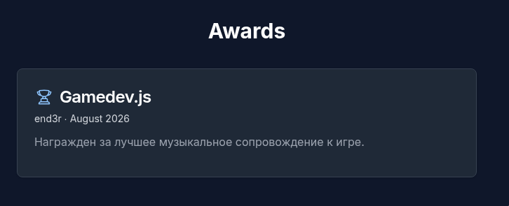
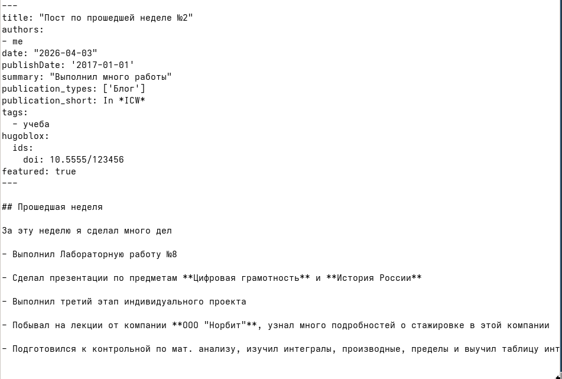
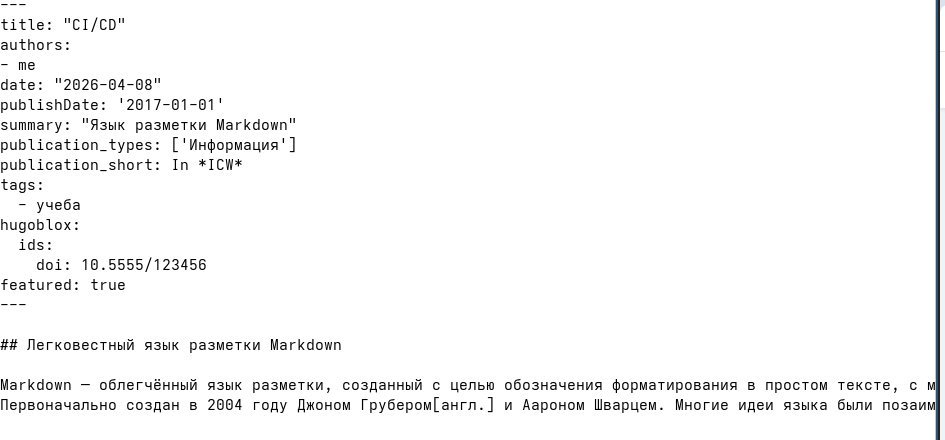
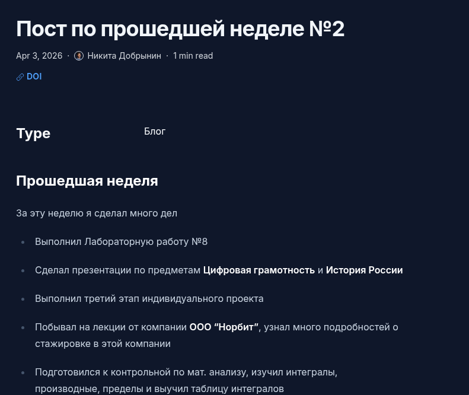
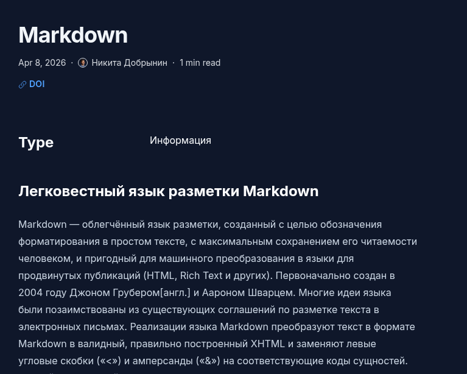

---
## Author
author:
  name: Добрынин Никита Артёмович
  degrees: 
  orcid:
  email: 1132255598@rudn.ru
  affiliation:
    - name: Российский университет дружбы народов
      country: Российская Федерация
      postal-code: 117198
      city: Москва
      address: ул. Миклухо-Маклая, д. 6

## Title
title: "Отчет №3 по Индивидуальному проекту"
subtitle: "Добавление списка достижений"
license: "CC BY"
---

# Цель работы

Добавление на сайт информации о навыках, опыте и достижениях, а так же создание двух постов на выделенные темы

# Задание

Добавить к сайту достижения.

Список достижений.
Добавить информацию о навыках (Skills).
Добавить информацию об опыте (Experience).
Добавить информацию о достижениях (Accomplishments).
Сделать пост по прошедшей неделе.

Добавить пост на тему по выбору:
Легковесные языки разметки.
Языки разметки. LaTeX.
Язык разметки Markdown.

Я выбрал язык разметки markdown.

# Выполнение лабораторной работы

Отредактировал файл _index.md, добавил информацию о навыках([рис. @fig-001]).

{#fig-001 width=70%}

Добавил информацию об опыте([рис. @fig-002]).

{#fig-002 width=70%}

Добавил информацию о достижениях([рис. @fig-003]).

{#fig-003 width=70%}

Информация на сайте об опыте([рис. @fig-004]).

{#fig-004 width=70%}

Информация на сайте о навыках([рис. @fig-005]).

{#fig-005 width=70%}

Информация на сайте о достижениях([рис. @fig-006]).

{#fig-006 width=70%}

Сделал пост о прошедшей неделе([рис. @fig-007]).

{#fig-007 width=70%}

Сделал пост по теме markdown([рис. @fig-008]).

{#fig-008 width=70%}

Пост по прошедшей неделе на сайте([рис. @fig-009]).

{#fig-009 width=70%}

Пост о markdown на сайте([рис. @fig-010]).

{#fig-010 width=70%}

# Выводы

Я добавил информацию о достижениях, навыках и наградах, и сделал пару постов.

