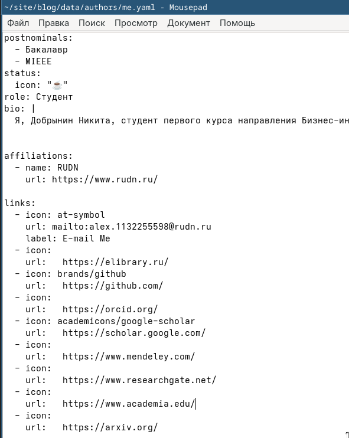
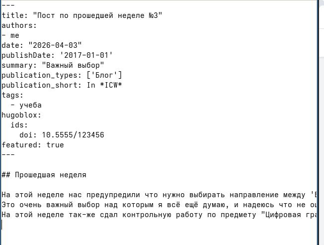
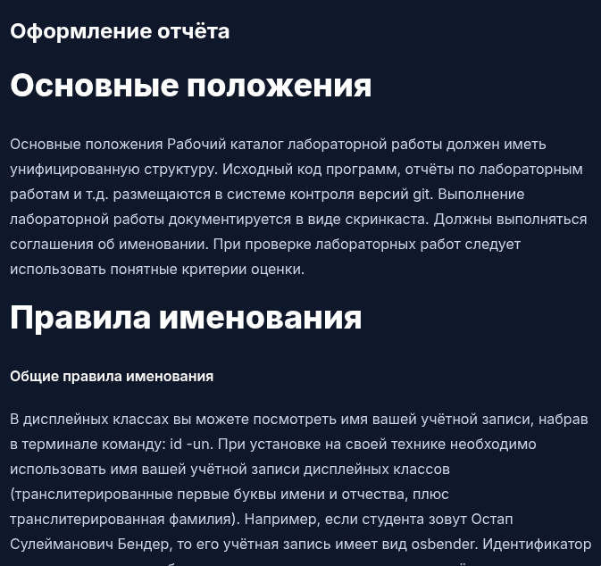
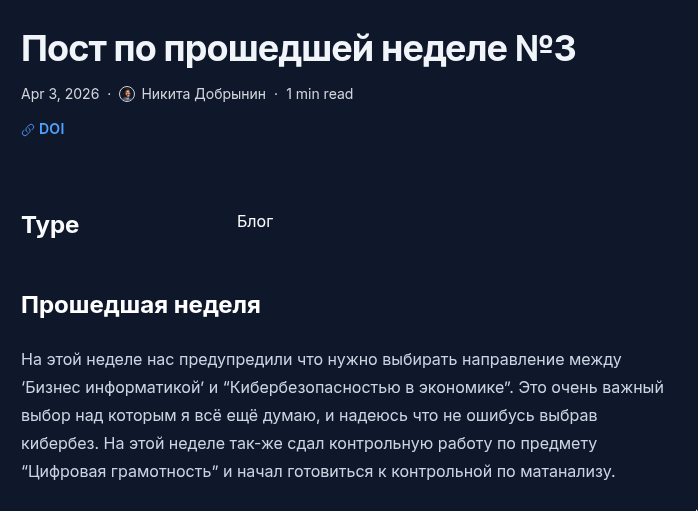

---
## Author
author:
  name: Добрынин Никита Артёмович
  email: 1132255598@rudn.ru
  affiliation:
    - name: Российский университет дружбы народов
      country: Российская Федерация
      postal-code: 117198
      city: Москва
      address: ул. Миклухо-Маклая, д. 6
## Title
title: Презентация по 4-му этапу персонального проекта
subtitle: Добавление ссылок на ресурсы
license: CC BY
date: today
date-format: "2026.05.02" # Example: 2025-09-06
---

# Цели и задачи работы

## Цель 4-го этапа проекта

Целью 4-го этапа персонального проекта является размещение ссылок на библиотечные ресурсы

# Процесс выполнения 4-го этапа проекта

## Пост об Отчёте

{ #fig:001 width=70% height=70% }

## Редактирование файла me.yaml

{ #fig:001 width=70% height=70% }

## Пост по прошедшей неделе

{ #fig:003 width=70% height=70% }

## Оформление отчёта

{ #fig:004 width=70% height=70% }

## Посты

{ #fig:005 width=70% height=70% }

# Выводы по проделанной работе

## Вывод

Я добавил ссылки на ресурсы и сделал 2 поста.

