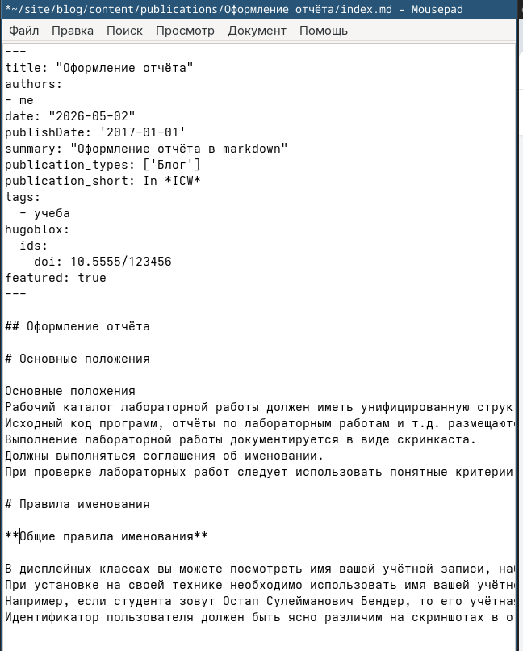

---
## Author
author:
  name: Добрынин Никита Артёмович
  degrees: 
  orcid:
  email: 1132255598@rudn.ru
  affiliation:
    - name: Российский университет дружбы народов
      country: Российская Федерация
      postal-code: 117198
      city: Москва
      address: ул. Миклухо-Маклая, д. 6

## Title
title: "Отчет №4 по Индивидуальному проекту"
subtitle: "Добавление информации о себе"
license: "CC BY"
---

# Цель работы

Добавить к сайту ссылки на научные и библиометрические ресурсы, а так же создание двух постов на выделенные темы

# Задание

Зарегистрироваться на соответствующих ресурсах и разместить на них ссылки на сайте:
eLibrary : https://elibrary.ru/;
Google Scholar : https://scholar.google.com/;
ORCID : https://orcid.org/;
Mendeley : https://www.mendeley.com/;
ResearchGate : https://www.researchgate.net/;
Academia.edu : https://www.academia.edu/;
arXiv : https://arxiv.org/;
github : https://github.com/.
Сделать пост по прошедшей неделе.
Добавить пост на тему по выбору:
Оформление отчёта.
Создание презентаций.
Работа с библиографией.

# Выполнение лабораторной работы

Сделал пост об оформлении отчёта([рис. @fig-001]).

{#fig-001 width=70%}

Изменил файл me.yaml и добавил ссылки на библиотечные ресурсы([рис. @fig-002]).

{#fig-002 width=70%}

Написал пост о прошедшей неделе([рис. @fig-003]).

{#fig-003 width=70%}

Публикация оформления отчёта([рис. @fig-004]).

{#fig-004 width=70%}

Пост по прошедшей неделе появился на сайте([рис. @fig-005]).

{#fig-005 width=70%}

# Выводы

Я добавил ссылки на библиотечные ресурсы и сделал пару постов.
